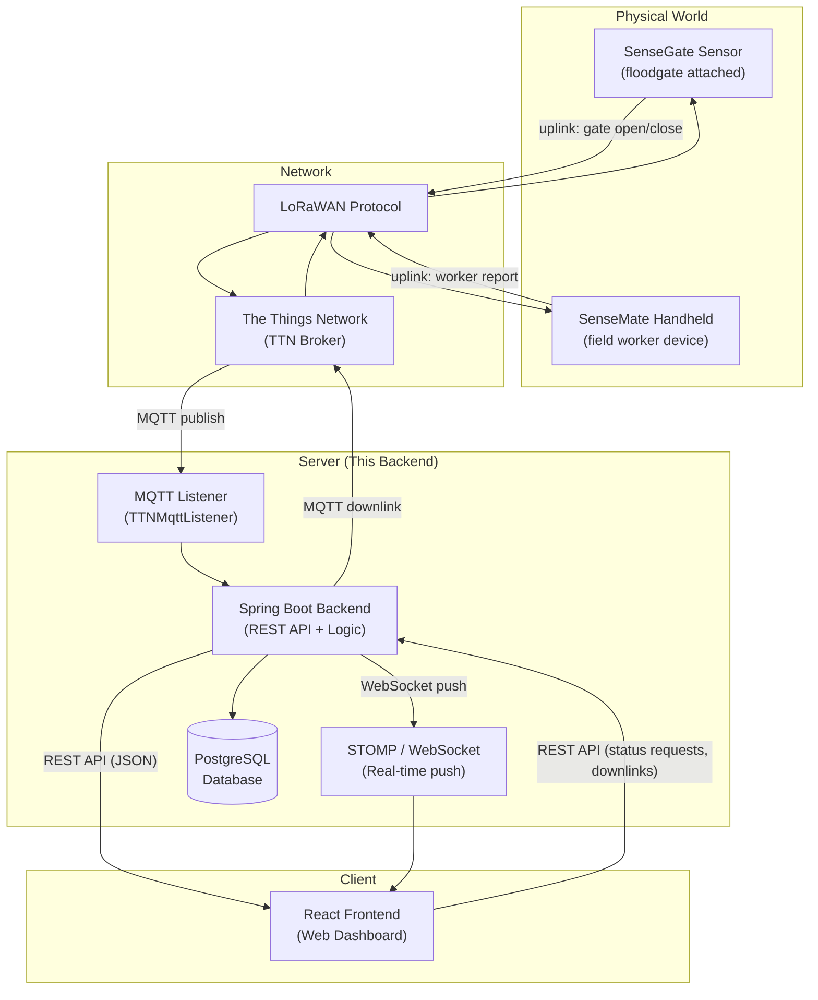

# 01 — Overview

## What is the Backend?

The **Backend** is the central server of the MateSense floodgate monitoring system. It acts as the bridge between:

- **Physical devices** (SenseGate sensors and SenseMate handhelds) — communicating via LoRaWAN through The Things Network (TTN) and MQTT
- **The web dashboard** (React frontend) — communicating via REST API and real-time WebSocket connections

Think of the Backend as the "brain" of the system: it receives sensor data, stores it in a database, makes decisions about gate states, and pushes updates to the web dashboard in real time.

---

## Technology Stack

| Technology | Purpose | Version |
|---|---|---|
| **Java** | Programming language | 17 |
| **Spring Boot** | Web application framework | 3.4.4 |
| **Maven** | Build tool and dependency manager | (wrapper included) |
| **PostgreSQL** | Production database | 15 |
| **H2 Database** | In-memory database for E2E testing | — |
| **Flyway** | Database schema migrations | — |
| **Eclipse Paho** | MQTT client (connects to TTN) | 1.2.5 |
| **STOMP + WebSocket** | Real-time push to frontend | — |
| **JJWT** (io.jsonwebtoken) | JWT token creation and validation | 0.11.5 |
| **Lombok** | Reduces boilerplate Java code | 1.18.30 |
| **Jackson** | JSON/CBOR parsing | 2.15.2 |

All dependencies are declared in `server/backend/pom.xml` (`server/backend/pom.xml:33-148`).

---

## System Context

### How the Backend fits into the overall system



### Data Flow Summary

1. **Uplink (Device → Server):** SenseGate/SenseMate sends data via LoRaWAN → TTN receives it → TTN publishes via MQTT → Backend listens and processes
2. **Persistence:** Processed data is stored in PostgreSQL
3. **Real-time Push:** Gate state changes are immediately pushed to the web dashboard via WebSocket/STOMP
4. **Downlink (Server → Device):** Web dashboard sends a command → Backend publishes via MQTT → TTN forwards over LoRaWAN → Device receives it

---

## Key Responsibilities

### 1. Receive Gate Data via MQTT
The `TTNMqttListener` class (`server/backend/src/main/java/com/riot/matesense/mqtt/TTNMqttListener.java:17`) connects to The Things Network's MQTT broker and subscribes to topics matching `v3/{app-id}@ttn/devices/+/up`. When a device sends an uplink, the listener:
- Decodes the Base64-encoded CBOR payload
- Converts it to JSON
- Passes it to `MqttMessageHandler` for processing

### 2. Persist Data to Database
All gate states, activities, user accounts, notifications, and metadata are stored in PostgreSQL. The Backend uses **Spring Data JPA** with **Hibernate** to map Java objects to database tables. **Flyway** handles database schema evolution through versioned SQL migration scripts.

### 3. Serve REST API
The Backend exposes a REST API that the React frontend calls to:
- Authenticate users (login/register/logout)
- View and manage gates, their statuses, and metadata
- View historical gate activity
- Manage IoT nodes and cryptographic keys
- View and manage notifications
- Send downlink commands to devices

### 4. Push Real-Time Updates via WebSocket
When gate states change (from sensor reports, worker reports, or manual overrides), the Backend immediately pushes updates to all connected web clients via STOMP on WebSocket. This means the dashboard updates without needing to refresh the page.

### 5. Manage Device Registry
The `DeviceRegistry` class (`server/backend/src/main/java/com/riot/matesense/registry/DeviceRegistry.java:12`) tracks which SenseGate and SenseMate devices are currently active on the network.

---

## Project Structure at a Glance

```
server/backend/
├── pom.xml                          # Maven build file (dependencies, plugins)
├── .env.example                     # Example environment variables
├── src/
│   ├── main/
│   │   ├── java/com/riot/matesense/
│   │   │   ├── Application.java     # Entry point (main method)
│   │   │   ├── config/              # Spring configuration classes
│   │   │   ├── controller/          # REST API endpoints
│   │   │   ├── entity/              # Database table mappings
│   │   │   ├── enums/               # Shared value types
│   │   │   ├── exceptions/          # Custom error handling
│   │   │   ├── model/               # Data transfer objects (DTOs)
│   │   │   ├── mqtt/                # MQTT listener and publisher
│   │   │   ├── registry/            # Device registry
│   │   │   ├── repository/          # Database access interfaces
│   │   │   ├── security/            # JWT filtering and extraction
│   │   │   └── service/             # Business logic layer
│   │   └── resources/
│   │       ├── application.yml      # Main configuration
│   │       └── db/migration/        # Flyway SQL migration scripts
│   └── test/                        # Unit and integration tests
```

---

Next: **[02-setup.md](02-setup.md)** — How to install and run the Backend.
