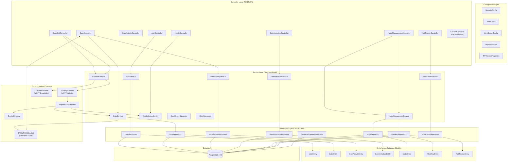

# 03 — Architecture

## Package Structure

The Backend follows a **layered architecture** pattern. All Java code lives under `server/backend/src/main/java/com/riot/matesense/`.

```
com.riot.matesense/
├── Application.java                  # Entry point: starts Spring Boot
├── EnableConfigurationProperties.java # Enables @ConfigurationProperties
│
├── config/                           # Spring configuration classes
│   ├── SecurityConfig.java           # Authentication, CORS, CSRF, endpoint protection
│   ├── WebConfig.java                # CORS mappings for REST endpoints
│   ├── WebSocketConfig.java          # STOMP/WebSocket broker configuration
│   ├── MqttProperties.java           # MQTT broker connection settings
│   ├── JWTSecretProperties.java      # JWT signing key from configuration
│   ├── TestAccountProperties.java    # Test user accounts from application.yml
│   ├── DeviceInfo.java               # Device metadata type (GATE / MATE)
│   └── DownPayload.java              # Downlink payload structure
│
├── controller/                       # REST API endpoints (HTTP layer)
│   ├── AuthController.java           # /auth/login, /auth/register, /auth/logout
│   ├── GateController.java           # /gates, /add-gate-ui, /update-gate
│   ├── GateActivityController.java   # /gate-activities
│   ├── GateMetadataController.java   # /gates/{id}/metadata
│   ├── NodeManagementController.java # /nodes, /nodes/root-key
│   ├── NotificationController.java   # /notifications
│   ├── HealthController.java         # /health
│   ├── HomeController.java           # / (unsecured), /secured
│   ├── DownlinkController.java       # /downlink (send command to device)
│   ├── DownlinkCounterController.java# /downlinkcounter
│   └── E2eTestController.java        # /e2e (only active with e2e profile)
│
├── service/                          # Business logic layer
│   ├── AuthService.java              # User login, registration, token management
│   ├── GateService.java              # Gate CRUD, status changes, confidence
│   ├── GateActivityService.java      # Gate activity logging
│   ├── GateMetadataService.java      # Key-value metadata for gates
│   ├── NodeManagementService.java    # Node registration and root key management
│   ├── NotificationService.java      # Notification management
│   ├── HealthStatusService.java      # In-memory gate health status
│   ├── DownlinkService.java          # Build and send CBOR downlink commands
│   ├── DownlinkCounterService.java   # Track downlink count with rate limiting
│   ├── ConfidenceCalculator.java     # Confidence scoring for gate states
│   ├── CborConverter.java            # CBOR binary encoding/decoding
│   ├── Base64ToList.java             # Base64 to list conversion
│   └── JsonFormatter.java            # Decoded payload to JSON formatting
│
├── repository/                       # Database access layer (Spring Data JPA)
│   ├── UserRepository.java           # User queries (findByEmail)
│   ├── GateRepository.java           # Gate CRUD operations
│   ├── GateActivityRepository.java   # Gate activity queries
│   ├── GateMetadataRepository.java   # Metadata queries
│   ├── GateForDownlinkRepository.java# Downlink queue queries
│   ├── NodeRepository.java           # Node queries
│   ├── RootKeyRepository.java        # Root key storage
│   ├── NotificationRepository.java   # Notification queries
│   └── DownlinkCounterRepository.java# Counter queries
│
├── entity/                           # JPA entities (map to database tables)
│   ├── UserEntity.java               # → users table
│   ├── GateEntity.java               # → gates table
│   ├── GateActivityEntity.java       # → gate_activities table
│   ├── GateMetadataEntity.java       # → gate_metadata table
│   ├── GateForDownlinkEntity.java    # → gates_for_downlink table
│   ├── NodeEntity.java               # → nodes table
│   ├── RootKeyEntity.java            # → root_keys table
│   ├── NotificationEntity.java       # → notifications table
│   └── DownlinkCounterEntity.java    # → downlink_counter table
│
├── model/                            # DTOs (Data Transfer Objects)
│   ├── Gate.java, GateActivity.java, GateForDownlink.java
│   ├── Node.java, NodeRequest.java, RootKey.java
│   ├── AuthRequest.java, RegisterRequest.java, UserDetailsResponse.java
│   ├── UserChangeRequest.java, Notification.java, NotificationReadRequest.java
│   ├── HealthStatusDTO.java, DownPayload.java, DownlinkCounter.java
│
├── enums/                            # Shared enumeration types
│   ├── Status.java                   # OPEN, CLOSED, OUT_OF_SERVICE, NONE, UNKNOWN
│   ├── StateConfirmation.java        # CONFIRMED, UNCONFIRMED, WORKER_CONFLICT, etc.
│   ├── MsgType.java                  # IST_STATE, SEEN_TABLE_STATE, HEALTH_MONITORING, etc.
│   ├── ActivityType.java             # SENSOR_NEW, SENSOR_VALUE_CHANGED, etc.
│   ├── BatteryStatus.java            # Battery health states
│   ├── ShockStatus.java              # Shock sensor states
│   ├── ConfidenceQuality.java        # HIGH, MEDIUM, LOW
│   └── RecordType.java               # CBOR record types
│
├── security/                         # JWT authentication components
│   ├── JwtService.java               # Token creation and validation
│   ├── JwtAuthenticationFilter.java  # Intercepts every HTTP request
│   └── CookieJwtExtractor.java       # Extracts JWT from Cookie header
│
├── mqtt/                             # MQTT communication
│   ├── TTNMqttListener.java          # Listens for uplinks from TTN
│   ├── TTNMqttPublisher.java         # Publishes downlinks to TTN
│   └── MqttMessageHandler.java       # Processes decoded uplink messages
│
├── registry/                         # Device tracking
│   └── DeviceRegistry.java           # Tracks active SenseGate/SenseMate devices
│
└── exceptions/                       # Custom exception classes
    ├── GateNotFoundException.java
    ├── GateAlreadyExistingException.java
    ├── MetadataNotFoundException.java
    ├── NodeNotFoundException.java
    ├── RootKeyNotFoundException.java
    ├── InvalidCredentialsException.java
    └── ApiExceptionHandler.java      # Global exception → HTTP response mapping
```

---

## Component Tree Diagram



---

## Layered Architecture

The Backend is organized into **four logical layers** — each with a single responsibility:

### 1. Controller Layer ("The Front Door")
**Location:** `server/backend/src/main/java/com/riot/matesense/controller/`

Controllers are the entry points for HTTP requests. They:
- Receive HTTP requests from the frontend (or any API client)
- Validate and extract request data
- Call the appropriate service method
- Return HTTP responses (JSON by default)

A controller class is annotated with `@RestController` and its methods are mapped to URL paths using `@RequestMapping`, `@GetMapping`, `@PostMapping`, etc.

**Example:** When the frontend calls `GET /gates`, the `GateController.getAllGates()` method (`server/backend/src/main/java/com/riot/matesense/controller/GateController.java:40-43`) handles the request and returns a list of all gates.

### 2. Service Layer ("The Brain")
**Location:** `server/backend/src/main/java/com/riot/matesense/service/`

Services contain the **business logic**. They decide *what* to do with data — not *how* to store it. Services are annotated with `@Service` and are injected into controllers via Spring's dependency injection.

A service method might:
- Validate business rules (e.g., "a gate cannot have two conflicting statuses")
- Coordinate multiple repository calls
- Trigger WebSocket notifications
- Call other services

**Example:** `GateService.requestGateStatusChange()` (`server/backend/src/main/java/com/riot/matesense/service/GateService.java:146-179`) validates the requested status, updates the gate's pending job and requested status, and saves the change.

### 3. Repository Layer ("The Librarian")
**Location:** `server/backend/src/main/java/com/riot/matesense/repository/`

Repositories handle all **database communication**. They are interfaces that extend `JpaRepository`, which automatically provides methods like:
- `findAll()` — get all rows
- `findById(id)` — get one row by primary key
- `save(entity)` — insert or update a row
- `delete(entity)` — remove a row
- `existsById(id)` — check if a row exists

Spring Data JPA generates the actual SQL queries at runtime. You can also define custom query methods by following naming conventions (e.g., `findByEmail(String email)` in `UserRepository` at `server/backend/src/main/java/com/riot/matesense/repository/UserRepository.java:18`).

### 4. Entity Layer ("The Data Shape")
**Location:** `server/backend/src/main/java/com/riot/matesense/entity/`

Entities are Java classes that represent **database table rows**. Each field in the entity maps to a column in a database table. Annotations like `@Entity`, `@Table`, `@Id`, and `@Column` define this mapping.

**Example:** `GateEntity` (`server/backend/src/main/java/com/riot/matesense/entity/GateEntity.java:17-18`) maps to the `gates` table, and its `id` field (line 27) maps to the primary key column.

---

## How Services are Wired Together (Dependency Injection)

Spring Boot uses **Dependency Injection (DI)** to manage how objects are connected. Instead of a class creating its own dependencies (with `new`), Spring creates all objects and **injects** them where needed.

### Constructor Injection (preferred)

```java
// In GateService.java (server/backend/.../service/GateService.java:31-35)
public GateService(GateRepository gateRepository, SimpMessagingTemplate messagingTemplate) {
    this.gateRepository = gateRepository;
    this.messagingTemplate = messagingTemplate;
}
```

When Spring creates a `GateService`, it automatically finds a `GateRepository` and a `SimpMessagingTemplate` bean and passes them to the constructor. No `new` keyword needed.

### Field Injection (alternative)

```java
// In GateController.java (server/backend/.../controller/GateController.java:29-32)
@Autowired
GateService gateService;
```

The `@Autowired` annotation tells Spring to find a `GateService` bean and assign it to this field automatically.

### What Beans Does Spring Create?

Spring creates and manages instances of classes annotated with:
- `@Service` — services
- `@Repository` — repositories
- `@Component` — general components (e.g., `MqttMessageHandler`, `DeviceRegistry`)
- `@Configuration` — configuration classes (e.g., `SecurityConfig`, `WebSocketConfig`)
- `@RestController` — controllers

---

## Configuration Classes

### SecurityConfig
**File:** `server/backend/src/main/java/com/riot/matesense/config/SecurityConfig.java:16-63`

Configures Spring Security:
- **CORS:** Disabled (handled separately by `WebConfig`)
- **CSRF:** Cookie-based CSRF protection, with exceptions for `/auth/login`, `/auth/logout`, and `/e2e/**`
- **Endpoint access:** Some endpoints are public (`/auth/login`, `/gates`, `/health`, `/ws/**`, `/actuator/health`), all others require authentication
- **JWT filter:** The `JwtAuthenticationFilter` is inserted after `SecurityContextHolderFilter` to process every request
- **Password encoder:** Uses BCrypt for secure password hashing

### WebConfig
**File:** `server/backend/src/main/java/com/riot/matesense/config/WebConfig.java:9-22`

Configures CORS globally: allows all origins, all HTTP methods, and all headers for every endpoint.

### WebSocketConfig
**File:** `server/backend/src/main/java/com/riot/matesense/config/WebSocketConfig.java:32-132`

Sets up STOMP over WebSocket:
- **Message broker:** Simple in-memory broker with `/topic` prefix for broadcasting
- **Application prefix:** `/app` for messages sent from clients to server
- **Endpoint:** `/ws` with JWT authentication via Cookie header
- **Auth interceptor:** Extracts the JWT from the WebSocket handshake and authenticates the user before allowing STOMP CONNECT

### MqttProperties
**File:** `server/backend/src/main/java/com/riot/matesense/config/MqttProperties.java:7-87`

Reads MQTT configuration from `application.yml` under the `mqtt:` prefix. Also provides a helper method `buildDeviceDownlinkTopic(deviceId)` that constructs the TTN downlink topic for a specific device.

### JWTSecretProperties
**File:** `server/backend/src/main/java/com/riot/matesense/config/JWTSecretProperties.java:10-27`

Reads `jwt-secrets.sharedSecret` from `application.yml` and provides it as a cryptographic `Key` object for signing and verifying JWTs.

---

Next: **[04-api-endpoints.md](04-api-endpoints.md)** — All REST API endpoints explained.
