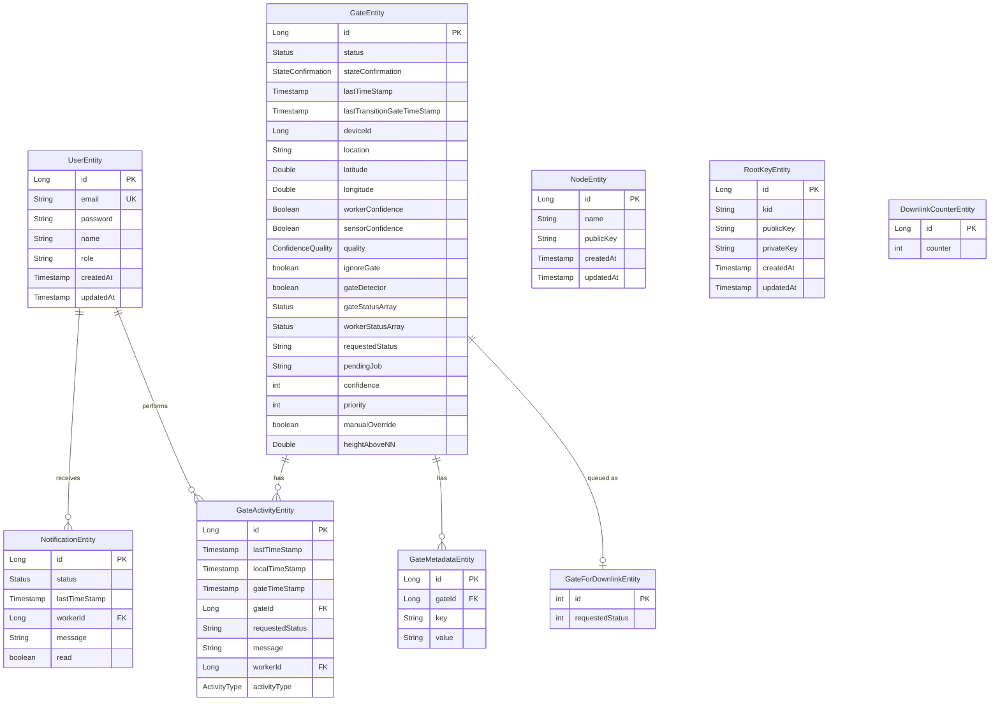

# 05 — Database

## Overview

The Backend uses a **relational database** to store all persistent data. The database choice depends on the active Spring profile:

| Profile | Database | Use Case |
|---|---|---|
| `dev`, `prod`, `integration` | **PostgreSQL 15** | Development, production, integration testing |
| `e2e` | **H2 In-Memory** | Deterministic end-to-end testing with no external dependencies |

In the `e2e` profile, all data is stored in memory and lost when the application stops. This makes tests repeatable and fast.

---

## Entity-Relationship Diagram



---

## Entity Details

### GateEntity
**File:** `server/backend/src/main/java/com/riot/matesense/entity/GateEntity.java:20-135`
**Table:** `gates`

The central entity representing a physical floodgate. Key fields:

| Field | Type | Purpose |
|---|---|---|
| `id` | `Long` (PK) | Gate identifier — manually assigned (no auto-generation) |
| `status` | `Status` enum | Current perceived state: `OPEN`, `CLOSED`, `OUT_OF_SERVICE`, `NONE` |
| `stateConfirmation` | `StateConfirmation` enum | How confident we are about the status: `UNCONFIRMED`, `WORKER_CONFIRMED_SINGLE`, etc. |
| `requestedStatus` | `String` | What status a user has requested (e.g., `"REQUESTED_OPEN"`) |
| `pendingJob` | `String` | The current pending operation (`"PENDING_OPEN"`, `"PENDING_CLOSE"`) |
| `confidence` | `int` | Confidence percentage (0-100) calculated by `ConfidenceCalculator` |
| `priority` | `int` | Display priority for the dashboard |
| `manualOverride` | `boolean` | Whether the status was manually set by a user |
| `heightAboveNN` | `Double` | Elevation above sea level in meters |
| `gateStatusArray` | `Status[3]` | Last 3 sensor-reported statuses (for confidence calculation) |
| `workerStatusArray` | `Status[3]` | Last 3 worker-reported statuses (for confidence calculation) |

### GateActivityEntity
**File:** `server/backend/src/main/java/com/riot/matesense/entity/GateActivityEntity.java:17-68`
**Table:** `gate_activities`

An audit trail of everything that happens to a gate. Each entry records:
- Which gate (`gateId`)
- What happened (`activityType`, `requestedStatus`)
- When (`gateTimeStamp` from the device, `localTimeStamp` from the server)
- Who triggered it (`workerId` — null for sensor events)
- A human-readable `message` (generated automatically in the constructor, lines 42-50)

### GateMetadataEntity
**File:** `server/backend/src/main/java/com/riot/matesense/entity/GateMetadataEntity.java:15-36`
**Table:** `gate_metadata` (added in V11 migration)

A flexible key-value store for gate attributes. Instead of adding columns to `gates` for every new property, any number of metadata entries can be attached.

### GateForDownlinkEntity
**File:** `server/backend/src/main/java/com/riot/matesense/entity/GateForDownlinkEntity.java:13-27`
**Table:** `gates_for_downlink`

A compact representation of gates for downlink purposes — only stores the gate ID and its requested status as an integer code.

### UserEntity
**File:** `server/backend/src/main/java/com/riot/matesense/entity/UserEntity.java:9-38`
**Table:** `users`

Stores user accounts for the web dashboard. Passwords are hashed with **BCrypt** before storage. The `role` field determines access level (`controller` or `viewer`).

### NodeEntity
**File:** `server/backend/src/main/java/com/riot/matesense/entity/NodeEntity.java:14-31`
**Table:** `nodes` (added in V13 migration)

Represents a physical IoT device (SenseGate or SenseMate) registered in the system. Each node has a `name` and a `publicKey` for COSE signature verification.

### RootKeyEntity
**File:** `server/backend/src/main/java/com/riot/matesense/entity/RootKeyEntity.java:14-34`
**Table:** `root_keys` (added in V13 migration)

Stores the cryptographic root key used for signing COSE messages. Contains `kid` (Key Identifier), `publicKey`, and `privateKey`.

### NotificationEntity
**File:** `server/backend/src/main/java/com/riot/matesense/entity/NotificationEntity.java:16-49`
**Table:** `notifications`

Stores notifications for workers. Each notification is linked to a `workerId` and has a `read` flag.

### DownlinkCounterEntity
**File:** `server/backend/src/main/java/com/riot/matesense/entity/DownlinkCounterEntity.java:13-25`
**Table:** `downlink_counter`

A single-row table (always ID=1) that tracks the number of sent downlinks, used for rate limiting.

---

## Flyway Migrations

**Flyway** is a database migration tool that applies versioned SQL scripts to evolve the database schema safely and repeatably.

### Migration Strategy

Migrations are numbered versions (V1, V2, V3, ...). Each one is applied in order, and Flyway tracks which ones have already run in a `flyway_schema_history` table. This means:
- Running the same migration twice has no effect
- New migrations are added to change the schema over time
- Rollbacks are done by creating inverse migrations

### Migration Files

All migrations live in `server/backend/src/main/resources/db/migration/`:

| Migration | Purpose |
|---|---|
| `V1__Initial_schema.sql` | Creates all initial tables, enum types, indexes, and views |
| `V2__Insert_seed_data.sql` | Inserts initial test data |
| `V3__Fix_enum_array_columns.sql` | Fixes enum array column definitions |
| `V4__Fix_quality_enum_column.sql` | Fixes `confidence_quality_enum` column |
| `V5__Fix_state_confirmation_column.sql` | Fixes `state_confirmation_enum` column |
| `V6__Add_updated_at_triggers.sql` | Adds PostgreSQL triggers for auto-updating `updated_at` |
| `V7__Add_foreign_key_constraints.sql` | Adds FK constraints between tables |
| `V8__Fix_status_column.sql` | Updates status enum handling |
| `V9__Fix_notifications_status_column.sql` | Fixes notification status column |
| `V10__Fix_gate_activities_activity_type_column.sql` | Adds `MANUAL_STATUS_SET` to activity type enum |
| `V11__Create_gate_metadata_table.sql` | Creates the `gate_metadata` table |
| `V12__Add_gate_override_height_fk_unique.sql` | Adds `manual_override` and `height_above_nn` columns, FK constraints, and unique indexes |
| `V13__Add_node_management_tables.sql` | Creates `nodes` and `root_keys` tables |
| `V14__Add_kid_and_triggers.sql` | Adds `kid` column and updated_at triggers |

### E2E Seed Migration

A separate migration at `server/backend/src/main/resources/db/migration-e2e/V100__e2e_seed.sql` provides deterministic test data for end-to-end testing. This migration only runs when the `e2e` profile is active.

---

## Spring Data JPA Repositories

Repositories are interfaces that extend `JpaRepository`. At runtime, Spring automatically generates the implementation — you get full CRUD operations without writing a single line of SQL.

### Example: GateRepository

```java
// server/backend/.../repository/GateRepository.java:8-9
@Repository
public interface GateRepository extends JpaRepository<GateEntity, Long> {
    GateEntity getById(Long id);
}
```

This single interface provides all these methods automatically:
- `findAll()` — SELECT * FROM gates
- `findById(Long id)` — SELECT * FROM gates WHERE id = ?
- `save(GateEntity)` — INSERT or UPDATE
- `delete(GateEntity)` — DELETE
- `existsById(Long id)` — SELECT COUNT(*) FROM gates WHERE id = ?
- `count()` — SELECT COUNT(*) FROM gates

### Custom Query Methods

Spring Data can generate queries from method names. For example, `UserRepository` (`server/backend/src/main/java/com/riot/matesense/repository/UserRepository.java:18`) declares:

```java
UserEntity findByEmail(String email);
```

Spring automatically translates this to: `SELECT * FROM users WHERE email = ?`

---

## Database Views

Two SQL views are defined in the initial migration for convenience:

- **`v_gate_summary`** (`server/backend/src/main/resources/db/migration/V1__Initial_schema.sql:149-162`): A simplified view of gates (status, location, confidence, priority), excluding ignored gates, ordered by priority.
- **`v_recent_activities`** (`server/backend/src/main/resources/db/migration/V1__Initial_schema.sql:164-177`): The 100 most recent gate activities with gate location and status joined in.

---

## How Entities Map to Database Tables

Spring Boot uses **Hibernate** (the JPA implementation) to automatically map entities to database tables. The mapping is defined by annotations:

| Annotation | Purpose |
|---|---|
| `@Entity` | Marks a class as a database entity |
| `@Table(name = "gates")` | Specifies the table name (defaults to class name if omitted) |
| `@Id` | Marks the primary key field |
| `@GeneratedValue(strategy = GenerationType.IDENTITY)` | Auto-increment for the primary key |
| `@Column(name = "...", nullable = false, unique = true)` | Column settings |
| `@Enumerated(EnumType.STRING)` | Stores Java enum values as strings in the database |

When the application starts, Hibernate reads these annotations and:
1. Validates that the database schema matches the entity definitions (because `ddl-auto` is set to `validate`)
2. Translates repository method calls into SQL queries

---

Next: **[06-authentication.md](06-authentication.md)** — How login and security work.
