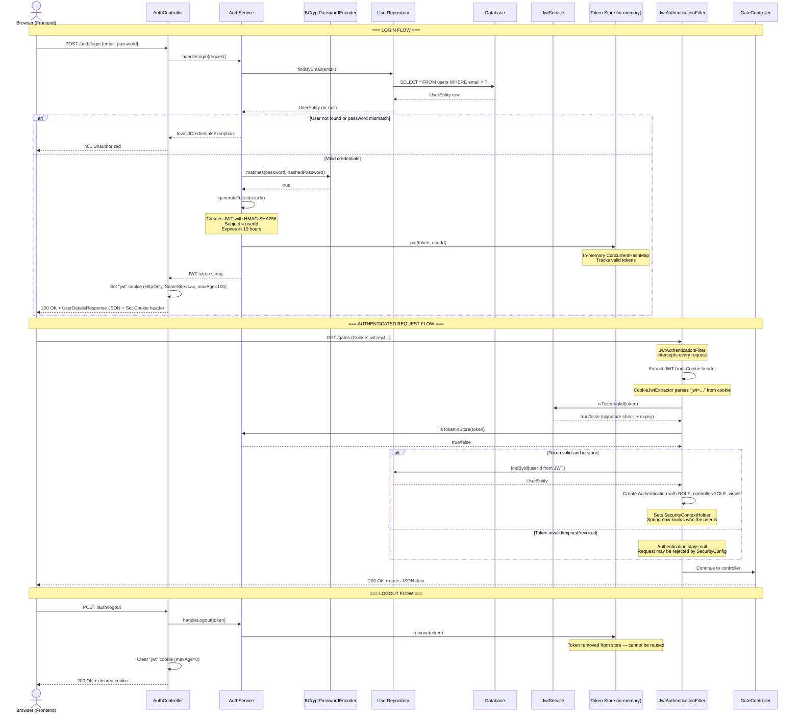

# 06 — Authentication

## Overview

The Backend uses **JWT (JSON Web Token)** based authentication. Here's the simple idea:

1. User logs in with email + password
2. Server verifies credentials and creates a signed JWT
3. The JWT is stored as an **HTTP-only cookie** in the browser
4. Every subsequent request automatically includes this cookie
5. The server validates the JWT on each request to identify the user

The JWT never needs to be manually sent — cookies are handled automatically by the browser.

---

## Authentication Flow Diagram



---

## Key Components

### 1. AuthService — Login & Registration
**File:** `server/backend/src/main/java/com/riot/matesense/service/AuthService.java:32-204`

The `AuthService` handles the core authentication logic:

**Login** (`handleLogin`, line 67-78):
1. Finds the user by email in the database
2. Compares the provided password with the BCrypt-hashed password stored in the database
3. If valid, generates a JWT and stores it in the in-memory `tokenStore` (a `ConcurrentHashMap`)
4. Returns the JWT string

**Registration** (`handleRegister`, line 80-93):
1. Checks if the email is already in use
2. Hashes the password with BCrypt
3. Creates and saves a new `UserEntity`
4. Generates a JWT and stores it

**Logout** (`handleLogout`, line 114-119):
1. Removes the token from the `tokenStore` — this invalidates it server-side

**Token Store Management:**
The `tokenStore` is an in-memory `ConcurrentHashMap<String, Long>` mapping token strings to user IDs. It serves two purposes:
- **Validation:** Only tokens in the store are considered valid (in addition to JWT signature verification)
- **Revocation:** Removing a token from the store immediately logs out that session

A scheduled task (`evictExpiredTokens`, line 182-203) runs every 60 seconds to clean up expired tokens.

### 2. JwtService — Token Creation & Validation
**File:** `server/backend/src/main/java/com/riot/matesense/security/JwtService.java:12-48`

The `JwtService` handles the cryptographic operations on JWTs:

- **`generateToken(Long userId)`** (line 22-29): Creates a JWT with the user ID as the subject, signed with HMAC-SHA256, expiring in 10 hours.
- **`isTokenValid(String token)`** (line 31-38): Verifies the JWT's signature and expiration. Returns `true` only if the signature is valid and the token hasn't expired.
- **`extractUsername(String token)`** (line 40-47): Extracts the user ID (stored in the JWT's "subject" claim).

The signing key comes from `JWTSecretProperties` which reads `jwt-secrets.sharedSecret` from `application.yml` (`server/backend/src/main/resources/application.yml:26`).

### 3. JwtAuthenticationFilter — Request Interception
**File:** `server/backend/src/main/java/com/riot/matesense/security/JwtAuthenticationFilter.java:23-67`

This filter runs on **every HTTP request** (except login, register, and logout — see `shouldNotFilter` on line 63-66):

1. Extracts the JWT from the `Cookie` header using `CookieJwtExtractor` (line 42-43)
2. If a token exists, validates it with `JwtService.isTokenValid()` (line 48)
3. Checks that the token is still in the `tokenStore` (line 48)
4. Looks up the user in the database by ID (line 49)
5. Creates a Spring Security `Authentication` object and sets it in the `SecurityContextHolder` (line 51-55)

After this filter runs, Spring Security knows who the user is for the rest of the request. Controllers can then use `@PreAuthorize` annotations to check roles.

### 4. CookieJwtExtractor — Cookie Parsing
**File:** `server/backend/src/main/java/com/riot/matesense/security/CookieJwtExtractor.java:3-17`

A simple utility that parses the `Cookie` HTTP header and extracts the value of the `jwt` cookie:

```java
public static String extractJwtFromCookie(String cookieHeader) {
    if (cookieHeader == null) return null;
    for (String cookie : cookieHeader.split(";")) {
        String trimmed = cookie.trim();
        if (trimmed.startsWith("jwt=")) {
            return trimmed.substring(4);
        }
    }
    return null;
}
```

The `jwt` cookie has these properties (set in `AuthController`, lines 31-37):
- **`httpOnly(true)`** — Cannot be read by JavaScript (prevents XSS attacks)
- **`secure(cookieSecure)`** — Only sent over HTTPS in production
- **`sameSite("Lax")`** — Protects against CSRF attacks
- **`path("/")`** — Sent with requests to all paths
- **`maxAge(36000)`** — Expires after 10 hours

---

## Security Configuration

**File:** `server/backend/src/main/java/com/riot/matesense/config/SecurityConfig.java:19-63`

The `SecurityConfig` class defines the security rules:

### Endpoint Protection

| Endpoints | Access Level |
|---|---|
| `/auth/login`, `/auth/register`, `/auth/logout` | **Public** (no auth required) |
| `/gates` | **Public** |
| `/gate-activities` | **Public** |
| `/health` | **Public** |
| `/ws/**` (WebSocket) | **Public** |
| `/actuator/health` | **Public** |
| `/e2e/**` | **Public** (e2e profile only) |
| Everything else | **Authenticated** |

### CSRF Protection
CSRF (Cross-Site Request Forgery) protection is enabled using cookie-based CSRF tokens (`CookieCsrfTokenRepository`, line 32). The following paths are exempted:
- `/auth/login`
- `/auth/logout`
- `/e2e/**`

### CORS
CORS is handled separately in `WebConfig` (`server/backend/src/main/java/com/riot/matesense/config/WebConfig.java:9-22`), which allows all origins, methods, and headers.

### Role-Based Access Control
Controller methods use `@PreAuthorize` annotations for fine-grained access control. The annotation `@EnableMethodSecurity` on `SecurityConfig` (line 18) enables this.

Example from `NodeManagementController.java:24`:
```java
@PreAuthorize("hasRole('controller')")
```

Spring creates authority strings as `ROLE_controller` or `ROLE_viewer` based on the user's role field (set in `JwtAuthenticationFilter.java:52`).

---

## Password Security

Passwords are **never stored in plain text**. BCrypt is used for one-way hashing:

1. When a user registers, `BCryptPasswordEncoder.encode(password)` creates a salted hash
2. When logging in, `BCryptPasswordEncoder.matches(plainTextPassword, storedHash)` compares them

BCrypt is designed to be **computationally expensive** (slow by design), making brute-force attacks impractical. Even if the database is compromised, original passwords cannot be recovered.

The `BCryptPasswordEncoder` bean is defined in `SecurityConfig.java:60-62`.

---

Next: **[07-communication.md](07-communication.md)** — MQTT and WebSocket communication.
