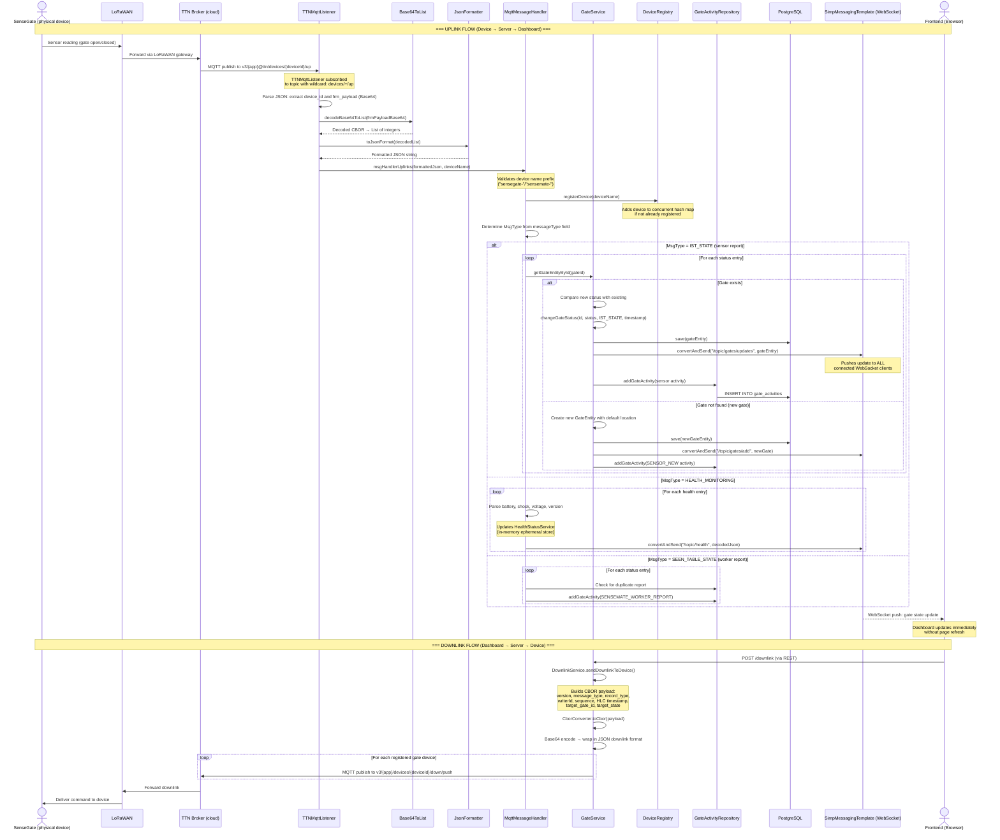

# 07 — Communication

## Overview

The Backend communicates with the outside world through two main channels:

1. **MQTT** — For communication with physical IoT devices (SenseGate, SenseMate) via The Things Network (TTN)
2. **WebSocket / STOMP** — For real-time push updates to the web frontend

Plus a standard **REST API** (covered in [04-api-endpoints.md](04-api-endpoints.md)) for request-response communication with the frontend.

---

## End-to-End Data Flow: Uplink to Dashboard Update



---

## MQTT Integration (TTN)

The Backend uses **Eclipse Paho** (`server/backend/pom.xml:55-58`) as its MQTT client library. Communication goes through **The Things Network's MQTT broker** at `ssl://eu1.cloud.thethings.network:8883`.

### MQTT Configuration

All MQTT settings are in `application.yml` under the `mqtt:` prefix and mapped to the `MqttProperties` class (`server/backend/src/main/java/com/riot/matesense/config/MqttProperties.java:7-87`):

```yaml
mqtt:
  broker: ssl://eu1.cloud.thethings.network:8883
  clientId: mqtt-client-1234
  username: your-app-id@ttn
  applicationId: your-app-id
  password: your-ttn-api-key
  subscribeTopic: v3/your-app-id@ttn/devices/+/up
```

- The `+` wildcard in the subscribe topic subscribes to uplinks from **all devices** in the TTN application
- Communication is over TLS (port 8883)
- TTN only supports **QoS 0** (fire and forget) — no guaranteed delivery

MQTT can be disabled by setting `mqtt.enabled=false` (used in the `e2e` profile). The listener is conditionally created via `@ConditionalOnProperty` annotation (`TTNMqttListener.java:16`).

### MQTT Components

#### TTNMqttListener (Uplink Receiver)
**File:** `server/backend/src/main/java/com/riot/matesense/mqtt/TTNMqttListener.java:17-95`

- Created at application startup via `@PostConstruct` (line 37)
- Connects to the TTN MQTT broker with username/password authentication (line 39-43)
- Subscribes to the configured topic (line 89)
- On each message (`messageArrived`, line 51):
  1. Parses the JSON payload from TTN
  2. Extracts `end_device_ids.device_id` (the device that sent the uplink)
  3. Extracts `uplink_message.frm_payload` (the Base64-encoded CBOR data)
  4. Decodes the Base64 payload using `Base64ToList`
  5. Formats it as JSON using `JsonFormatter`
  6. Passes the result to `MqttMessageHandler.msgHandlerUplinks()`

#### MqttMessageHandler (Payload Processor)
**File:** `server/backend/src/main/java/com/riot/matesense/mqtt/MqttMessageHandler.java:27-191`

- Validates the device name prefix (must start with `sensegate-` or `sensemate-`) — line 47
- Registers the device in `DeviceRegistry` (line 51)
- Parses the JSON to determine the `messageType` (line 53-63)
- Routes to the appropriate handler based on `MsgType`:
  - **`IST_STATE`** (sensor reading): Updates gate status, creates activity entries, discovers new gates, pushes WebSocket updates
  - **`HEALTH_MONITORING`**: Updates in-memory health status, pushes to WebSocket `/topic/health`
  - **`SEEN_TABLE_STATE`** (worker report): Creates activity entries, deduplicates repeated reports
- Publishes informational messages to `/topic/uplinks` via WebSocket

#### TTNMqttPublisher (Downlink Sender)
**File:** `server/backend/src/main/java/com/riot/matesense/mqtt/TTNMqttPublisher.java:7-46`

- Created at startup with a separate client ID (`{clientId}-publisher`)
- The `publishDownlink(byte[] payload, String topic)` method (line 31-45):
  1. Automatically reconnects if disconnected
  2. Publishes the CBOR-encoded payload to the specified TTN downlink topic
- Called by `DownlinkService.sendDownlinkToDevice()` when the frontend triggers a downlink

### Downlink Service
**File:** `server/backend/src/main/java/com/riot/matesense/service/DownlinkService.java:14-111`

Handles the construction and sending of downlink commands:

1. Receives a `DownPayload` containing gate ID + target status pairs
2. For each gate-status pair, builds a **CBOR-encoded** payload with:
   - Version, message type, record type
   - Writer ID, sequence number
   - HLC (Hybrid Logical Clock) physical and logical timestamps
   - Target gate ID (4 bytes: `[0x00, 0x00, device_type, gate_num]`)
   - Target state (integer code)
3. Converts the payload to CBOR bytes, then Base64-encodes it
4. Wraps it in a JSON downlink format with `f_port: 15`
5. Validates that the CBOR payload is under 255 bytes (TTN's limit)
6. Sends it to all registered gate devices via `TTNMqttPublisher`

---

## WebSocket / STOMP (Real-time Frontend Updates)

The Backend uses **STOMP** (Streaming Text Oriented Messaging Protocol) over **WebSocket** to push real-time updates to the browser dashboard.

### Configuration
**File:** `server/backend/src/main/java/com/riot/matesense/config/WebSocketConfig.java:32-132`

- **Endpoint:** Clients connect at `/ws` (line 102)
- **Broker:** Simple in-memory broker with `/topic` prefix for broadcasts (line 96-97)
- **Application prefix:** `/app` for messages from client to server (line 97)
- **Authentication:** JWT from the cookie is validated during the STOMP CONNECT handshake (lines 48-91)

### How It Works

1. The frontend opens a WebSocket connection to `ws://localhost:8080/ws`
2. It sends a STOMP CONNECT frame — the `ChannelInterceptor` validates the JWT cookie
3. After connecting, the frontend subscribes to topics like `/topic/gates/updates`
4. Whenever the Backend changes a gate's state, it calls:
   ```java
   messagingTemplate.convertAndSend("/topic/gates/updates", gateEntity);
   ```
   This is done in `GateService` at lines 192, 204, 247, 257, 283 (`server/backend/src/main/java/com/riot/matesense/service/GateService.java`)
5. The STOMP broker delivers the message to all subscribed clients

### WebSocket Topics

| Topic | Purpose | Published By |
|---|---|---|
| `/topic/gates/updates` | Gate status changes (sensor reports, overrides) | `GateService` (lines 192, 204, 247, 257, 283) |
| `/topic/gates/add` | New gate discovered | `GateService.addGateFromGUI()` (line 321) |
| `/topic/gates/delete` | Gate deleted | `GateService.removeGateById()` (line 79) |
| `/topic/gate-activities/add` | New activity logged | `GateService.addGate()` (line 62) |
| `/topic/uplinks` | Raw uplink notification | `MqttMessageHandler` (line 71) |
| `/topic/health` | Health status update | `MqttMessageHandler` (line 74) |

---

## Device Registry

**File:** `server/backend/src/main/java/com/riot/matesense/registry/DeviceRegistry.java:12-69`

The `DeviceRegistry` is an in-memory tracker of active IoT devices. It uses a `ConcurrentHashMap` for thread-safe access.

### How Devices Are Registered

When an uplink message arrives, `MqttMessageHandler` calls `deviceRegistry.registerDevice(deviceName)` (line 51 of `MqttMessageHandler.java`). The device name is parsed to determine its type:

- Names starting with `sensegate-` → DeviceInfo.Type.**GATE**
- Names starting with `sensemate-` → DeviceInfo.Type.**MATE**
- Any other prefix → rejected

### Available Operations

| Method | Purpose |
|---|---|
| `registerDevice(name)` | Add a device if not already present |
| `removeDevice(name)` | Remove a device, returns true if it existed |
| `getAllGateDevices()` | Set of all registered gate device names |
| `getAllMateDevices()` | Set of all registered mate device names |
| `getAllDevices()` | Set of all registered device names |
| `getGateDeviceCount()` | Number of registered gate devices |
| `getMateDeviceCount()` | Number of registered mate devices |
| `isRegistered(name)` | Check if a device is registered |

The registry is used by `DownlinkService` (line 32-33 of `DownlinkService.java`) to determine which devices to send downlink commands to.

---

## Message Encoding: CBOR + COSE

The payloads exchanged between devices and the server are encoded in **CBOR** (Concise Binary Object Representation) and potentially signed with **COSE** (CBOR Object Signing and Encryption).

### Why CBOR?
CBOR is like JSON but in binary form — much more compact. This is critical for LoRaWAN, which has severe payload size limits (typically 51-242 bytes per message).

### Encoding/Decoding Pipeline

**Uplink (Device → Server):**
```
LoRaWAN radio packet → Base64 (TTN JSON wrapper) → Byte array → CBOR decoding → Java List → JSON
```

This is handled by:
- `Base64ToList.decodeBase64ToList()` — Base64 → CBOR bytes → Java List
- `JsonFormatter.toJsonFormat()` — Java List → JSON string

**Downlink (Server → Device):**
```
Java List (gate commands) → CBOR encoding → Byte array → Base64 → JSON wrapper → MQTT publish
```

This is handled by:
- `CborConverter.toCbor()` — Java List → CBOR bytes
- `DownlinkService.encodePayloadToBase64Json()` — wraps CBOR bytes in TTN's downlink JSON format with `f_port: 15`

### Payload Size Limit
TTN has a 255-byte limit on CBOR payloads. The `DownlinkService` validates this before sending (`server/backend/src/main/java/com/riot/matesense/service/DownlinkService.java:90-92`).

---

## Summary of Communication Patterns

| Pattern | Technology | Direction | Use Case |
|---|---|---|---|
| **Request-Response** | REST (HTTP/JSON) | Frontend → Backend | Login, CRUD operations, manual actions |
| **Server Push** | STOMP/WebSocket | Backend → Frontend | Real-time gate state updates, health data |
| **Device Uplinks** | MQTT (via TTN) | Device → Backend | Sensor readings, worker reports, health monitoring |
| **Device Downlinks** | MQTT (via TTN) | Backend → Device | Gate open/close commands |

---
