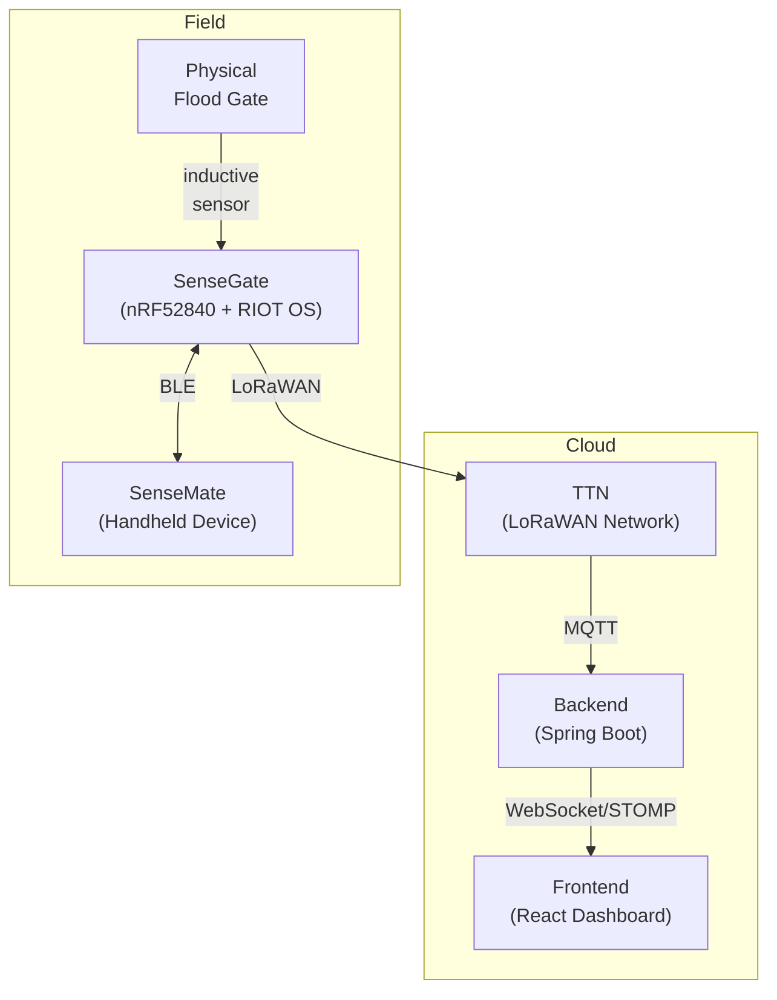

# 01 -- Overview

## What is SenseGate?

**SenseGate** is the embedded sensor node that is mounted directly on a physical flood gate. Its job is simple: continuously monitor whether the gate is **open** or **closed**, and report that state to the cloud via LoRaWAN wireless communication.

SenseGate runs on **RIOT OS**, an open-source operating system designed for tiny, battery-powered Internet of Things (IoT) devices. The hardware is an **nRF52840** microcontroller made by Nordic Semiconductor.

## System Context

SenseGate is one of three tiers in the BAI5 floodgate monitoring system:

**Data flow step by step:**

1. The **inductive sensor** on SenseGate detects the gate's physical position.
2. SenseGate timestamps the reading with an **HLC** (Hybrid Logical Clock), packages it using **CBOR**, and signs it using **COSE** (cryptographic signature).
3. The signed data is transmitted via **LoRaWAN** to **The Things Network (TTN)**.
4. TTN forwards the message via **MQTT** to the **Spring Boot backend**.
5. The backend processes it and pushes real-time updates to the **React frontend dashboard** via **WebSocket/STOMP**.

Additionally, SenseGate can communicate with **SenseMate** handheld devices over **BLE** (Bluetooth Low Energy) when a field worker is nearby.

## Hardware

| Component | Pin / Location | Purpose |
|-----------|----------------|---------|
| **nRF52840 MCU** | Main board (Seeed Studio XIAO nRF52840 Sense) | The "brain" -- runs the firmware |
| **Inductive sensor** | GND (ground) / A5 (analog pin) | Detects metal proximity to determine gate open/closed |
| **Red LED** | On-board | Indicates gate state: **ON = closed**, **OFF = open** |
| **Blue LED** | On-board | Indicates update progress: **ON = update in progress** |

The inductive sensor works without physical contact. When a metal part of the gate comes near the sensor, the sensor's output voltage changes. SenseGate measures this voltage through the **ADC** (Analog-to-Digital Converter) on pin **A5** to decide whether the gate is open or closed.

> **Note:** Pin assignments differ between board revisions. The current v2 board (XIAO) uses `GPIO_PIN(0, 9)` for the limit switch input and `GPIO_PIN(0, 4)` for sensor power control (`nodes/firmware/applications/senseGate/main.c:50-58`).

## LED Behavior During Operation

1. Connect power to the device.
2. Wait until the **blue LED** turns on (this means the system is initialized and ready).
3. **Red LED**: ON = gate closed, OFF = gate open.
4. **Blue LED**: ON while an update is being processed and transmitted. It turns OFF when transmission completes. Any sensor input restarts a timer -- when the timer expires, the blue LED comes on and the update is sent.
