# 03 -- Architecture

This section explains the high-level code structure of the SenseGate firmware -- which files exist, what each one does, and how they connect.

## Application File Overview

All application source files live under `nodes/firmware/applications/senseGate/`.

| File | Purpose |
|------|---------|
| `main.c` | Entry point: initializes everything and runs the main loop. |
| `gate_observer.c` | Gate state machine: reads sensors, concludes open/closed, fires change callbacks. |
| `registerInterrupt.c` | Legacy interrupt handler for sensor input (currently superseded by gate_observer). |
| `errorHandling.c` | Placeholder for sensor health checks. |
| `credential_manager_setup.c` | Loads cryptographic keys (root key, own private/public keys, trusted peers). |
| `storage_setup.c` | Initializes persistent storage (emulated RAM-based flash memory). |
| `tables_setup.c` | Initializes the "tables" data layer: storage, encryption (COSE), and HLC clock. |
| `personalization.c` | Defines the global `self_node_id` variable (populated from identity store). |
| `include/personalization.h` | Exposes `self_node_id` to other files. |
| `include/gate_observer.h` | Data types and function declarations for gate_observer. |
| `include/errorHandling.h` | Function declaration for door health check. |
| `include/registerInterrupt.h` | Function declaration for interrupt init. |
| `Makefile` | Build configuration: board, modules, compiler flags. |

## Component Tree

The following diagram shows how the main application connects to sensor logic and custom modules:

```mermaid
graph TD
    main.c["main.c\n(entry point / main loop)"] --> GO["gate_observer.c\n(gate state machine)"]
    main.c --> CMS["credential_manager_setup.c\n(crypto key loading)"]
    main.c --> SS["storage_setup.c\n(flash storage init)"]
    main.c --> TS["tables_setup.c\n(data layer + HLC + COSE)"]
    main.c --> ML["mate_lorawan\n(LoRaWAN communication)"]
    main.c --> MB["mate_ble\n(BLE communication)"]

    GO --> IS["inductive_sensor\n(sensor driver)"]
    GO --> RI["registerInterrupt.c\n(legacy interrupt handler)"]
    GO --> EH["errorHandling.c\n(health checks)"]

    CMS --> CM["credential_manager\n(key management)"]
    CMS --> FSS["flashdb_store_service\n(flash key-value DB)"]
    CMS --> IS2["identity_store\n(stored identities)"]

    TS --> HLC["hlc_ztimer + hybrid_logical_clock\n(HLC timestamping)"]
    TS --> COSE["cose_crypto_service\n(COSE sign/verify)"]
    TS --> FSS2["flashdb_store_service\n(flash key-value DB)"]
    TS --> TAB["tables\n(record storage + sync)"]

    ML --> CBOR["cbor_serialization\n(data packaging)"]
    ML --> TAB2["tables\n(record queries)"]

    MB --> CBOR2["cbor_serialization\n(data packaging)"]
    MB --> TAB3["tables\n(record queries)"]
```



## How RIOT OS Is Integrated

RIOT OS is included as a git submodule at `nodes/firmware/RIOT/`. The Makefile in SenseGate includes the RIOT build system:

```makefile
include $(RIOTBASE)/Makefile.include   # nodes/firmware/applications/senseGate/Makefile:111
```

### Custom Board Support

The application supports two board variants (`nodes/firmware/applications/senseGate/main.c:47-54`):

| Board | Limit Switch Pin | Status |
|-------|-----------------|--------|
| `adafruit-feather-nrf52840-sense` (v1) | `GPIO_PIN(0, 5)` | Legacy |
| `seeedstudio-xiao-nrf52840-sense` (v2) | `GPIO_PIN(0, 9)` | **Default** |

The default board is set in the Makefile (`nodes/firmware/applications/senseGate/Makefile:8`):

```makefile
BOARD ?= seeedstudio-xiao-nrf52840-sense
```

### Loaded RIOT Drivers and Modules

The Makefile pulls in RIOT OS modules for hardware access and system services (`nodes/firmware/applications/senseGate/Makefile:23-100`):

| Module | Category | Purpose |
|--------|----------|---------|
| `periph_gpio` | GPIO | Read/write digital pins (sensor, LEDs) |
| `periph_gpio_irq` | GPIO IRQ | Hardware interrupts on pin changes |
| `ztimer` / `ztimer_msec` / `ztimer_sec` | Timer | Millisecond and second timers |
| `event` / `event_thread*` / `event_timeout` | Event System | RIOT's event loop framework |
| `shell` / `shell_cmds_default` / `ps` | Debug | Interactive shell for debugging |
| `vfs_default` / `vfs_util` | Filesystem | Virtual filesystem for flash storage |
| `mtd_emulated` | Storage | RAM-backed emulated flash memory |
| `flashdb_mtd` or `flashdb_vfs` | Storage | FlashDB key-value database (MTD or VFS backed) |

## Custom Modules

Custom modules live in `nodes/firmware/custom-modules/`. Each module has its own directory with a Makefile, source code, and headers.

### Modules Used by SenseGate

| Module | Path | Purpose |
|--------|------|---------|
| **inductive_sensor** | `custom-modules/inductive_sensor/` | Driver for the inductive proximity sensor on ADC pin A5. Provides power control, sampling, and voltage conversion. |
| **gate_observer** | *(built into senseGate app)* | State machine that reads all sensors and concludes whether the gate is open or closed. Handles debouncing. |
| **mate_lorawan** | `custom-modules/mate_lorawan/` | LoRaWAN communication: OTAA join, periodic uplink, downlink reception. Uses CBOR for data packaging and works with the tables module. |
| **mate_ble** | `custom-modules/mate_ble/` | BLE communication: advertises presence, exchanges records with SenseMate handheld devices over Bluetooth. |
| **cbor_serialization** | `custom-modules/cbor_serialization/` | Encodes and decodes records into compact CBOR binary format for transmission over LoRaWAN and BLE. |
| **cose_crypto_service** | `custom-modules/cose_crypto_service/` | Cryptographically signs outgoing records and verifies signatures on incoming records using COSE (CBOR Object Signing and Encryption). |
| **credential_manager** | `custom-modules/credential_manager/` | Stores and retrieves cryptographic keys (Ed25519 key pairs) so other modules can sign and verify data. |
| **tables** | `custom-modules/tables/` | Distributed record storage: stores gate reports, observations, encounters, commands, and jobs. Handles record merging with conflict resolution via HLC. |
| **hlc_ztimer** | `custom-modules/hlc_ztimer/` | Provides a ztimer-based physical clock source for the Hybrid Logical Clock. |
| **hybrid_logical_clock** | `custom-modules/hybrid_logical_clock/` | HLC implementation: provides causally-ordered timestamps combining physical time with a logical counter. |
| **identity_store** | `custom-modules/identity_store/` | Manages node identity files on flash storage: reads own keys, root key, LoRaWAN credentials, and peer public identities. |
| **flashdb_store_service** | `custom-modules/flashdb_store_service/` | Key-value database layer using FlashDB (on top of emulated flash), used by both credential_manager and tables. |
| **store_service** | `custom-modules/store_service/` | Abstraction layer for key-value storage, so tables and credential_manager work with any storage backend. |
| **mate_types** | `custom-modules/mate_types/` | Shared constants and type definitions shared between SenseMate and SenseGate firmware. |

## Makefile Explanation

The Makefile at `nodes/firmware/applications/senseGate/Makefile` controls the entire build.

### Key Variables

```makefile
APPLICATION = SenseGate                         # line 2:  application name
BOARD ?= seeedstudio-xiao-nrf52840-sense        # line 8:  default target board
EXTERNAL_MODULE_DIRS += $(PROJECT_BASE)/custom-modules  # line 12: where custom modules live
```

### Device Type

```makefile
RIOT_CONFIG_DEVICE_TYPE = DEVICE_TYPE_GATE      # line 17: hardcoded, cannot be overwritten
CFLAGS += -DRIOT_CONFIG_DEVICE_TYPE=$(RIOT_CONFIG_DEVICE_TYPE)  # line 42: passed to compiler
```

This constant tells the system what kind of device this firmware is. It affects behavior in the `tables` module (e.g., which record types are relevant). The possible values are defined in `nodes/firmware/custom-modules/tables/include/tables/types.h:17-27`:

- `DEVICE_TYPE_GATE` = 0
- `DEVICE_TYPE_SENSEMATE` = 1
- `DEVICE_TYPE_SERVER` = 2

### Sensor Configuration

```makefile
CFLAGS += -DGATE_OBSERVER_DISTANCE_SENSOR_CNT=0  # line 46: no distance sensors, only limit switches
```

SenseGate uses exactly **one** limit switch sensor (default in gate_observer.h). Distance sensors are disabled.

### Storage Configuration

```makefile
# RAM-backed emulated flash: 16 sectors x 64 pages x 64 bytes = 64 KB
CFLAGS += -DRAM_MTD_SECTOR_COUNT=\(16\)   # line 58
CFLAGS += -DRAM_MTD_PAGE_PER_SECTOR=\(64\) # line 59
CFLAGS += -DRAM_MTD_PAGE_SIZE=\(64\)       # line 60
```

This creates a 64 KB emulated flash storage in RAM. On a real production device, this would be replaced by actual flash memory. The `USE_FLASHDB_ON_VFS` setting (`line 21`) controls whether the FlashDB database sits on a filesystem (littlefs2) or accesses the flash directly.

### Thread Stack Sizes

```makefile
CFLAGS += -DEVENT_THREAD_HIGHEST_STACKSIZE=6*1024  # line 43
CFLAGS += -DEVENT_THREAD_MEDIUM_STACKSIZE=6*1024    # line 44
CFLAGS += -DTHREAD_STACKSIZE_MAIN=THREAD_STACKSIZE_LARGE*2  # line 48
```

These allocate memory for RIOT OS threads. The main application thread gets extra-large stack space to accommodate the deep call chains through the tables and crypto modules.
