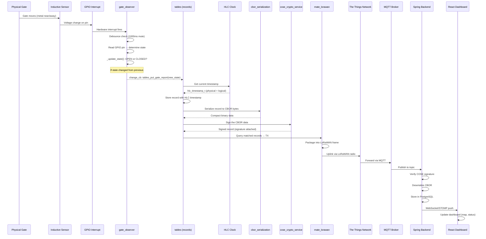

# 04 -- Sensor Logic

This section explains how SenseGate detects the gate position, processes the data, and securely sends it to the cloud.

## Inductive Sensor

The **inductive sensor** is a metal detector that works without physical contact. When a metal part of the flood gate comes close to the sensor, the sensor's electromagnetic field changes, which alters its output voltage.

SenseGate does not use the inductive sensor directly as a binary switch. Instead, it uses a **limit switch** approach: the sensor's output is treated as a digital signal on a GPIO pin (`nodes/firmware/applications/senseGate/main.c:50-51`):

```c
// v2 board (XIAO):
#define REED_0_PIN_0 GPIO_PIN(0, 9)
```

The sensor is connected to **GND** (ground) and **A5** (analog pin). A separate GPIO pin (`GPIO_PIN(0, 4)`) controls power to the sensor, allowing it to be turned off between readings to save energy (`nodes/firmware/applications/senseGate/main.c:56`).

The `inductive_sensor` custom module driver (`nodes/firmware/custom-modules/inductive_sensor/inductive_sensor.c`) provides:

- **Power control**: Turn the sensor on/off via GPIO (`inductive_sensor_power()`)
- **Sampling**: Read the raw ADC value (`inductive_sensor_sample()`)
- **Voltage conversion**: Convert raw samples to millivolts (`inductive_sensor_sample2adc_voltage()`)

## Gate Observer Module

The `gate_observer.c` module is the heart of the sensor logic. It is a **state machine** that reads sensors, determines whether the gate is open or closed, and notifies the rest of the system when the state changes.

### Sensor Types

The gate observer supports two kinds of sensors (`nodes/firmware/applications/senseGate/include/gate_observer.h:30-52`):

1. **Limit switches** (digital): A GPIO pin that reads HIGH or LOW depending on gate position.
2. **Distance sensors** (analog): A sensor that reports a numeric distance, with a configurable min/max range for "closed."

SenseGate uses only **limit switches** (distance sensors are configured to count 0 with `GATE_OBSERVER_DISTANCE_SENSOR_CNT=0` in the Makefile, `nodes/firmware/applications/senseGate/Makefile:46`).

### State Machine Logic

The core logic is in `_update_state()` at `nodes/firmware/applications/senseGate/gate_observer.c:8-42`:

```
For each limit switch:
    Read GPIO pin → is gate closed?
    Count votes

If ALL sensors say "closed" → GATE_STATE_CLOSED
Otherwise                   → GATE_STATE_OPEN

If state changed from previous → fire change_cb(new_state)
```

Currently, since there's only one sensor, the rule simplifies to: "the gate is closed if and only if the single limit switch says closed."

### Debouncing

Mechanical switches (and sensors) can "bounce" -- produce rapid on/off signals when the gate is moving. The gate observer handles this with **debouncing** (`nodes/firmware/applications/senseGate/gate_observer.c:44-60`):

1. When a limit switch signal arrives, the handler checks if debouncing is active (`ls_event_muted`).
2. If not muted, it evaluates the new state and then **mutes** further events for 1000 ms (configured by `GATE_OBSERVER_LIMITSWITCH_DEBOUNCE_MS` in `nodes/firmware/applications/senseGate/include/gate_observer.h:21`).
3. After 1000 ms, a timeout event re-enables event processing.

### State Change Callback

When the gate state changes, `gate_observer_state_change_cb()` in main.c is called (`nodes/firmware/applications/senseGate/main.c:103-118`). It does two things:

1. **Stores the new state** in the tables system: `tables_put_gate_report(tables, new_state)`.
2. **Notifies nearby SenseMate devices** via BLE: sends a query message to the BLE transmission thread.

## Error Handling

The error handling module (`nodes/firmware/applications/senseGate/errorHandling.c`) is currently a **placeholder**. The `door_health_check()` function is defined (`nodes/firmware/applications/senseGate/include/errorHandling.h:4-8`) but its logic is commented out. It was intended to validate sensor readings (are they actually 0 or 1?) and flag `INVALID_DOOR_STATUS` errors.

## End-to-End Flow: Sensor to Cloud

The sequence below traces a physical gate movement all the way to the web dashboard:



## LoRaWAN Communication

The **mate_lorawan** module (`nodes/firmware/custom-modules/mate_lorawan/`) handles all long-range wireless communication.

### How It Starts

In `main()`, after initialization, LoRaWAN is started with:

```c
int lorawanstarted = mate_lorawan_start(tables);  // main.c:200
```

`mate_lorawan_start()` creates a dedicated event thread that:

1. Detects the LoRaWAN radio interface.
2. Performs **OTAA (Over-The-Air Activation)** join to authenticate with TTN using the credentials provisioned by the identity manager.
3. Enters an event loop, periodically checking the tables module for new records to transmit.

### Data Packaging

When a gate report record is ready to send, the module:
1. Queries the tables module for matching records of type `RECORD_GATE_REPORT`.
2. Serializes the record to CBOR format (compact binary).
3. Attaches the COSE cryptographic signature (proving authenticity).
4. Packages the result into a LoRaWAN uplink frame and transmits it.

### Known Issues

The mate_lorawan README (`nodes/firmware/custom-modules/mate_lorawan/README.md:29`) notes a known bug: **downlink reception can crash SenseMate and SenseGate**, likely due to thread priority conflicts.

## CBOR Serialization

**CBOR** (Concise Binary Object Representation, RFC 8949) is like a binary version of JSON. It's used because:

- LoRaWAN messages are very small (typically < 50 bytes of payload).
- Every byte counts -- CBOR is much more compact than text formats.
- Devices are battery-powered -- smaller messages use less radio energy.

The `cbor_serialization` module (`nodes/firmware/custom-modules/cbor_serialization/`) handles encoding and decoding. Each message has a defined structure (`nodes/firmware/custom-modules/cbor_serialization/README.md:9-59`):

```
[version, message_type, record_header, record_data, signature]
```

Message types supported:
- **Single report** (`0x01`): A gate state report from SenseGate.
- **ID request** (`0x02`): Request for identity information (used in BLE pairing).
- **ID response** (`0x03`): Response with identity information.

## COSE Signing

**COSE** (CBOR Object Signing and Encryption, RFC 9052) provides digital signatures for CBOR data. Every record stored in the tables module is cryptographically signed using Ed25519 (a fast elliptic curve algorithm).

The flow is:
1. A record is created (e.g., gate state is "closed").
2. The `cose_crypto_service` module signs the record using the device's **private key** (`nodes/firmware/custom-modules/cose_crypto_service/include/cose_crypto_service.h`).
3. The signature is attached to the record.
4. When the backend receives the record, it verifies the signature using the device's **public key** (provisioned earlier).

This ensures that:
- Only legitimate devices can create records (authentication).
- Records cannot be modified in transit (integrity).
- A compromised device cannot forge records from another gate.

## HLC (Hybrid Logical Clock)

The **Hybrid Logical Clock** solves the problem of **ordering events across distributed devices** that don't have perfectly synchronized clocks.

### The Problem

Imagine two gates both report "closed" at roughly the same time. Which report happened first? If clocks are even slightly out of sync, you can't trust the timestamps.

### How HLC Solves It

An HLC timestamp consists of two parts (`nodes/firmware/custom-modules/hybrid_logical_clock/include/hybrid_logical_clock.h:30-33`):

- **Physical**: The wall-clock time (in seconds, from the device's ztimer).
- **Logical**: A counter that increments when clocks might disagree.

The rule is simple:
- Normally, use the physical clock time and reset the logical counter.
- If a message arrives with a physical timestamp that is **ahead** of our clock, adopt the remote physical time and increment the logical counter.
- If a message arrives with the **same** physical time as ours, keep the larger logical counter + 1.

This guarantees **causal ordering**: if event A happens before event B (in the real world), the HLC timestamp of A will always be less than the HLC timestamp of B.

The `hlc_ztimer` module (`nodes/firmware/custom-modules/hlc_ztimer/`) provides the physical clock source using RIOT's ztimer. The `hybrid_logical_clock` module (`nodes/firmware/custom-modules/hybrid_logical_clock/`) contains the HLC algorithm implementation.

## Main Loop

The main loop in `main.c:216-234` runs once per second:

```c
while(1) {
    ztimer_sleep(ZTIMER_MSEC, 1000);            // wait 1 second
    if (timeToUpdateTable == TIME_PERIOD_TABLE_UPDATE) {  // every 30 seconds
        gate_state_t current = gate_observer_get_state(&observer, &obs_state);
        tables_put_gate_report(tables, current);  // store new record
        timeToUpdateTable = 0;
    } else {
        timeToUpdateTable++;
    }
}
```

Every **30 seconds** (`TIME_PERIOD_TABLE_UPDATE` = 30, `nodes/firmware/applications/senseGate/main.c:44`), the firmware:
1. Reads the current gate state from the observer.
2. Creates a new record in the tables system (timestamped with HLC, stored, signed with COSE).
3. The `mate_lorawan` event thread picks up new records and transmits them via LoRaWAN.

Additionally, state changes trigger an **immediate** record via the callback (no need to wait for the periodic timer).
