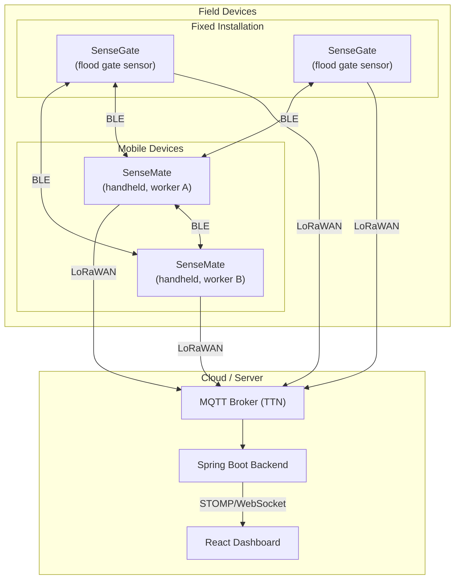

# 01 — SenseMate Overview

## What is SenseMate?

SenseMate is a **handheld device** carried by field workers who inspect flood gates. It connects wirelessly to nearby flood gate sensors (SenseGates) and shows their status on a small OLED screen. If the worker observes a different gate state than what the sensor reports, they can record an observation directly on the device.

In short: **SenseMate is the bridge between the worker in the field and the digital monitoring system.**

## System Context

The BAI5 floodgate monitoring system has three tiers:

**How it works:**

1. **SenseGate** — a fixed sensor node mounted on each flood gate. It detects whether the gate is open or closed and broadcasts this information via BLE and LoRaWAN.
2. **SenseMate** — a portable device a field worker carries. It scans for nearby SenseGates via BLE, displays their status, lets the worker confirm or override the reading, and can relay data to the server through LoRaWAN.
3. **Server** — the cloud backend that receives all sensor data and worker observations, making them available on a web dashboard.

## Hardware

SenseMate runs on the **nRF52840** microcontroller (MCU), specifically the **Seeed Studio XIAO nRF52840 Sense** board (v2). The board was chosen because it includes built-in BLE (Bluetooth 5) and has enough RAM/flash for the LVGL graphics library.

| Component | Pin (v2 board) | Purpose |
|-----------|---------------|---------|
| OLED Display (SSD1306) | I2C bus, address `0x3c` | 128x64 pixel monochrome screen for UI |
| Buzzer | `GPIO_PIN(0, 8)` — PWM channel 0 | Audio feedback: startup melodies, alert sounds |
| Vibration motor | `GPIO_PIN(0, 10)` | Haptic feedback when receiving data |
| Thumbwheel (Up) | `GPIO_PIN(0, 19)` | Navigate UI up |
| Thumbwheel (Select) | `GPIO_PIN(1, 1)` | Select/confirm in UI |
| Thumbwheel (Down) | `GPIO_PIN(0, 9)` | Navigate UI down |

## What a Field Worker Can Do with SenseMate

- **See nearby gates**: The dashboard shows how many SenseGates and other SenseMates are nearby.
- **Browse gate states**: The menu lists all known gates with their current open/closed status.
- **Record observations**: If the worker sees a gate is in a different state than reported, they can record a correction.
- **Receive alerts**: Audio/vibration feedback when new data arrives via BLE or LoRaWAN.
- **Adjust settings**: Set the minimum RSSI (signal strength) threshold for filtering visible devices.

## Key Technologies at a Glance

| Technology | Used For |
|-----------|----------|
| **RIOT OS** | The operating system that manages threads, timers, GPIO, and all hardware |
| **LVGL** | Drawing the user interface on the OLED screen |
| **PWM** | Producing different tones on the buzzer |
| **BLE (NimBLE)** | Short-range communication with SenseGates and other SenseMates |
| **LoRaWAN** | Long-range communication to the cloud via TTN |
| **CBOR + COSE** | Efficient binary encoding and cryptographic signing of messages |
| **FlashDB** | Persistent storage for keys, identities, and sensor data |
| **HLC** | Hybrid Logical Clock for ordering events across devices |
