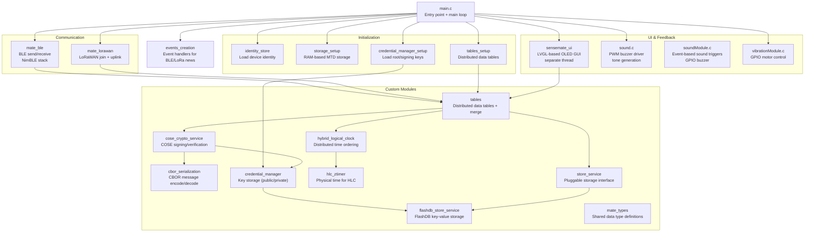

# 03 — Architecture

## Application Structure

The SenseMate application (`nodes/firmware/applications/senseMate/`) is a RIOT OS application written in C. It uses a modular design where the `main.c` file initializes subsystems and then enters a main event loop.

### Component Hierarchy



### Startup Sequence (`main.c:235-341`)

The `main()` function at `nodes/firmware/applications/senseMate/main.c:235` follows this sequence:

1. **Load identity** — `identity_store_init()` reads the device's private key, signed public identity, and LoRaWAN keys from flash (`main.c:236`).
2. **Initialize UI thread** — `sensemate_ui_init()` starts the LVGL graphics thread (`main.c:243`).
3. **Wait 5 seconds** — a `ztimer_sleep(5000ms)` is needed before credential manager setup (a known workaround, `main.c:250`).
4. **Set up storage** — `storage_setup_ram_mtd()` initializes an emulated RAM-based MTD (8 KB) for FlashDB and tables (`main.c:251`).
5. **Load credentials** — `credential_manager_setup()` loads the root public key and private key into FlashDB for signing/verification (`main.c:254`).
6. **Initialize tables** — `tables_setup()` creates the distributed data table context with the store service, crypto service, and HLC (`main.c:257`).
7. **Configure sound** — `sound_init()` initializes the PWM buzzer (`main.c:263`).
8. **Configure vibration** — `init_vibration_module()` sets up the GPIO pin for the motor (`main.c:265`).
9. **Create event thread** — `init_event()` starts a thread for handling incoming BLE/LoRaWAN news events (`main.c:270`).
10. **Start shell** — A debug shell runs in a low-priority background thread (`main.c:272-280`).
11. **Start BLE** — `mate_ble_init()` initializes the BLE stack (NimBLE) for scanning and connecting (`main.c:289`).
12. **Start LoRaWAN** — `mate_lorawan_start()` begins the TTN join procedure (`main.c:299`).
13. **Enter main loop** — Polls gate/device counts every second, updates the UI when things change (`main.c:306-337`).

### Source File Overview

| File | Purpose |
|------|---------|
| `main.c` | Application entry point, startup sequence, main polling loop |
| `personalization.c` | Global variable `self_node_id` — the device's 4-byte identity (`personalization.c:3`) |
| `storage_setup.c` | Symlink to `../senseGate/storage_setup.c`. Sets up RAM-based emulated MTD flash storage |
| `credential_manager_setup.c` | Symlink to `../senseGate/credential_manager_setup.c`. Loads root & private keys into FlashDB |
| `tables_setup.c` | Symlink to `../senseGate/tables_setup.c`. Creates the tables context with store/crypto/HLC |
| `events_creation.c` | Defines event handlers for incoming BLE and LoRaWAN messages. Triggers vibration + sound |
| `sound.c` | Low-level PWM buzzer driver — plays tones by matching PWM frequencies |
| `soundModule.c` | Higher-level sound module — event-driven interface for playing predefined sounds via GPIO |
| `vibrationModule.c` | GPIO control for the vibration motor |
| `sensemate_ui/` | LVGL-based UI subsystem (see `04-ui-subsystem.md`) |

## How RIOT OS is Integrated

### Board Configuration

The application uses RIOT OS's board abstraction layer. The board is set at the top of the Makefile:

```makefile
# nodes/firmware/applications/senseMate/Makefile:7
BOARD ?= seeedstudio-xiao-nrf52840-sense
```

Board-specific differences (v1 vs v2) are handled via `#ifdef` preprocessor directives throughout the code. For example, GPIO pin assignments differ between the two boards (`sound.c:49-55`, `vibrationModule.c:8-14`).

### Loaded RIOT Drivers and Modules

The Makefile loads numerous RIOT OS modules (`Makefile:28-81`):

| RIOT Module | Purpose |
|------------|---------|
| `periph_gpio` + `periph_gpio_irq` | Control physical pins (buzzer, vibration, buttons) |
| `periph_pwm` | PWM output for buzzer frequency generation (required feature, `Makefile:123`) |
| `periph_i2c` | I2C bus for OLED display communication |
| `ztimer` + `ztimer_msec` + `ztimer_usec` | High-resolution timers for delays and timeouts |
| `event` + `event_thread` + `event_timeout` | RIOT's event system for inter-thread communication |
| `shell` + `shell_cmds_default` | Debug command-line interface over serial |
| `mtd_emulated` | Emulates flash memory in RAM (development/testing) |
| `flashdb_mtd` | FlashDB adapter for direct MTD access (without filesystem) |
| `vfs_default` + `vfs_util` | Virtual filesystem for identity storage |
| `ps` | Process status command |

### External Packages

| Package | Purpose |
|---------|---------|
| `u8g2` | Universal graphics library for SSD1306 OLED |
| `lvgl` | Light and Versatile Graphics Library for the UI |
| `lvgl_contrib` + sub-widgets | Additional LVGL widgets (slider, chart, list, tileview, flex layout, mono theme) |

### Memory Configuration

RIOT's thread stack sizes are configured in the Makefile (`Makefile:58-59, 74-75`):

- `EVENT_THREAD_HIGHEST_STACKSIZE=1024*3` (3 KB)
- `EVENT_THREAD_MEDIUM_STACKSIZE=1024*3` (3 KB)
- `THREAD_STACKSIZE_MAIN=2*4096` (8 KB)
- `THREAD_STACKSIZE_UI=2*4096` (8 KB)
- `LV_MEM_SIZE=1024*16` (16 KB heap for LVGL)

The RAM-based storage uses an 8 KB emulated MTD device (`Makefile:89-91`):
- 16 sectors x 64 pages/sector x 64 bytes/page = **65,536 bytes** of emulated flash (used for FlashDB)

## Custom Modules — What They Do

All custom modules live in `nodes/firmware/custom-modules/`.

| Module | What It Does |
|--------|-------------|
| **mate_ble** | Wraps NimBLE (RIOT's BLE stack). Handles scanning for BLE advertisements from SenseGates, receiving CBOR-encoded messages, and sending data back. Maintains a TX thread and an RX event queue. |
| **mate_lorawan** | Manages LoRaWAN connectivity via TTN. Handles the join procedure and periodic uplink of table data to the cloud server. |
| **cbor_serialization** | Encodes and decodes records and identities into compact CBOR binary format. Supports gate reports, observations, commands, jobs, and identity requests/responses. |
| **cose_crypto_service** | Signs and verifies records using the COSE (RFC 8152) standard. Each record gets a cryptographic signature so receivers can verify its authenticity. |
| **credential_manager** | A simple key-value store for cryptographic keys. Stores public keys and private keys identified by a Key ID (KID). |
| **crypto_service** | Abstract interface for signing and verification. The COSE crypto service implements this interface. |
| **flashdb_store_service** | Implements the `store_service` interface using FlashDB — a lightweight embedded key-value database. Used for persistent storage of table records and credentials. |
| **identity_store** | Reads and writes device identity data (keys, signed identities, LoRaWAN keys) from/to the VFS filesystem on flash. |
| **hybrid_logical_clock (HLC)** | Provides a Hybrid Logical Clock — a mechanism for globally ordering events across devices that don't share a wall clock. Combines physical time (from ztimer) with a logical counter. |
| **hlc_ztimer** | Provides the physical time source for the HLC by wrapping a RIOT ztimer stopwatch. |
| **tables** | The core data layer. Manages distributed tables for gate reports, gate observations, gate encounters, mate encounters, and jobs. Supports merging records received from other devices via BLE/LoRaWAN. |
| **tables_shell** | RIOT shell commands for inspecting and debugging the tables module. |
| **store_service** | A pluggable storage abstraction. Different backends (FlashDB, RAM, filesystem) can implement the same interface. |
| **mate_types** | Common C type definitions shared across applications: gate states, job states, timestamps, and composite structures. |
