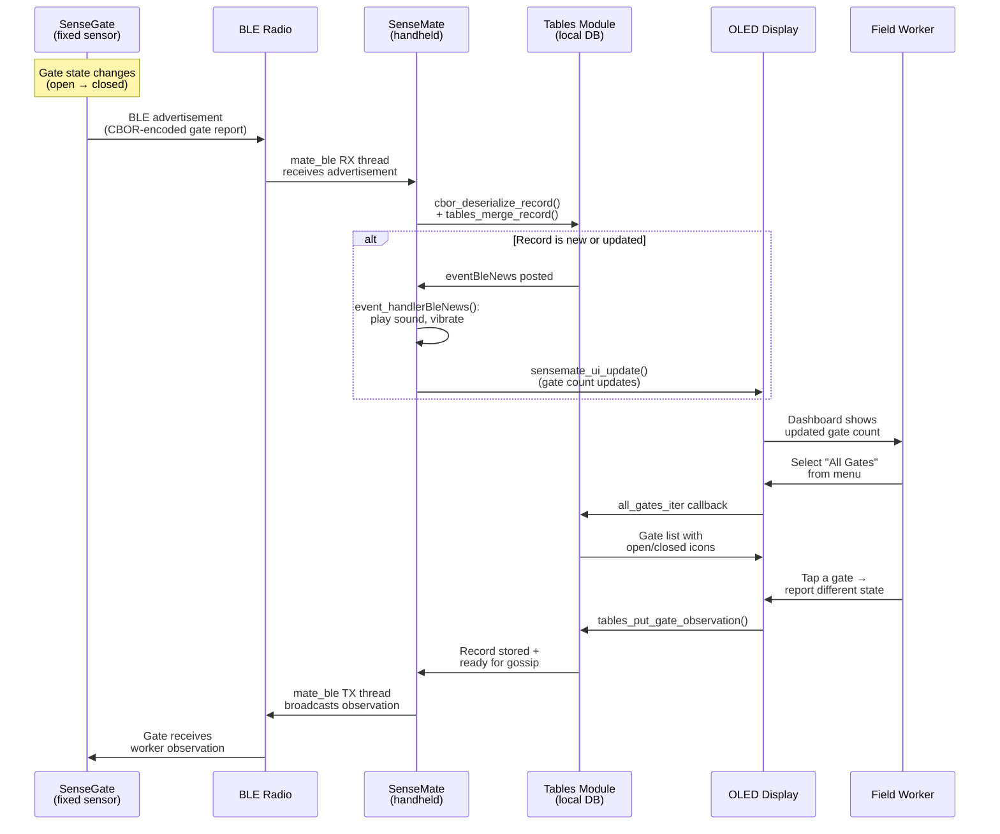

# 05 — Communication

## Overview

SenseMate communicates over two wireless channels:

1. **BLE (Bluetooth Low Energy)** — short-range communication with nearby SenseGates and other SenseMates
2. **LoRaWAN** — long-range communication to the cloud server via The Things Network (TTN)

All messages are encoded in **CBOR** (a binary JSON alternative) and cryptographically signed using **COSE** (a signing standard for CBOR). The data layer is built on the **tables** module which handles record creation, storage, merging, and querying.

## BLE Communication (`mate_ble`)

The `mate_ble` custom module at `nodes/firmware/custom-modules/mate_ble/` wraps the NimBLE stack (RIOT's BLE implementation).

### Initialization

Called from the main startup sequence (`main.c:289`):

```c
kernel_pid_t ble_tx_pid = KERNEL_PID_UNDEF;
if (BLE_SUCCESS == mate_ble_init(tables, &ble_tx_pid)) {
    puts("Ble init complete");
}
```

`mate_ble_init()` takes a pointer to the initialized `tables` context and optionally returns the TX thread's PID. It:
- Sets up BLE advertisement scanning
- Creates an RX thread with an event queue for incoming data
- Creates a TX thread for outgoing data
- Registers table memos (callbacks) so that when new records match certain queries, they are broadcast

### How BLE Data Flows



### BLE Message Structure

BLE advertisements carry CBOR-encoded payloads up to a configured maximum:

```c
// nodes/firmware/custom-modules/mate_ble/include/mate_ble.h:38-42
#define MATE_BLE_ADV_PKT_BUFFER_SIZE    (300)
#define MATE_BLE_SIGNING_DATA_SIZE      (88)
#define MATE_BLE_MAX_PAYLOAD_SIZE       (MATE_BLE_ADV_PKT_BUFFER_SIZE)  // 300 bytes
#define MATE_BLE_MAX_CBOR_PACKAGE_COUNT (10)
```

The payload is split into: CBOR message data (up to 212 bytes) + COSE signature (88 bytes). Large messages can be split across multiple BLE packets (up to 10).

### Receive Filtering

Incoming BLE messages are matched against table queries. Only records that the tables module determines are relevant (newer timestamp, different writer, etc.) trigger events. This avoids showing duplicate or outdated information.

## CBOR Serialization (`cbor_serialization`)

CBOR (RFC 7049) is a binary serialization format — think of it as "binary JSON" that uses fewer bytes. It's ideal for low-power radio protocols where every byte counts.

### Message Types

```c
// nodes/firmware/custom-modules/cbor_serialization/include/cbor_serialization.h:44-51
typedef enum {
    MESSAGE_SINGLE_REPORT = 1,  // Contains one record (gate report, observation, etc.)
    MESSAGE_ID_REQUEST    = 2,  // Request a device's signed identity
    MESSAGE_ID_RESPONSE   = 3   // Respond with a signed identity
} message_type_t;
```

### Record Types

| Record Type | Contains | Written By |
|------------|----------|-----------|
| `RECORD_TYPE_GATE_REPORT` | Gate state (open/closed) | SenseGate sensor |
| `RECORD_TYPE_GATE_OBSERVATION` | Gate state + observed gate ID | SenseMate (worker observation) |
| `RECORD_TYPE_GATE_COMMAND` | Target state + target gate ID | Server (remote command) |
| `RECORD_TYPE_GATE_JOB` | Gate ID + job details | Server (assigned task) |

### Encoding a Record

A record is serialized as a CBOR array with this structure:
```
[message_version, message_type, [record_header, record_data, signature]]
```
Where `record_header` = `[record_type, writer_id, sequence_number, hlc_physical, hlc_logical]`.

Key serialization functions:
- `cbor_serialize_record()` — full record with signature (`cbor_serialization.h:64`)
- `cbor_serialize_record_no_sig()` — record without signature (for pre-signing) (`cbor_serialization.h:77`)
- `cbor_deserialize_record()` — parse a received CBOR message back into a record (`cbor_serialization.h:128`)
- `cbor_serialize_id_reqres()` — identity request/response messages (`cbor_serialization.h:92`)

## COSE Cryptography (`cose_crypto_service`)

COSE (CBOR Object Signing and Encryption, RFC 8152) provides cryptographic signatures for CBOR data. Every record stored in the tables module is signed so that other devices can verify:
- The record was created by the claimed writer (authenticity)
- The record has not been modified in transit (integrity)

### How Signing Works

```c
// nodes/firmware/custom-modules/cose_crypto_service/include/cose_crypto_service.h:15-23
typedef struct {
    uint8_t scratch[2048];            // Working buffer
    mutex_t lock;                     // Thread safety
    cose_sign_enc_t cose_sign_enc;    // COSE signer (create signatures)
    cose_sign_dec_t cose_sign_dec;    // COSE signature decoder
    cose_signature_t cose_signature;  // Signature data
    cose_key_t cose_key;              // Ed25519 key
} cose_crypto_service_context_t;
```

The flow:
1. When the tables module creates a record, it calls `crypto_service_sign()` which uses the device's private key (from `credential_manager`) to produce an Ed25519 signature.
2. The signature is stored as part of the record in FlashDB.
3. When the record is sent over BLE or LoRaWAN, the receiver calls `crypto_service_verify()` to check the signature using the sender's public key (also stored in `credential_manager`).

The signing key is identified by a 4-byte Key ID (KID), which is the device's node ID.

## The Tables Module — Distributed Data Layer

The `tables` module is the heart of the data architecture. It's a **Conflict-free Replicated Data Type (CRDT)** implementation that allows multiple devices to maintain a consistent view of gate states without needing a central coordinator.

### What Tables Stores

| Table | Record Type | Description |
|-------|------------|-------------|
| Gate Reports | `RECORD_GATE_REPORT` | Sensor readings from gate nodes |
| Gate Observations | `RECORD_GATE_OBSERVATION` | Worker's visual confirmation of gate state |
| Gate Encounters | (encounter) | When a device detects a gate via BLE |
| Mate Encounters | `RECORD_MATE_ENCOUNTER` | When a device detects another mate via BLE |
| Gate Commands | `RECORD_GATE_COMMAND` | Server-issued commands |
| Gate Jobs | `RECORD_GATE_JOB` | Tasks assigned to field workers |

Each record carries:
- **Writer ID** — who created it
- **HLC Timestamp** — when it was created (hybrid logical clock)
- **COSE Signature** — proof of authenticity

### Record Merging

When a new record arrives (via BLE or LoRaWAN), `tables_merge_record()` at `tables.h:98` decides whether to keep the new record based on:
1. **Timestamp comparison** (via HLC) — newer records win
2. **Writer priority** — a sensor's own report may have higher authority than a third-party observation
3. **Content comparison** — duplicate records are skipped

If a record is merged, registered callbacks (memos) fire, which can trigger BLE rebroadcast (gossiping) or UI updates.

### How main.c Uses Tables

The main loop queries tables for UI data:

```c
// nodes/firmware/applications/senseMate/main.c:81-101
_get_known_gate_count_by_type(RECORD_GATE_REPORT) // Count of known gates
_get_visible_mate_count(min_visible_rssi)          // Count of nearby mates
_get_known_gate_count_by_type(RECORD_GATE_JOB)     // Count of pending jobs
```

And the UI's gate list callback iterates over gate reports:

```c
// nodes/firmware/applications/senseMate/main.c:142-191
static bool _all_gates_iter(ui_data_element_t *prev) {
    // Initialize table iterator with RECORD_GATE_REPORT query
    // Return each gate's ID, state, and timestamp
}
```

## LoRaWAN Communication (`mate_lorawan`)

SenseMate can join The Things Network (TTN) via LoRaWAN and send data to the cloud server.

### Startup

```c
// nodes/firmware/applications/senseMate/main.c:299
lorawan_started = mate_lorawan_start(tables);
```

### Join Status

```c
// nodes/firmware/applications/senseMate/main.c:321
if(!join_done && mate_lorawan_joined()) {
    ui_state->lora_state = CONNECTED;
    join_done = true;
    updateui = true;
}
```

The join procedure requires the LoRaWAN keys that were provisioned by the identity-manager. These are stored by the `identity_store` module in `VFS_DEFAULT_NVM(0) "/config/loramac/"` (`identity_store.h:14`) and include:
- **JoinEUI** — identifies the TTN join server
- **DevEUI** — unique device identifier
- **AppKey** — application session key

### What Gets Sent

The `mate_lorawan` module sends table records to TTN as uplink messages. The server receives these via MQTT and stores them in the backend database. Similarly, the server can send downlink messages (commands, job assignments) that arrive at SenseMate as `eventNews` events.

## Identity Gossip

When two devices encounter each other via BLE, they exchange **signed public identities**. This is how a SenseMate learns to trust data from a SenseGate it has never seen before:

1. SenseMate scans for BLE advertisements
2. SenseGate's advertisement includes its signed public identity (a `signed_identity_t` with CBOR payload + COSE signature)
3. SenseMate verifies the signature using the root key (provisioned during setup)
4. If valid, the identity is stored in `identity_store` for future reference
5. Now SenseMate can verify records signed by that SenseGate's private key

This "web of trust" model means devices don't need to be pre-configured with every peer's key — they discover and verify each other in the field using a common root of trust.

## Summary: Complete Data Flow

```
                        ┌──────────────┐
                        │   Server     │
                        │ (Spring Boot)│
                        └──────┬───────┘
                               │
                     MQTT (TTN integration)
                               │
                    ┌──────────┴──────────┐
                    │     LoRaWAN (TTN)    │
                    └──────┬──────┬───────┘
                           │      │
              ┌────────────┘      └────────────┐
              │                                │
     ┌────────▼────────┐              ┌───────▼─────────┐
     │   SenseGate     │              │   SenseMate     │
     │                 │              │                 │
     │ [sensor reads]  │───BLE───────►│ [tables merge]  │
     │                 │◄──BLE────────│ [UI updates]    │
     │                 │              │ [worker input]  │
     └─────────────────┘              └───────┬─────────┘
                                              │
                              BLE gossip with other SenseMates
                                              │
                                     ┌────────▼────────┐
                                     │ Other SenseMates │
                                     └─────────────────┘
```
