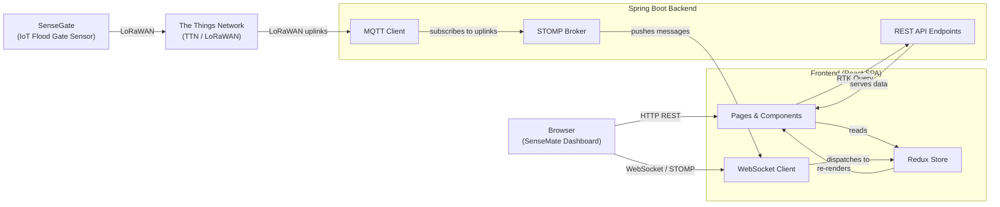

# 01 — Overview

## What is the Frontend?

The SenseMate Frontend is a **web dashboard** for monitoring and controlling IoT-connected flood gates. Municipal water operators use it to:

- See which flood gates are open, closed, or out of service — in real time
- View flood gates on an interactive map of Hamburg
- Send commands to open or close gates remotely
- Dispatch configuration payloads ("downlinks") to IoT devices
- Track a chronological log of all gate activities
- Manage nodes, notifications, and user accounts

The Frontend runs entirely in a web browser (Chrome, Firefox, Safari). It is a **Single Page Application (SPA)** — it loads once and never does a full page reload. All data comes from a Spring Boot backend through REST API calls and a persistent WebSocket connection for real-time updates.

---

## System Context

The Frontend is the outermost layer that humans interact with. Here is how it fits into the overall system:

**Data flow summary:**
1. A physical **SenseGate** device on a flood gate sends its status via **LoRaWAN** to **The Things Network (TTN)**.
2. The **Backend** receives these messages from TTN via **MQTT** and stores/processes them.
3. The **Frontend** fetches gate lists via **REST API** (HTTP requests) and receives live updates via **STOMP over WebSocket**.
4. React components re-render automatically whenever new data arrives.

---

## Technology Stack

| Technology | Role |
|------------|------|
| **React 19** | UI framework — builds interactive user interfaces from reusable components |
| **Vite 8** | Build tool and dev server — fast startup, instant reloads (HMR) |
| **Redux Toolkit** | State management — keeps application-wide data in a central store |
| **RTK Query** | Data fetching — automatically generates API call code with caching |
| **MUI 7** | Component library — pre-styled buttons, dialogs, cards, tables |
| **Leaflet / react-leaflet** | Interactive maps — shows gate locations with color-coded markers |
| **STOMP.js** | Real-time messaging protocol over WebSocket — pushes live updates |
| **react-router-dom v7** | Client-side routing — navigates between pages without reloading |
| **Vitest** | Unit test runner |
| **Playwright** | End-to-end test framework (opens a real browser) |
| **ESLint** | Code quality and style checking |

For a detailed technology breakdown, see the internal docs at `server/frontend/docs/techstack.md`.

---

## Key Features

| Feature | Description | Where (source) |
|---------|-------------|----------------|
| **Dashboard** | Summary cards (total/open/closed/OOS gates), full gate table, activity log | `server/frontend/src/pages/DashboardPage.jsx:1` |
| **Map View** | Interactive Leaflet map centered on Hamburg with color-coded gate markers | `server/frontend/src/pages/MapPage.jsx:1` |
| **Gate Control** | Open/close/OOS status changes, priority management, downlink commands | `server/frontend/src/features/gates/components/StatusTables.jsx:1` |
| **Real-Time Updates** | Live gate status, new activities, and uplink events via STOMP/WebSocket | `server/frontend/src/app/store/middleware/wsMiddleware.js:1` |
| **Activity Log** | Chronological event list showing all gate status changes | `server/frontend/src/features/activities/components/ActivityPanel.jsx:1` |
| **Notifications** | Bell-icon notification popup for user-specific alerts | `server/frontend/src/features/notifications/components/NotificationPopup.jsx:1` |
| **Node Management** | Add/delete nodes, manage root keys (for provisioning IoT devices) | `server/frontend/src/features/nodes/components/NodeTable.jsx:1` |
| **Authentication** | Login/register, JWT cookies, role-based access control (controller vs. viewer) | `server/frontend/src/features/auth/components/ProtectedRoute.jsx:1` |
| **Dark Mode** | Toggle between light and dark themes, persisted in session storage | `server/frontend/src/shared/components/DarkModeToggle.jsx:1` |
| **Guest Dashboard** | Read-only dashboard accessible without logging in | `server/frontend/src/pages/DashboardGuestPage.jsx:1` |

---

## User Roles

| Role | What they can do | Dashboard behavior |
|------|-----------------|--------------------|
| **Controller** | Full access: change gate status, send downlink commands, manage nodes, view logs | Sees `StatusTables` with full control UI |
| **Viewer** | Read-only: view gate statuses, map, and activity log | Sees `StatusTablesView` (read-only table and map) |
| **Guest** | Unauthenticated read-only: guest dashboard at `/dashboard-guest` | Sees a limited read-only view via polling |
