# 03 — Architecture

## Folder Structure

The frontend source code lives in `server/frontend/src/` and follows a **feature-based structure**. Instead of grouping files by technical layer (all components together, all styles together), files are grouped by the *domain* they belong to.

```
src/
├── app/                       # Application shell and global state
│   ├── App.jsx                # Root component — defines all routes
│   ├── App.test.jsx           # Smoketest
│   └── store/                 # Redux store
│       ├── index.js           # Store configuration (combines slices + middleware)
│       ├── api/
│       │   └── api.js         # RTK Query API definition (all endpoints)
│       ├── middleware/
│       │   ├── wsMiddleware.js        # WebSocket/STOMP lifecycle manager
│       │   ├── healthMessageHandler.js  # Validates incoming health messages
│       │   └── healthMessageHandler.test.js
│       └── slices/
│           ├── authSlice.js    # Login state, user info
│           ├── gatesSlice.js   # Uplink event state
│           ├── healthSlice.js  # Device health (battery, shock, voltage)
│           ├── healthSlice.test.js
│           └── uiSlice.js     # Dark mode toggle
├── features/                  # Domain modules — the core of the app
│   ├── activities/
│   │   ├── index.js           # Barrel export
│   │   └── components/
│   │       └── ActivityPanel.jsx
│   ├── auth/
│   │   ├── index.js
│   │   └── components/
│   │       ├── LogoutButton.jsx
│   │       ├── ProtectedRoute.jsx
│   │       └── PublicOnlyRoute.jsx
│   ├── gates/
│   │   ├── index.js
│   │   └── components/
│   │       ├── GateOverviewCard.jsx
│   │       ├── GateMetadataCard.jsx
│   │       ├── ManualStatusDialog.jsx
│   │       ├── StatCards.jsx
│   │       ├── StatusChangedDialog.jsx
│   │       ├── StatusTables.jsx
│   │       ├── StatusTablesView.jsx
│   │       └── gateCardHelpers.js
│   ├── health/
│   │   ├── index.js
│   │   ├── healthUtils.js
│   │   ├── components/
│   │   │   ├── HealthBadge.jsx
│   │   │   └── HealthBadge.test.jsx
│   │   └── hooks/
│   │       └── useHealthForGate.js
│   ├── map/
│   │   ├── index.js
│   │   └── components/
│   │       └── MapView.jsx
│   ├── nodes/
│   │   ├── index.js
│   │   └── components/
│   │       ├── AddNodeDialog.jsx
│   │       ├── DeleteNodeDialog.jsx
│   │       ├── KeyDisplayBox.jsx
│   │       ├── NodeTable.jsx
│   │       └── RootKeySection.jsx
│   ├── notifications/
│   │   ├── index.js
│   │   └── components/
│   │       └── NotificationPopup.jsx
│   └── shell/
│       ├── index.js
│       └── components/
│           ├── AppLayout.jsx
│           ├── Sidebar.jsx
│           └── Topbar.jsx
├── pages/                     # Top-level page components (one per route)
│   ├── DashboardPage.jsx
│   ├── DashboardGuestPage.jsx
│   ├── LoginPage.jsx
│   ├── RegisterPage.jsx
│   ├── MapPage.jsx
│   ├── DevicesPage.jsx
│   ├── NodesPage.jsx
│   ├── AutomationPage.jsx
│   ├── DiagnosticsPage.jsx
│   ├── LogsPage.jsx
│   ├── SettingsPage.jsx
│   ├── GateDetailPage.jsx
│   └── LandingPage.jsx
├── shared/                    # Cross-cutting utilities used by all features
│   ├── components/
│   │   ├── CollapseToggle.jsx
│   │   ├── ComingSoonHero.jsx
│   │   ├── DarkModeToggle.jsx
│   │   ├── EmptyState.jsx
│   │   ├── LoadingCard.jsx
│   │   ├── NotFoundPage.jsx
│   │   ├── SkeletonLoader.jsx
│   │   └── UplinkToast.jsx
│   ├── hooks/
│   │   └── useCopyToClipboard.js
│   ├── styles/
│   │   ├── theme.css
│   │   └── typography.css
│   └── utils/
│       └── cookie.js          # getCookie() helper for reading CSRF token
├── assets/img/png/            # Static images
├── index.jsx                  # Application entry point
├── index.css                  # Global styles
└── setupTests.js              # Vitest setup (DOM cleanup, polyfills)
```

**Key conventions:**
- Each feature has an `index.js` **barrel file** that re-exports its public components (`server/frontend/src/features/gates/index.js:1`).
- Other features import from these barrel files, never from deep paths. Example: `import { StatusTables } from '../features/gates';`
- **No cross-feature imports** between features — they go through the shared layer. The two exceptions are `shell` → `auth`/`notifications` and `map` → `gates`.

---

## Component Tree

The following diagram shows how components are assembled into pages. Solid arrows mean "composes" (a page contains a component). Dashed arrows mean "imports from another feature."

```mermaid
flowchart TB
    subgraph App["App.jsx — Root"]
        Router["BrowserRouter"]
        Routes["Routes"]
    end

    subgraph Pages["Page Components"]
        Landing["LandingPage"]
        Login["LoginPage"]
        Register["RegisterPage"]
        Dashboard["DashboardPage"]
        GuestDash["DashboardGuestPage"]
        MapP["MapPage"]
        GateDetail["GateDetailPage"]
        Diagnostics["DiagnosticsPage"]
        Devices["DevicesPage"]
        Nodes["NodesPage"]
        Automation["AutomationPage"]
        Logs["LogsPage"]
        Settings["SettingsPage"]
        NotFound["NotFoundPage"]
    end

    subgraph Features["Feature Components"]
        subgraph Shell["shell"]
            AppLayout["AppLayout"]
            Sidebar["Sidebar"]
            Topbar["Topbar"]
        end
        subgraph Gates["gates"]
            StatCards["StatCards"]
            StatusTables["StatusTables"]
            StatusTablesView["StatusTablesView"]
            StatusChangedDialog["StatusChangedDialog"]
            ManualStatusDialog["ManualStatusDialog"]
            GateOverviewCard["GateOverviewCard"]
            GateMetadataCard["GateMetadataCard"]
        end
        subgraph Activities["activities"]
            ActivityPanel["ActivityPanel"]
        end
        subgraph Map["map"]
            MapView["MapView"]
        end
        subgraph Notifications["notifications"]
            NotificationPopup["NotificationPopup"]
        end
        subgraph Auth["auth"]
            ProtectedRoute["ProtectedRoute"]
            PublicOnlyRoute["PublicOnlyRoute"]
            LogoutButton["LogoutButton"]
        end
        subgraph Health["health"]
            HealthBadge["HealthBadge"]
        end
        subgraph Nodes["nodes"]
            NodeTable["NodeTable"]
            RootKeySection["RootKeySection"]
            AddNodeDialog["AddNodeDialog"]
            DeleteNodeDialog["DeleteNodeDialog"]
        end
    end

    subgraph Shared["Shared Components"]
        DarkModeToggle["DarkModeToggle"]
        UplinkToast["UplinkToast"]
        SkeletonLoader["SkeletonLoader"]
        EmptyState["EmptyState"]
    end

    Router --> Routes
    Routes --> Landing & Login & Register & Dashboard & GuestDash & MapP & GateDetail & Diagnostics & Devices & Nodes & Automation & Logs & Settings & NotFound

    Dashboard --> AppLayout & StatCards & StatusTables & StatusTablesView & ActivityPanel
    GuestDash --> StatCards & StatusTablesView & ActivityPanel
    MapP --> AppLayout & MapView
    GateDetail --> AppLayout & GateOverviewCard & GateMetadataCard
    Diagnostics --> AppLayout
    Devices --> AppLayout
    Nodes --> AppLayout & NodeTable & RootKeySection & AddNodeDialog & DeleteNodeDialog
    Automation --> AppLayout
    Logs --> AppLayout & ActivityPanel
    Settings --> AppLayout & LogoutButton

    AppLayout --> Sidebar & Topbar
    StatusTables --> StatusChangedDialog & ManualStatusDialog

    Topbar -.->|imports| Notifications
    Topbar -.->|imports| Auth
    MapView -.->|imports| Gates
```



---

## The Three Layers Explained

### 1. App Shell (`src/app/`)

The entry point is `server/frontend/src/index.jsx:1`, which mounts the `<App />` component into the HTML page. `App.jsx` (`server/frontend/src/app/App.jsx:1`) does three things:

1. **Wraps everything in Redux `<Provider>`** so all components can access the store.
2. **Dispatches `initializeAuth()`** when the app loads — this checks if the user has a valid session cookie and restores their login state.
3. **Defines all routes** using `<BrowserRouter>` and `<Routes>` from `react-router-dom`.

The `app/store/` directory configures the Redux store, combining all slices and middleware into one centralized data hub.

### 2. Feature Modules (`src/features/`)

Eight domain-specific modules, each self-contained:

| Feature | Purpose | Key files |
|---------|---------|-----------|
| **activities** | Chronological log of gate status changes | `server/frontend/src/features/activities/components/ActivityPanel.jsx:1` |
| **auth** | Login/logout, route guards, role enforcement | `server/frontend/src/features/auth/components/ProtectedRoute.jsx:1`, `server/frontend/src/features/auth/components/PublicOnlyRoute.jsx:1` |
| **gates** | Gate CRUD, status control dialogs, downlink commands | `server/frontend/src/features/gates/components/StatusTables.jsx:1` |
| **health** | Device health badges (battery/shock) with staleness detection | `server/frontend/src/features/health/components/HealthBadge.jsx:1` |
| **map** | Interactive Leaflet map with color-coded gate markers | `server/frontend/src/features/map/components/MapView.jsx:1` |
| **nodes** | IoT node registration and key management | `server/frontend/src/features/nodes/components/NodeTable.jsx:1` |
| **notifications** | Popup notification system for user alerts | `server/frontend/src/features/notifications/components/NotificationPopup.jsx:1` |
| **shell** | Application chrome: sidebar navigation, top bar, overall layout | `server/frontend/src/features/shell/components/AppLayout.jsx:1` |

### 3. Shared Layer (`src/shared/`)

Code reused across multiple features. Key items:

| Item | Purpose |
|------|---------|
| `DarkModeToggle.jsx` | Light/dark theme switch (`server/frontend/src/shared/components/DarkModeToggle.jsx:1`) |
| `UplinkToast.jsx` | Toast notification when an IoT device sends an uplink |
| `SkeletonLoader.jsx` | Placeholder shimmer animations while data loads |
| `NotFoundPage.jsx` | Catch-all 404 page for unknown routes |
| `cookie.js` | `getCookie()` utility for reading CSRF tokens (`server/frontend/src/shared/utils/cookie.js:1`) |
| `theme.css` | Global CSS variables for colors and dark mode |
| `typography.css` | Font styles and text sizes |

---

## Routing Overview

All routes are defined in `server/frontend/src/app/App.jsx:38`. There are three categories:

| Guard | Routes | Behavior |
|-------|--------|----------|
| **None** | `/`, `/dashboard-guest` | Anyone can access |
| **PublicOnlyRoute** | `/login`, `/register` | Only unauthenticated users; redirects to `/dashboard` if already logged in |
| **ProtectedRoute** | `/dashboard`, `/map`, `/diagnostics`, `/devices`, `/nodes`, `/automation`, `/logs`, `/settings`, `/gates/:id` | Requires login; accepts both `controller` and `viewer` roles |

The `ProtectedRoute` component (`server/frontend/src/features/auth/components/ProtectedRoute.jsx:5`) checks:
1. Is auth still loading? → Show a spinner.
2. Is the user unauthenticated? → Redirect to `/login`.
3. Is the user's role not in the allowed list? → Redirect to `/`.

The `PublicOnlyRoute` component (`server/frontend/src/features/auth/components/PublicOnlyRoute.jsx:5`) does the reverse: redirects authenticated users away from login/register pages.

---

## Feature File Convention

Each feature follows this pattern:

```
features/{feature}/
├── index.js            # Barrel — exports all public components
├── components/         # React JSX components
├── hooks/              # Custom React hooks (if needed)
└── styles/             # CSS files (if needed)
```

The barrel file (`server/frontend/src/features/gates/index.js:1`) is the single entry point for imports:

```javascript
export { default as StatusTables } from './components/StatusTables';
```

Other files import from the barrel, never from deep paths:

```javascript
import { StatusTables } from '../features/gates';  // ✅ Correct
import StatusTables from '../features/gates/components/StatusTables';  // ❌ Avoid
```

---

## React Compiler (Automatic Memoization)

The project uses **React Compiler** (babel-plugin-react-compiler v1.x) to automatically optimize component rendering at build time. This is configured in `server/frontend/vite.config.js:9`:

```javascript
plugins: [react({ reactCompiler: true })],
```

**What this means for developers:**
- Components are automatically memoized — React won't re-render them unless their data actually changed.
- You don't need to manually use `useMemo`, `useCallback`, or `React.memo`.
- ESLint enforces React Compiler compatibility rules at error severity.

To disable the compiler for debugging: set `reactCompiler: false` in `vite.config.js`.
