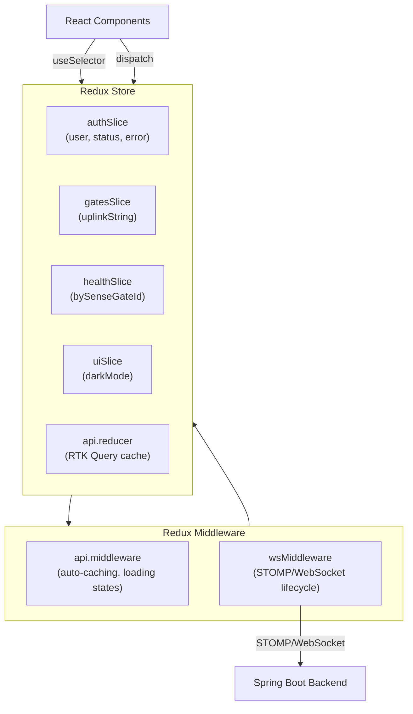
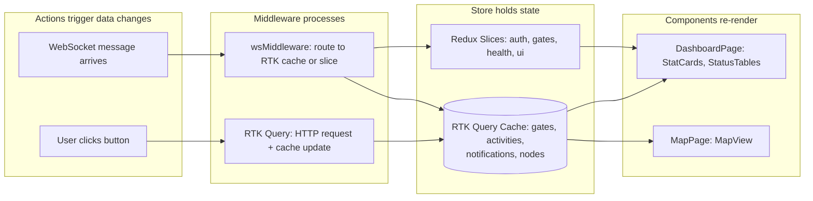

# 04 — State Management

## What is "State"?

In a web application, **state** is any data that the app needs to remember. Examples: who is logged in, the list of flood gates, whether dark mode is on, incoming real-time messages.

The SenseMate Frontend uses **Redux Toolkit** to manage state. Think of Redux as a central "database" inside the browser — any component can read from it or write to it. This avoids the chaos of passing data through dozens of component layers.

---

## Store Structure

The Redux store is created in `server/frontend/src/app/store/index.js:10`. It combines five independent "slices" (think of them as database tables) and two middleware layers:



| Slice | What it stores | File |
|-------|---------------|------|
| `authSlice` | Current user (`name`, `email`, `role`, `workerId`), auth status (`loading`/`authenticated`/`unauthenticated`), error messages | `server/frontend/src/app/store/slices/authSlice.js:1` |
| `gatesSlice` | Latest uplink message string from IoT devices | `server/frontend/src/app/store/slices/gatesSlice.js:1` |
| `healthSlice` | Device health data (battery status, shock status, voltage) keyed by SenseGate ID | `server/frontend/src/app/store/slices/healthSlice.js:1` |
| `uiSlice` | Dark mode toggle (boolean), persisted in sessionStorage | `server/frontend/src/app/store/slices/uiSlice.js:1` |
| `api` | RTK Query's auto-managed cache of all server data (gates, activities, notifications, nodes, etc.) | `server/frontend/src/app/store/api/api.js:25` |

---

## authSlice — Authentication State

Defined in `server/frontend/src/app/store/slices/authSlice.js:35`.

**State shape:**

```javascript
{
  user: { name, email, role, workerId } | null,
  status: 'loading' | 'authenticated' | 'unauthenticated',
  error: string | null
}
```

**How it works:**
- On app startup, `initializeAuth()` (line 18) calls `GET /api/auth/user-details` to check if the user has a valid session cookie.
- If the cookie is valid → `status` becomes `'authenticated'` and `user` is populated.
- If no cookie or expired → `status` becomes `'unauthenticated'`.
- When a user logs in, `LoginPage` dispatches `auth/setUser` with the user details from the backend response.
- When a user logs out, `auth/clearAuth` resets the state.

---

## gatesSlice — Uplink Events

Defined in `server/frontend/src/app/store/slices/gatesSlice.js:7`.

Tracks the most recent uplink message from an IoT device. When the WebSocket middleware receives a message on `/topic/uplinks`, it dispatches `uplinkReceived(body)` to store the raw string. The `UplinkToast` shared component reads this and shows a toast notification.

---

## healthSlice — Device Health

Defined in `server/frontend/src/app/store/slices/healthSlice.js:51`.

Tracks battery status, shock status, and voltage for each SenseGate device. Data arrives via the `/topic/health` WebSocket topic and is processed by `healthMessageHandler.js`.

**State shape:**

```javascript
{
  bySenseGateId: {
    42: {
      battery:   { value: 'CHARGING',   receivedAt: 1719900000000 },
      shock:     { value: 'NO_SHOCK',   receivedAt: 1719900000000 },
      voltageMv: { value: 3950,         receivedAt: 1719900000000 },
      version:   { value: 1,            receivedAt: 1719900000000 }
    }
  }
}
```

**Sentinel value merging:** Health messages only include one type of event at a time. A shock message has `batteryStatus: 'UNKNOWN'`. The reducer (`mergeField` at line 18) preserves previously-stored values when an incoming value is a sentinel (`UNKNOWN` for battery/shock, `0` for voltage).

---

## uiSlice — Dark Mode

Defined in `server/frontend/src/app/store/slices/uiSlice.js:15`.

Tracks a single boolean: `darkMode`. On initialization, it reads from `sessionStorage` (key `'sensemante-dark'`). If no saved preference exists, it falls back to the system's `prefers-color-scheme` media query.

---

## RTK Query — Server State

**RTK Query** is Redux Toolkit's built-in data fetching layer. Instead of writing `fetch()` calls manually, you define **endpoints** and RTK Query generates React hooks for you.

All endpoints are defined in `server/frontend/src/app/store/api/api.js:25`.

### How it works (for beginners)

1. You define an endpoint: "get the list of gates from `/api/gates`"
2. RTK Query auto-generates a hook: `useGetGatesQuery()`
3. Any component calls the hook to get the data

**Example — fetching gates:**

```javascript
// In any component:
const { data: gates, isLoading, isError } = useGetGatesQuery();

if (isLoading) return <LoadingCard />;
if (isError) return <p>Error loading gates.</p>;
return <ul>{gates.map(g => <li key={g.id}>{g.name}</li>)}</ul>;
```

RTK Query automatically handles:
- **Loading states** (`isLoading` = `true` while fetching)
- **Error states** (`isError` = `true` if the request failed)
- **Caching** (won't re-fetch the same data if it's already in cache)
- **Cache invalidation** (auto-refetch after a mutation changes data)
- **Deduplication** (multiple components requesting the same data share one request)

### Tag-Based Cache Invalidation

Each endpoint declares **tags** to describe what data it touches:

```javascript
getGates: builder.query({
  query: () => '/api/gates',
  providesTags: (result) =>
    result ? result.map(g => ({ type: 'Gate', id: g.id })) : [{ type: 'Gate' }],
}),
```

When a mutation is declared with `invalidatesTags: ['Gate']`, RTK Query automatically refetches all queries that provide `'Gate'` tags. This means after creating or deleting a gate, the gate list refreshes automatically — no manual refresh logic needed.

### 401 Handling

The `baseQueryWithReauth` wrapper (`server/frontend/src/app/store/api/api.js:17`) checks every API response. If it receives a `401 Unauthorized`, it dispatches `auth/clearAuth`, which logs the user out and redirects them to the login page.

---

## WebSocket Middleware — Real-Time Updates

The WebSocket middleware is the bridge between the backend's STOMP broker and the Redux store. It is defined in `server/frontend/src/app/store/middleware/wsMiddleware.js:10`.

### Lifecycle

The WebSocket connection is **tied to authentication** — it only connects when a user logs in and disconnects when they log out:

| Redux Action | Effect |
|-------------|--------|
| `auth/setUser` or `auth/initialize/fulfilled` | **Connect** the STOMP client (if not already active) |
| `auth/clearAuth` | **Disconnect** permanently |

### Reconnection Strategy

If the connection drops unexpectedly, the middleware uses **exponential backoff**:

- First attempt: wait 1 second
- Second attempt: wait 2 seconds
- Third: 4 seconds → 8 → 16 → capping at 30 seconds
- On successful reconnect, the delay resets to 1 second

An `intentionalDisconnect` flag prevents reconnection loops after a deliberate logout.

### Topic Subscriptions

When connected, the middleware subscribes to **7 STOMP topics**:

| Topic | What it delivers | How it updates the store |
|-------|-----------------|--------------------------|
| `/topic/gates/add` | New gate created | Pushes into RTK Query `getGates` cache |
| `/topic/gates/delete` | Gate ID deleted | Filters out of RTK Query `getGates` cache |
| `/topic/gates/updates` | Gate status changed | Replaces by ID in RTK Query `getGates` cache |
| `/topic/gate-activities` | New activity logged | Pushes into RTK Query `getActivities` cache |
| `/topic/gate-activities/delete` | Activity ID deleted | Filters out of RTK Query `getActivities` cache |
| `/topic/uplinks` | IoT device uplink received | Dispatches to `gatesSlice` |
| `/topic/health` | Device health status | Validates via `healthMessageHandler`, dispatches to `healthSlice` |

### Two Update Patterns

- **RTK Query cache patching** (for gates, activities): The middleware calls `api.util.updateQueryData()` to directly modify the cached data. Any component subscribed via `useGetGatesQuery()` or `useGetActivitiesQuery()` re-renders automatically.
- **Slice action dispatch** (for uplinks, health): The middleware dispatches a standard Redux action to the appropriate slice.

### On-Connect: Initial Health Fetch

When the WebSocket connects, the middleware fetches the initial health state via `GET /api/health` (`server/frontend/src/app/store/middleware/wsMiddleware.js:145`). This ensures health data is displayed immediately, even before the first real-time health message arrives.

---

## Health Message Handler

Defined in `server/frontend/src/app/store/middleware/healthMessageHandler.js:91`.

Incoming health messages from `/topic/health` go through a validation pipeline before being stored:

1. **Parse** the raw JSON string body.
2. **Validate** `messageType` must equal `5`.
3. **Validate** `statuses` must be an array.
4. **Normalize** each entry: coerce `senseGateId` to a number, validate battery/shock enum values (uppercased, invalid values become `'UNKNOWN'`), coerce `version` and `voltageMv` to numbers.
5. **Dispatch** `healthReceived({ statuses })` to the `healthSlice`.

---

## Data Flow Summary



**Key insight:** Components never know *how* data arrived (REST API vs. WebSocket). They simply read from Redux, and Redux handles updating itself from both sources.
