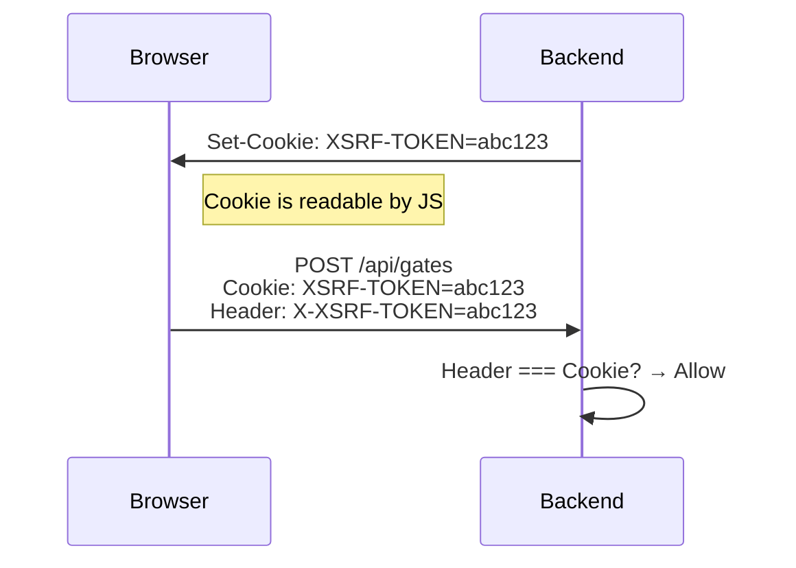

# 05 — Authentication

## Overview

The Frontend uses **JWT (JSON Web Token) authentication** with **HttpOnly cookies**. This means:

- The login token is **stored in a browser cookie**, not in JavaScript memory or localStorage.
- JavaScript code **cannot read** the token (HttpOnly flag) — this protects against XSS attacks stealing credentials.
- The browser **automatically sends the cookie** with every request to the backend.
- Auth state is tracked in **Redux** (`authSlice`), so every component knows who is logged in.

---

## Login Flow

```mermaid
sequenceDiagram
    actor User
    participant Browser as "Browser"
    participant LoginPage as "LoginPage"
    participant Redux as "Redux (authSlice)"
    participant RTK as "RTK Query (api.js)"
    participant Backend as "Spring Boot Backend"

    Note over Browser,Backend: App Startup
    Browser->>Redux: dispatch(initializeAuth())
    Redux->>Backend: GET /api/auth/user-details
    alt Valid JWT cookie exists
        Backend-->>Redux: { name, email, role, workerId }
        Redux->>Redux: status = 'authenticated'
        note right of Redux: User is logged in —<br/>ProtectedRoute allows access
    else No cookie or expired
        Backend-->>Redux: 401 Unauthorized
        Redux->>Redux: status = 'unauthenticated'
        note right of Redux: ProtectedRoute redirects to /login
    end

    Note over User,Backend: Login
    User->>LoginPage: Enter email + password, click Sign In
    LoginPage->>RTK: useLoginMutation({ email, password })
    RTK->>Backend: POST /api/auth/login
    Backend-->>Browser: Set-Cookie: jwt=<token>; HttpOnly; SameSite=Lax
    Backend-->>RTK: { name, email, role, workerId }
    RTK-->>LoginPage: User details

    LoginPage->>Redux: dispatch(auth/setUser)
    Redux->>Redux: status = 'authenticated'
    LoginPage->>Browser: navigate('/dashboard')

    Note over Browser,Backend: Authenticated Requests
    Browser->>Backend: GET /api/gates (cookie sent automatically)
    Backend->>Backend: Validate JWT from cookie
    Backend-->>Browser: Gate data (200 OK)

    Note over User,Backend: Logout
    User->>Browser: Click Logout
    Browser->>RTK: useLogoutMutation()
    RTK->>Backend: POST /api/auth/logout
    Backend-->>Browser: Set-Cookie: jwt=""; Max-Age=0 (delete)
    RTK-->>Redux: dispatch(auth/clearAuth)
    Redux->>Redux: status = 'unauthenticated'
    Browser->>Browser: navigate('/')
```

---

## Step-by-Step: What Happens When You Log In

1. **User submits** email and password on the `LoginPage` (`server/frontend/src/pages/LoginPage.jsx:19`).
2. **`useLoginMutation()` fires** a `POST /api/auth/login` request via RTK Query (`server/frontend/src/app/store/api/api.js:31`).
3. **Backend validates** credentials. If correct, it:
   - Sets an **HttpOnly cookie** named `jwt` containing the signed token (10-hour expiry, `SameSite=Lax`).
   - Returns a JSON response with `{ name, email, role, workerId }`.
4. **Frontend stores user data** in Redux via `dispatch(auth/setUser)` (`server/frontend/src/pages/LoginPage.jsx:29`).
5. **User is redirected** to `/dashboard`.
6. **WebSocket connects** because the `auth/setUser` action triggers the `wsMiddleware` (`server/frontend/src/app/store/middleware/wsMiddleware.js:193`).
7. **All subsequent requests** automatically include the JWT cookie and CSRF token header.

---

## Session Persistence

When the user **refreshes the page** or opens a new tab, the app doesn't require re-login:

1. `App.jsx` dispatches `initializeAuth()` on mount (`server/frontend/src/app/App.jsx:28`).
2. This calls `GET /api/auth/user-details` with `credentials: 'include'` (sends cookies).
3. If the JWT cookie is still valid, the backend returns the user details, and `authSlice` sets `status: 'authenticated'`.
4. While this check is happening, `ProtectedRoute` shows a loading spinner — the user doesn't see a flash of the login page.

---

## Logout Flow

1. User clicks **Logout** (the `LogoutButton` component at `server/frontend/src/features/auth/components/LogoutButton.jsx:1`).
2. `useLogoutMutation()` calls `POST /api/auth/logout` (`server/frontend/src/app/store/api/api.js:57`).
3. **Backend** clears the JWT cookie by setting `Max-Age=0`.
4. **On success**, RTK Query dispatches `auth/clearAuth`, which:
   - Sets `user = null`, `status = 'unauthenticated'`.
   - Triggers the WebSocket middleware to **disconnect permanently**.
5. **On failure** (network error, server down), auth state is *preserved* — the user is still logged in and can retry.

---

## Route Guards

Two components control who can see which pages.

### ProtectedRoute (`server/frontend/src/features/auth/components/ProtectedRoute.jsx:5`)

Wraps pages that require authentication:

```jsx
<Route element={<ProtectedRoute roles={['controller', 'viewer']} />}>
  <Route path="/dashboard" element={<DashboardPage />} />
</Route>
```

**Behavior:**
| Auth State | Effect |
|------------|--------|
| `'loading'` | Shows a centered `CircularProgress` spinner |
| `'unauthenticated'` | Redirects to `/login` |
| Wrong role | Redirects to `/` |
| Authenticated + correct role | Renders the child page |

Used for: `/dashboard`, `/map`, `/diagnostics`, `/devices`, `/nodes`, `/automation`, `/logs`, `/settings`, `/gates/:id`.

### PublicOnlyRoute (`server/frontend/src/features/auth/components/PublicOnlyRoute.jsx:5`)

Wraps pages that should only be visible to *unauthenticated* users:

```jsx
<Route element={<PublicOnlyRoute />}>
  <Route path="/login" element={<LoginPage />} />
  <Route path="/register" element={<RegisterPage />} />
</Route>
```

**Behavior:**
| Auth State | Effect |
|------------|--------|
| `'loading'` | Shows a spinner |
| `'authenticated'` | Redirects to `/dashboard` (user is already logged in) |
| `'unauthenticated'` | Renders the login/register page |

---

## CSRF Protection

CSRF (Cross-Site Request Forgery) is an attack where a malicious website tricks your browser into making requests to the backend. The Frontend uses Spring Security's **double-submit cookie pattern** to prevent this:

1. **Backend** sets a `XSRF-TOKEN` cookie (this one is *not* HttpOnly — JavaScript can read it).
2. **RTK Query** reads this cookie via `getCookie('XSRF-TOKEN')` in `server/frontend/src/app/store/api/api.js:8`.
3. Every API request includes the cookie value as an `X-XSRF-TOKEN` HTTP header.
4. **Backend** compares the header value against the cookie value — they must match.



---

## Role-Based Access Control

After login, the user's `role` is stored in `authSlice.user.role`. Components read this to conditionally show/hide UI elements:

| Role | What they see |
|------|--------------|
| **controller** | Full `StatusTables` with control buttons, downlink forms, gate management |
| **viewer** | Read-only `StatusTablesView` — can see gates but not change them |
| **guest** (no login) | `DashboardGuestPage` — limited read-only view via polling |

Inside `DashboardPage` (`server/frontend/src/pages/DashboardPage.jsx:10`):

```javascript
const user = useAppSelector((state) => state.auth.user);
const isController = user?.role === 'controller';

// Conditionally renders controller UI vs viewer UI
{isController ? <StatusTables ... /> : <StatusTablesView ... />}
```

---

## Key Files

| File | Role |
|------|------|
| `server/frontend/src/app/store/slices/authSlice.js` | Redux slice for auth state |
| `server/frontend/src/app/store/api/api.js` | RTK Query endpoints (login, register, logout, user-details) |
| `server/frontend/src/features/auth/components/ProtectedRoute.jsx` | Route guard for authenticated pages |
| `server/frontend/src/features/auth/components/PublicOnlyRoute.jsx` | Route guard for login/register pages |
| `server/frontend/src/features/auth/components/LogoutButton.jsx` | Logout button component |
| `server/frontend/src/pages/LoginPage.jsx` | Login form page |
| `server/frontend/src/pages/RegisterPage.jsx` | Registration form page |
| `server/frontend/src/shared/utils/cookie.js` | `getCookie()` helper for reading CSRF token |
| `server/frontend/src/app/App.jsx` | Route definitions with guards applied |
