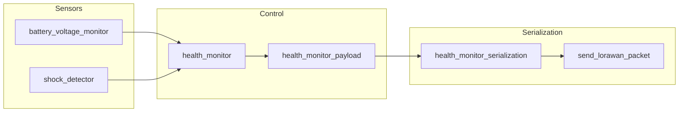
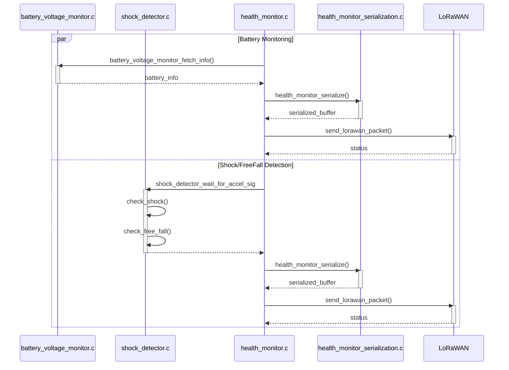

## Overview
  
The `health_monitor` module is the orchestration layer for the SenseGate health telemetry path. It collects battery and motion-related state, turns those readings into compact payloads, serializes them as CBOR, and sends them over LoRaWAN.
  
The module is split into small components so that each part has one job:

- `battery_voltage_monitor.c` wraps lower-level battery voltage readings
- `shock_detector.c`samples the accelerometer, FFT's the sample, and detects free fall.
- `health_monitor_serialization.c` converts health payloads into CBOR.
- `health_monitor_payload.h` defines the payload shape that moves between the monitor and serializer.
- `health_monitor.c` coordinates the worker threads and sends reports.

## Architecture

The module follows a simple producer-to-encoder-to-transmitter pipeline.

  

`health_monitor_init()` creates two threads:

- a battery thread that periodically samples voltage and reports state changes
- a shock thread that waits for shock detector events and reports them immediately. The wait mechanism is done via Semaphore.  

Both threads build a `health_monitor_payload_t`, serialize it with `health_monitor_serialize()`, and hand the bytes to `send_lorawan_packet()`.

  

## Sequence Diagram  

  

## Components

### `health_monitor.c`

This is the top-level runtime component. It creates the worker threads and keeps the reporting loop running.
- `health_monitor_init()` initializes the battery monitor and shock detector, then starts both threads.
- `thread_battery_function()` polls the battery monitor every `BATTERY_UPDATE_PERIOD_SEC` seconds.
- `thread_shock_detector_function()` blocks until the shock detector reports a shock or free fall.
- `serialize_and_send()` is the shared helper that performs CBOR serialization and sends the result over LoRaWAN.

### `battery_voltage_monitor.c`

This component reads the battery ADC input and converts the raw sample into millivolts.
- `battery_voltage_monitor_init()` configures the ADC and GPIO power pin.
- `battery_voltage_monitor_fetch_info()` reads a fresh sample, compares it with the previous value, and classifies the trend as charging, discharging, stable, or unknown.
The monitor stores a small amount of state so it can infer the battery trend over time instead of only reporting the current voltage.

### `shock_detector.c`

This component samples the accelerometer and runs a lightweight detection pipeline.
- `shock_detector_init()` prepares the accelerometer sensor, FFT buffers, frequency averaging state, and synchronization primitives.
- `shock_detector_start()` launches the sampling thread.
- `acceleration_thread()` collects raw acceleration samples, smooths them, runs FFT processing, and checks for two conditions:
	- free fall, based on low acceleration magnitude in the time domain
	- shock, based on sparsity in the frequency domain
- `shock_detector_wait_for_accel_sig()` blocks until a detection event is available.

The shock detector keeps the detection logic isolated from the reporting logic, which lets the health monitor consume events without knowing the FFT details.

### `health_monitor_payload.h`  

- `header` identifies the health event type, such as battery charging, battery discharging, battery low, or accelerometer.

- `body` carries the measured value, currently the battery voltage or shock-related data. Size is 16 bits (2 bytes).
	- If the header is either `BATTERY_CHARGING` or `BATTERY_DISCHARGING` or `BATTERY_LOW`, the payload contains the battery voltage in millivolts, defined in `int16_t voltage_mv` inside `battery_info_t` in `battery_voltage_monitor.h`
	- If the header is `SHOCKSTATUS`, the payload contains the status of the accelerometer (either shock is detected, or there's a free fall detected). This is defined in `int16_t accelerometer_status` in `shock_detector.h`

  

### `health_monitor_serialization.c`

The health payload is wrapped in a CBOR array before transmission.
The serialized message contains:
1. CBOR format version
2. health monitor message type
3. node ID
4. payload header
5. payload body
This keeps the wire format small and consistent with the other CBOR-based modules in the firmware.
  
## Runtime Behavior

Battery reporting is periodic. The battery thread always sends the current battery state, and it sends an additional low-battery message once when the voltage drops below `LOW_BATTERY_THRESHOLD_MV`.

Shock reporting is event-driven. The shock thread waits until the detector posts a detection, then immediately serializes and sends the event.

  

## Open TODOs
1. The FFT can almost differentiate between shock because human puts the board and a real hit shock applied to the board. Accuracy is 60% depending on the Board.
2. The Backend, which receives the message from the SenseGate, still contains the old code, where between SHOCK_DETECTED and FREE_FALL, are distinguished in the **header**. This is however has been modified, so that there's only 1 **header** for both cases (`ACCELEROMETER`), and its body tells whether if it's free fall or shock is detected.
3. Since the Backend is still to be modified, the frontend also has to be adjusted as well