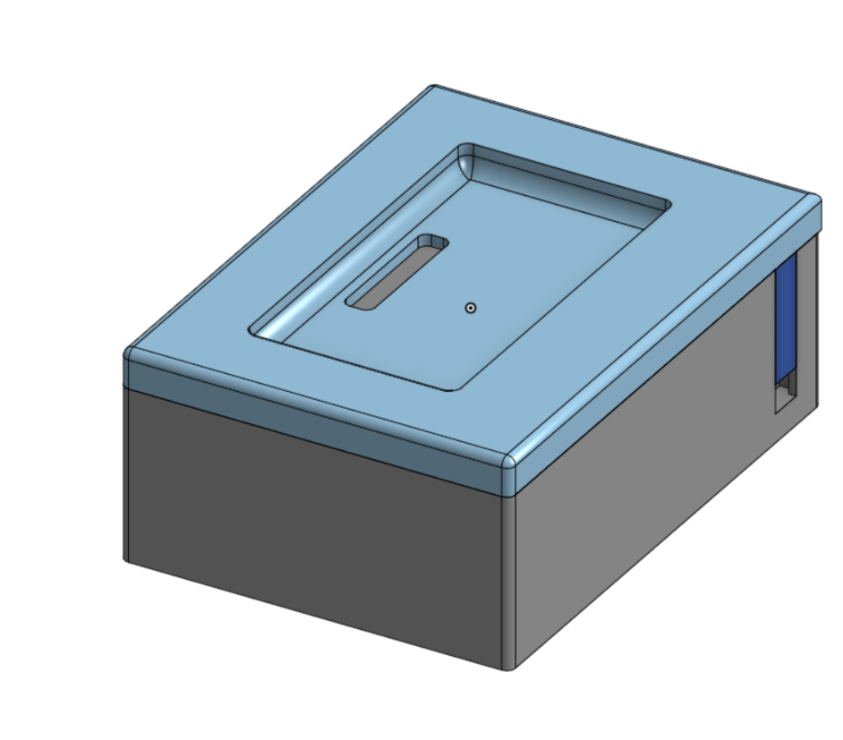
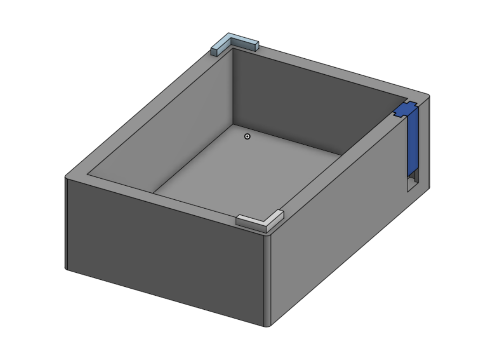

# SenseMate Docking Station — 3D Design

The SenseMate docking station is a printable two-shell enclosure for seating a
SenseMate and routing its pogo-pin connection to a USB-UART converter.

> **Status:** This document covers the 3D design only. Firmware is not ready
> yet, and the UART pin assignment and final firmware behavior are not defined.

- **CAD source (Onshape):** [Docking station document](https://cad.onshape.com/documents/29112f95dbf05823acab5d36/w/504163540d9ed0b2ed79e1d0/e/0006e1403e3a6a10bd24478f?renderMode=0&uiState=6a7c99bb1c43838a9ceff340)
- **Design:** Two-shell enclosure with separate connector and interlocking parts
- **Electrical concept:** A pogo-pin connector is connected to a USB-UART converter inside the enclosure

## Views

| View | Image |
|------|-------|
| Overview |  |
| Inside view |  |

## Design

### Top Shell

The pogo-pin connector is press-fit into the slot in the top shell. The
connector mates with the pogo-pin contacts in the SenseMate case when the
SenseMate is seated in the dock.

Magnet polarity must remain consistent with the existing SenseMate reference
device. The magnets are integrated into the pogo-pin connector, so their size
and installation are not specified here. Do not swap connector polarity between
devices or docking stations: the pogo-pin placement prevents reverse seating,
but mismatched magnet polarity prevents the connector from engaging correctly.

### Bottom Shell and USB Routing

The empty space inside the docking station houses the USB-UART converter. The
USB cable is routed through the lower opening in the side of the enclosure.

The separate `DockingstationUSBConnectorThingy.step` part slots into the side
opening. It guides the cable and helps retain the cable and USB-UART converter
inside the enclosure.

### Interlocking Parts

The shells are joined by separate 90-degree angle interlocking pieces. Each
piece slots into matching recesses in the top and bottom shells and was intended
to be press-fit, creating a snap-fit-like joint.

The current interlocking design is experimental. Its strength is insufficient
and its press-fit tolerances are difficult to reproduce reliably across printers.
It should be redesigned using the `1.75 mm` filament-pin method used by the
SenseMate case before it is relied on for a strong or semi-permanent assembly.

## Printing

The docking station is generally easy to print. Use the orientation in which
each part is provided by its STEP file; this is the easiest orientation.

Material is not prescribed. Tolerances may need to be tuned for the printer and
the specific part.

The USB connector insert was printed successfully on a P2S with precise-wall
settings. Its current design uses a tolerance of `0`; other printers may need
that value adjusted for a reliable fit.

## Assembly

1. Print the top shell, bottom shell, USB connector insert, and interlocking
   pieces in their STEP-file orientations.
2. Press-fit the pogo-pin connector into the slot in the top shell.
3. Route the USB cable through the lower opening in the bottom shell.
4. Connect the USB-UART converter to the pogo pins.
5. Place the USB-UART converter inside the docking station and retain the cable
   with the connector insert.
6. Fit the top and bottom shells together using the interlocking pieces.

## Files

| Part | File |
|------|------|
| Top shell | `DockingstationTopShell.step` |
| Bottom shell | `DockingstationBottomShell.step` |
| USB connector insert | `DockingstationUSBConnectorThingy.step` |
| Interlocking piece | `DockingstationInterlocking.step` |
| CAD source | [Onshape document](https://cad.onshape.com/documents/29112f95dbf05823acab5d36/w/504163540d9ed0b2ed79e1d0/e/0006e1403e3a6a10bd24478f?renderMode=0&uiState=6a7c99bb1c43838a9ceff340) |
