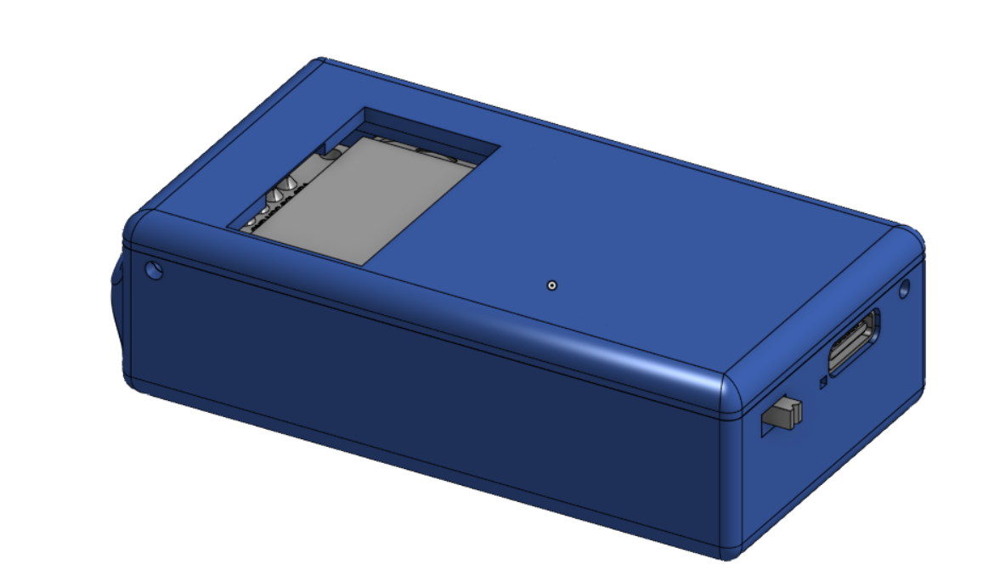
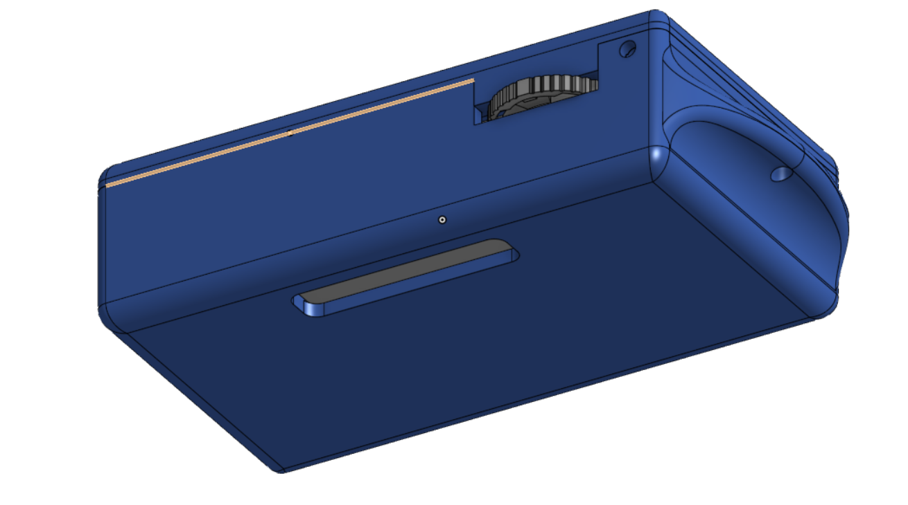
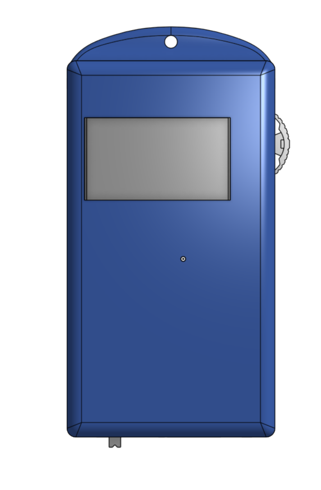
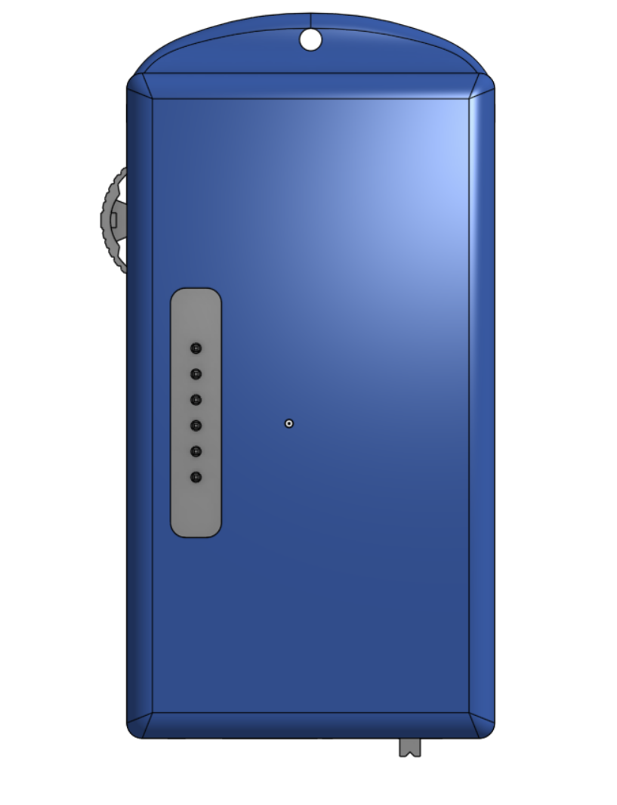
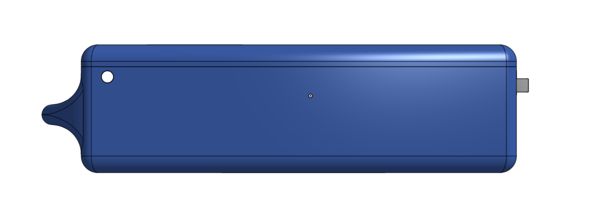
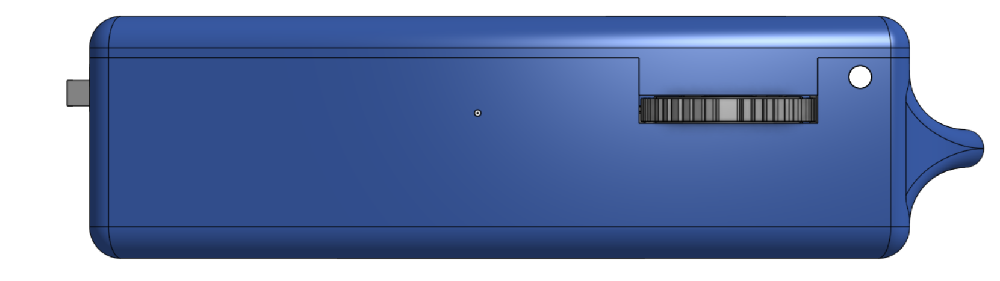
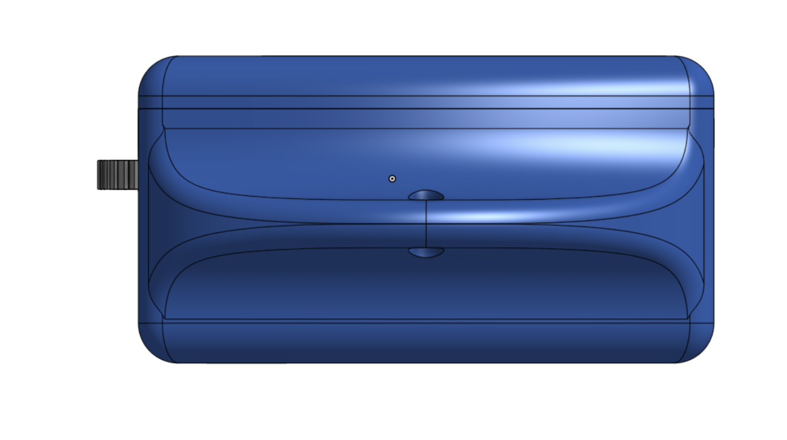
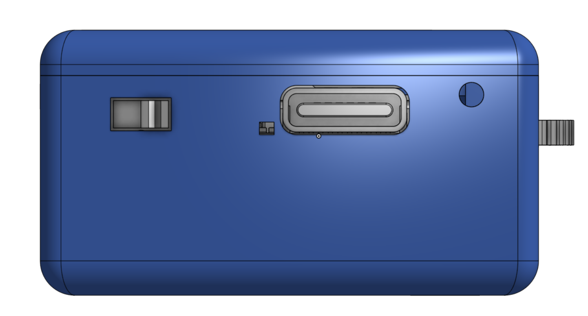
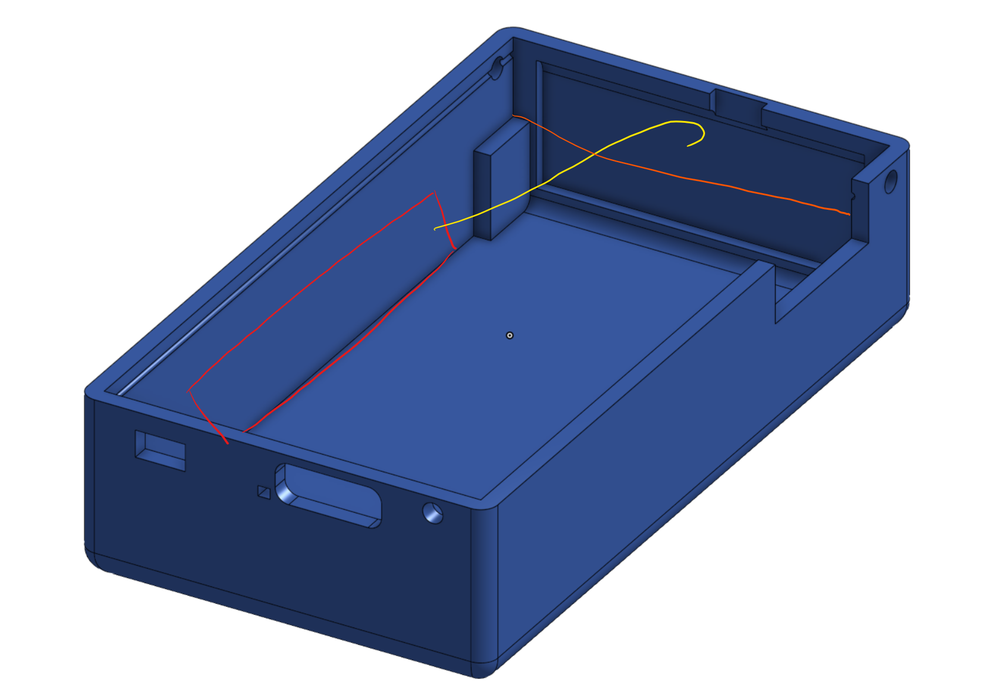

# SenseMate — Case Documentation

The **SenseMate case** is a two-part 3D-printed enclosure designed to house the SenseMate PCB, LiPo battery, LoRa antenna, and OLED display.

- **Parts:** Bottom shell (houses PCB, battery, antenna) + front cover (display cutout)
- **Source (Onshape):** https://cad.onshape.com/documents/29112f95dbf05823acab5d36/w/504163540d9ed0b2ed79e1d0/e/3089b2e857805464ee0d6a36?renderMode=0&uiState=6a69fb285808250c59198e7f
- **Exported STEP files:** `Sensemate case - Bottom.step`, `Sensemate case - Top.step`
- **Connection:** Clip mechanism + optional filament interlock pins

| View | Image |
|------|-------|
| Front overview |  |
| Back overview |  |
| Front side |  |
| Back side |  |
| Left side (clips edge) |  |
| Right side |  |
| Top side |  |
| Connector side (pogo pin + thumbwheel) |  |

---

## Design

### Two-Part Shell

- **Bottom shell:** Houses the whole PCB, battery, and antenna. Contains stilts that the PCB rests on, a pogo-pin cutout in the bottom face (pill-shaped, press-fit, friction-held), and an antenna glue channel along the left wall.
- **Front cover:** Contains the display cutout. Clips onto the bottom shell.

### Cutouts & Features

- **Display cutout** (top surface, front cover): rectangular recess for the OLED.
- **Thumbwheel cutout** (right side): cutout for the SparkFun COM-08184 thumbwheel / 5-way nav switch.
- **Pogo-pin cutout** (bottom face of bottom shell): pill-shaped recess, press-fit. Holds pogo pins by friction.
- **Lanyard hole** (top center, extends the top face): for a lanyard. Internally, the case has a recession in this area that can be used to route the antenna cable toward the top.

### Clip Mechanism

The two halves are joined by a **clipping mechanism** along the left edge. Clipping strength is sufficient for daily use on its own.

### Filament Interlock Holes

For a stronger, semi-permanent connection, **three holes** are provided for interlocking the shells with standard **1.75 mm 3D-printing filament**:

1. Left side (upper quadrant)
2. Right side (upper quadrant)
3. Connector side

**Procedure:**

1. Insert a piece of 1.75 mm filament into each hole. Pliers recommended — the fit is intentionally tight.
2. Cut the filament flush with the outer surface.

This locks bottom and top shell together very securely.

> **Note:** Filament pins are optional. Use them when the device will see mechanical stress or when a tamper-resistant assembly is desired.

---

## Assembly Guide

> **Read fully before starting.** Assembly is tricky due to display tolerances. Take care not to squash or shift the display — it can break.

### Soldering the XIAO Sense

The XIAO Sense is soldered to the SenseMate PCB using its castellated edges.
This connects the XIAO Sense battery pads and debug pins to the corresponding
SenseMate PCB connections.

1. Apply flux to the XIAO Sense battery pads and debug pins.
2. Solder the XIAO Sense castellated edges to the SenseMate PCB.
3. Flip the PCB over and apply solder through the corresponding holes for
   approximately `10 seconds` so the XIAO Sense bottom pads make an electrical
   connection with the SenseMate PCB.
4. Test the connection over USB. Apply USB power and measure the voltage at the
   battery pins; this tests whether the battery connection can receive charging
   voltage.

> **Connection test:** If no voltage is present at the battery pins, the solder
> connection is not sufficient. Apply more heat and test again.

> **Future PCB revision:** Add a cutout on the XIAO Sense side of the PCB and
> treat the battery pads more like castellated edges. This should make the
> soldering process easier and the electrical connection more reliable.

### Preparation

#### Cut Pinhole Components Flush (Critical)

Every pinhole component must be cut flush on the bottom side **before soldering**.

⚠️ **Do not skip this.** Sharp pin protrusions on the bottom side of the PCB will puncture the battery. The battery sits directly beneath the PCB; any pin stub will pierce it.

- Use electronic side cutters to **trim all through-hole pins flush** on the underside of the board.
- Trim **before** soldering — cutting after soldering can crack joints or lift pads.
- After trimming, verify no pin protrudes below the PCB surface.

#### Cut Display Pin Headers

The male pin headers on top of the display are flush with the display surface. If left uncut, they press against the PCB and prevent the display from sitting flush with the top shell.

- Use electronic side cutters to **trim the header pins slightly**.
- Goal: enough clearance between top shell and pin headers so the display lies flush.

### Antenna Routing

> The image above shows the **rough antenna routing** drawn manually on the bottom shell. Colors:
> - **Red** — antenna (glued to the left wall, runs along floor toward the center)
> - **Yellow** — antenna cable (routed from the antenna toward the PCB antenna connector, crossing over the back-wall path, ending in a hook near the antenna connector)
> - **Orange** — PCB edge (drawn for visual reference only)

### Step-by-Step Assembly

#### 1. Glue the Antenna

- Glue the antenna to the **left side wall** of the bottom shell.
- Antenna must be **quite parallel** to the wall.
- Antenna **cannot** be glued in the clip-mechanism section — keep it clear of the clips.
- Route the antenna cable toward the top. The **lanyard hole** extends the top face; internally the case has a recession in that area that can be used to route the cable upward.

> **Assembly cutout:** There is a cutout at the top of the bottom-case lip, where top and bottom shell touch. This recession is **for assembly only**. Because the display sits very tightly in the bottom case, the antenna cable is temporarily placed in this cutout during PCB insertion and re-routed afterwards.

#### 2. Connect Battery, Insert PCB

- Connect the battery to the PCB first.
- Insert the assembly into the case.

> **Pogo-pin builds:** Insertion is hard due to size limitations. The PCB must be **slightly angled** because of the battery connector and the pogo pins.
>
> ⚠️ **Be very careful not to puncture the battery** during insertion.

#### 3. Insert PCB

- Hold the antenna cable in the assembly cutout.
- Insert the PCB **bottom-first (connector area) at an angle**.
- Lower the PCB onto the stilts.

#### 4. Route and Connect Antenna

- Route the antenna cable **around the display connector**.
- Clip the antenna cable into the antenna connector on the PCB.

#### 5. Insert Display

- Stick the display into the **female pin-header connector** on the PCB.

#### 6. Attach Front Cover

- **Align the left edge** of the bottom shell and the top cover first (the edge that contains the clips).
- Press the cover onto the bottom shell from the clipped edge toward the other side.
- **Watch the display:** it must not be moved or squashed during this step, otherwise it may break.
- This must be done carefully.

### Pogo Pins

Pogo pins are held **by friction** in the bottom case (press-fit). No adhesive required.

---

## 3D Printing Guide

The case is generally easy to print.

- **Orientation:** Place onto the bottom side (bottom shell) / top side (front cover) — flat face down.
- **Layer height:** `0.12 mm` recommended for print quality.
- **Supports:** None needed.
- **Tolerances:** May need adjustment per printer. A Bambu Lab P1S prints it with default values without issue.

### Files

| Part | File |
|------|------|
| Bottom shell | `Sensemate case - Bottom.step` |
| Front cover | `Sensemate case - Top.step` |
| Onshape source | [Onshape document](https://cad.onshape.com/documents/29112f95dbf05823acab5d36/w/504163540d9ed0b2ed79e1d0/e/3089b2e857805464ee0d6a36?renderMode=0&uiState=6a69fb285808250c59198e7f) |
