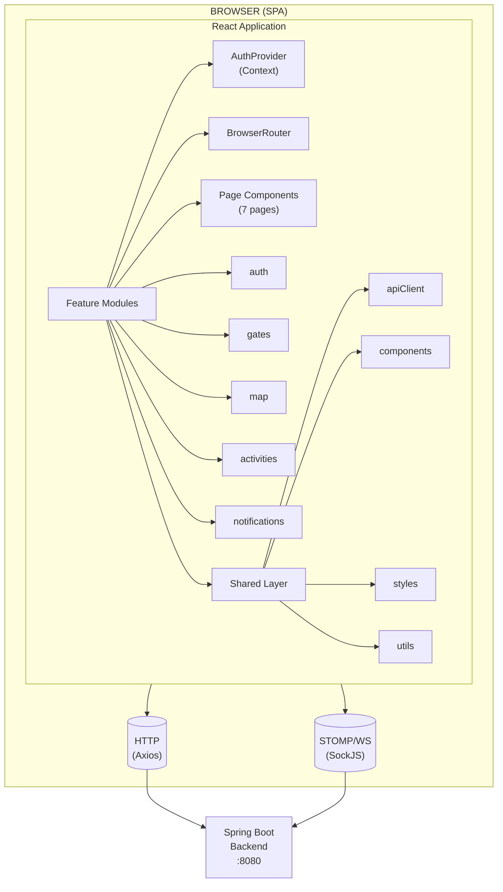
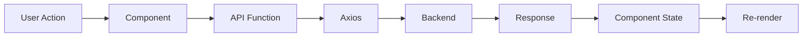
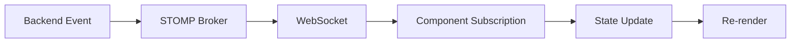
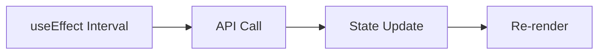

# Architecture

## High-Level Overview

The SenseMate frontend follows a **feature-based, single-page application architecture** with React at its core. There is no server-side rendering — the app is a purely client-side SPA that communicates with a Java Spring Boot backend.



## Layer Architecture

### 1. Application Shell (`src/app/`)

The `App.jsx` component serves as the composition root:

1. Wraps everything in `AuthProvider` (React Context for auth state)
2. Wraps everything in `BrowserRouter` (client-side routing)
3. Defines 7 route entries mapping paths to page components

### 2. Page Layer (`src/pages/`)

Each page is a top-level React component that:

- Assembles feature components into a full page layout
- Handles authentication checks (imperative guards)
- Manages top-level loading and error states
- Orchestrates layout (header, sidebar, content area)

### 3. Feature Layer (`src/features/`)

Each feature module (auth, gates, map, activities, notifications) follows a consistent internal structure:

```
features/{feature}/
├── index.js              # Barrel exports (public API surface)
├── components/           # Feature-specific React components
├── api/                  # REST API client functions
└── styles/               # CSS files for feature components
```

Key characteristics:
- **No cross-feature imports** — features do not import from each other
- **Shared code** lives in `src/shared/` (apiClient, common components, utils)
- **State is local** — each component manages its own state via `useState` + `useEffect`

### 4. Shared Layer (`src/shared/`)

Cross-cutting code used by multiple features:

| Directory | Contents |
|---|---|
| `shared/api/` | Axios singleton instance (base URL, default headers) |
| `shared/components/` | HeaderBar, AlertDialog variants, reusable UI |
| `shared/styles/` | Global CSS (App.css, HeaderBar.css, Sidebar.css) |
| `shared/utils/` | Cookie get/set/erase helpers |

## Data Flow

The application uses three distinct data flow mechanisms:

### REST Request-Response (Synchronous)



### WebSocket Push (Real-Time)



### Polling Fallback (Synchronous)



## State Management Architecture

> **No external state management library** is used. The app relies on React's built-in mechanisms.

| State Type | Mechanism | Example |
|---|---|---|
| **Auth state** | `React.createContext` + `useAuth` hook | Current user, token, login/logout methods |
| **Server data** | Local `useState` + `useEffect` fetch | Gate list, activities, notifications |
| **UI state** | Local `useState` | Dialog open/close, search filter text, selected tab |
| **Real-time data** | WebSocket message → local `useState` | Gate status changes, new activities |

## Key Architectural Decisions

| Decision | Rationale |
|---|---|
| **No TypeScript** | Reduced complexity for a student team; fast iteration |
| **No state management library** | App is flat enough that Context + local state suffices |
| **Feature-based folders** | Easier navigation by domain vs. by technical role |
| **Imperative auth guards** | More flexible loading/error handling vs. route wrappers |
| **Per-component WebSocket** | Each component manages its own subscription lifecycle; no global WS manager |
| **Plain CSS alongside MUI sx** | Familiar workflow; no extra tooling for CSS modules |
