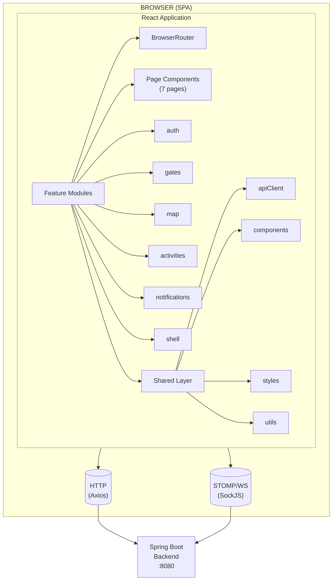
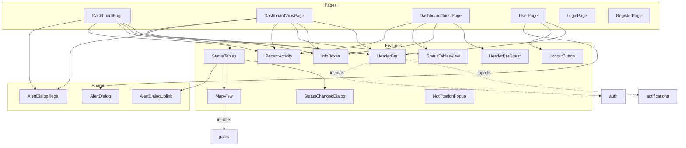

# Architecture

## High-Level Overview

The frontend follows a **feature-based SPA architecture** — purely client-side React, no SSR, communicating with a Java Spring Boot backend via REST and STOMP/WebSocket.


```mermaid
flowchart TB
    subgraph Browser["BROWSER (SPA)"]
        subgraph ReactApp["React Application"]
            Router["BrowserRouter"]
            Pages["Page Components<br/>(7 pages)"]
            
            Features["Feature Modules"]
            Features --> Router
            Features --> Pages
            
            Features --> F1[auth]
            Features --> F2[gates]
            Features --> F3[map]
            Features --> F4[activities]
            Features --> F5[notifications]
            Features --> F6[shell]
            
            Shared["Shared Layer"]
            Shared --> API["apiClient"]
            Shared --> Components["components"]
            Shared --> Styles["styles"]
            Shared --> Utils["utils"]
            
            Features --> Shared
        end
        
        HTTP[("HTTP<br/>(Axios)")]
        WS[("STOMP/WS<br/>(SockJS)")]
        
        ReactApp --> HTTP
        ReactApp --> WS
    end
    
    Backend["Spring Boot<br/>Backend<br/>:8080"]
    
    HTTP --> Backend
    WS --> Backend
```

## Layers

### 1. App Shell (`src/app/`)

`App.jsx` is the composition root: `BrowserRouter` wraps `Routes` with 7 page components. Protected pages validate auth inline (a proper auth context is planned as issue #9).

### 2. Pages (`src/pages/`)

Top-level components that assemble feature components into layouts and handle auth guards. One page per route.

### 3. Features (`src/features/`)

Six domain modules, each with the same internal shape:

```
features/{feature}/
├── index.js        # Barrel exports (public API)
├── components/     # React components
├── api/            # REST functions (optional)
└── styles/         # CSS (optional)
```

| Feature | Purpose | Components |
|---|---|---|
| `auth` | Authentication, session, user management | `LogoutButton` |
| `gates` | Gate CRUD, status control, downlinks | `StatusTables`, `StatusTablesView`, `InfoBoxes`, `StatusChangedDialog` |
| `map` | Leaflet map visualization | `MapView` |
| `activities` | Gate activity log | `RecentActivity` |
| `notifications` | User notification system | `NotificationPopup` |
| `shell` | Application chrome (header bars) | `HeaderBar`, `HeaderBarGuest` |

Minimal cross-feature imports: `shell` imports from `auth` + `notifications`; `map` imports from `gates`. All other features go through `shared/`.

### 4. Shared (`src/shared/`)

Cross-cutting code:

| Module | Contents |
|---|---|
| `api/apiClient.js` | Axios singleton (`http://localhost:8080`, JSON headers) |
| `components/` | Three alert dialogs: `AlertDialog`, `AlertDialogIllegal`, `AlertDialogUplink` |
| `styles/` | `App.css` (layout, badges), `HeaderBar.css`, `Sidebar.css` |
| `utils/cookie.js` | `getCookie`, `setCookie`, `eraseCookie` |
| `index.js` | Barrel re-exports of all shared modules |

## State Management

No external library. React's built-in mechanisms only:

| State Type | Mechanism | Example |
|---|---|---|
| Auth state | Per-component (cookie + `apiClient` header) — #9 will add context | User, token, login/logout |
| Server data | Local `useState` + `useEffect` fetch | Gate list, activities, notifications |
| UI state | Local `useState` | Dialog open/close, search, tab selection |
| Real-time data | WebSocket message → local `useState` | Gate status changes, new activities |
| Downlink counter | Local `useState` + REST | Count value, rate limiting state |

## React Compiler

The project uses React Compiler to automatically memoize components at compile time, removing the need for manual optimization.

### How it works

React Compiler runs as a Babel transform (`babel-plugin-react-compiler`) during the Vite build process. It analyzes component render functions and automatically wraps expensive computations and JSX trees with memoization, similar to what developers would otherwise do manually with `useMemo` and `useCallback`.

### Build pipeline integration

```
vite.config.js → @vitejs/plugin-react({ reactCompiler: true })
                     → @rolldown/plugin-babel → babel-plugin-react-compiler
```

The compiler is enabled via the `reactCompiler` option in the `react()` plugin call in `vite.config.js`. No changes to component code were required — the compiler is purely additive.

### Impact

- No manual memoization (`useMemo`, `useCallback`, `React.memo`) is needed in the codebase
- ESLint compiler rules (via `eslint-plugin-react-hooks`) enforce safe React patterns at "error" severity
- Rollback is trivial: set `reactCompiler: false` in `vite.config.js`

## Component Dependencies


```mermaid
flowchart TB
    subgraph Pages
        DP[DashboardPage]
        DVP[DashboardViewPage]
        DGP[DashboardGuestPage]
        UP[UserPage]
        LP[LoginPage]
        RP[RegisterPage]
    end

    subgraph Features
        ST[StatusTables]
        STV[StatusTablesView]
        IB[InfoBoxes]
        SCD[StatusChangedDialog]
        MV[MapView]
        RA[RecentActivity]
        NP[NotificationPopup]
        HB[HeaderBar]
        HBG[HeaderBarGuest]
        LB[LogoutButton]
    end

    subgraph Shared
        ADI[AlertDialogIllegal]
        AD[AlertDialog]
        ADU[AlertDialogUplink]
    end

    DP --> HB & IB & ST & RA & ADI
    DVP --> HB & IB & STV & RA & ADI
    DVP --> HB
    DGP --> HBG & IB & STV & RA
    UP --> HB & LB & AD

    ST --> SCD & MV & ADU
    HB -.->|imports| notifications
    HB -.->|imports| auth
    MV -.->|imports| gates
```

Solid = composition, dashed = cross-feature import.
