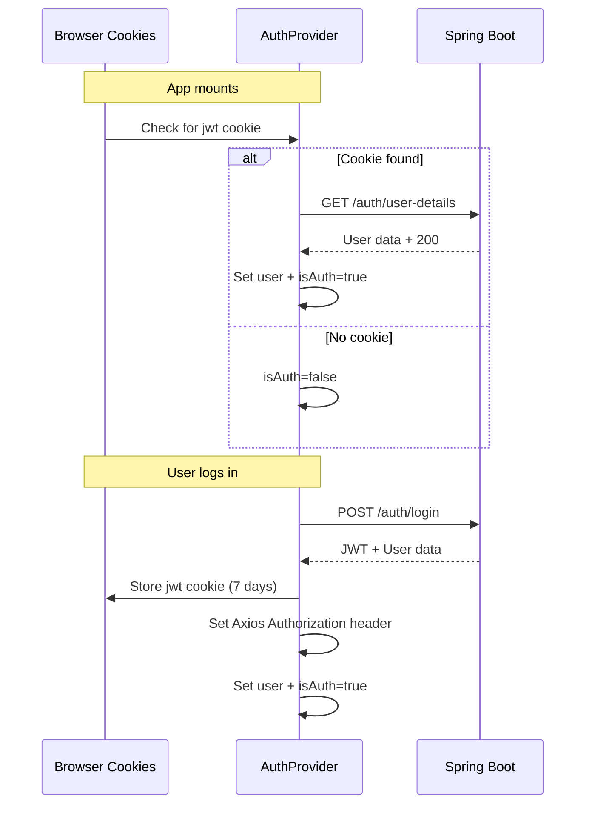

# Authentication Flow

## Overview

Authentication is managed by the `AuthContext` (React Context) in `src/features/auth/AuthContext.jsx`. The system uses **JWT tokens** for stateless authentication with cookie persistence for session recovery.

## Flow Diagram



## Authentication State (AuthContext)

The `AuthProvider` exposes the following via `useAuth()`:

| Value | Type | Description |
|---|---|---|
| `user` | Object or null | `{ id, email, name, role, workerId, ... }` |
| `isAuthenticated` | Boolean | Whether a valid user session exists (`!!user`) |
| `loading` | Boolean | True while checking JWT cookie on mount |
| `error` | Any or null | Last auth error |
| `login(email, password)` | Function | Authenticate, store JWT in cookie + Axios header, load user data |
| `register(name, email, password, role)` | Function | Register + auto-login |
| `logout()` | Function | Call backend logout, clear JWT cookie + header, set user=null |
| `refreshUser()` | Function | Reload user details from backend |
| `updateUser(request)` | Function | Update user details + refresh local state |

## Session Persistence

1. **On login**: The JWT token is stored in both:
   - A browser cookie (`jwt`, 7-day expiry, `SameSite=Lax`, path=`/`)
   - An Axios default header: `Authorization: Bearer <token>`

2. **On app mount**: `AuthProvider` checks for the `jwt` cookie:
   - If found → sets Axios header → calls `loadUserDetails()` to validate and load profile
   - If valid → sets `user` and `isAuthenticated = true`
   - If invalid/expired → clears cookie and header, sets `isAuthenticated = false`

3. **On logout**: 
   - Calls `logoutUser()` API (`POST /auth/logout`)
   - Deletes the Axios Authorization header
   - Erases the `jwt` cookie
   - Sets `user = null`, `isAuthenticated = false`
   - Navigates to `/`

## Role-Based Authorization

The backend returns a `role` field in the user object. Role routing is handled at login:

```javascript
// Inside login() — determines redirect after successful auth
if (user.role === 'controller') {
  navigate('/dashboard');
} else if (user.role === 'viewer') {
  navigate('/dashboard-view');
}
```

Role enforcement on protected pages is done via `useEffect`:

```javascript
useEffect(() => {
  if (!loading && !isAuthenticated) {
    setDialogOpen(true); // AlertDialogIllegal → redirects to /
  }
}, [loading, isAuthenticated]);
```

## Cookie Utilities

Located in `src/shared/utils/cookie.js`:

| Function | Description |
|---|---|
| `getCookie(name)` | Reads a cookie value by name from `document.cookie` |
| `setCookie(name, value, days)` | Sets a cookie with expiry in days |
| `eraseCookie(name)` | Removes a cookie by setting `Max-Age=0` |

## API Client Configuration

```javascript
// src/shared/api/apiClient.js
import axios from 'axios';

const apiClient = axios.create({
  baseURL: 'http://localhost:8080',
  headers: {
    'Content-Type': 'application/json',
    'Accept': 'application/json',
  },
});
```

The Authorization header is added dynamically by the `AuthProvider` after a successful login or cookie restoration:

```javascript
apiClient.defaults.headers.common['Authorization'] = 'Bearer ' + token;
```

## Security Considerations

> ⚠️ **Known security notes in the codebase:**

1. **JWT cookie is not `HttpOnly`** — the frontend reads it via JavaScript (`document.cookie`), making it accessible to XSS attacks. `HttpOnly` would prevent JS access, requiring a different token management strategy.

2. **No CSRF protection** — cookies use `SameSite=Lax`, which provides some CSRF protection but is not a complete solution.

3. **Hardcoded admin password** — the downlink counter reset password (`"secret123"`) is embedded in the frontend source code in `StatusTables.jsx`.

4. **No token refresh mechanism** — when the JWT expires, the user must log in again. There is no silent token refresh.
