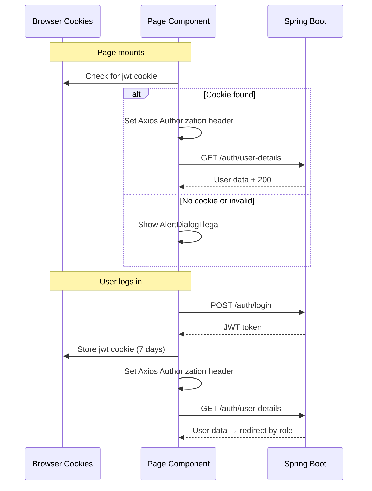

# Authentication Flow

## Overview

Authentication uses **JWT tokens** stored in browser cookies for session persistence. Each component manages its own auth state by reading the JWT cookie and calling the backend directly via the shared `apiClient`. There is no global auth context — this will be addressed in a future issue (#9).

## Flow Diagram


```mermaid
sequenceDiagram
    participant Browser as Browser Cookies
    participant Page as Page Component
    participant Backend as Spring Boot
    
    Note over Browser,Page: Page mounts
    Page->>Browser: Check for jwt cookie
    
    alt Cookie found
        Page->>Page: Set Axios Authorization header
        Page->>Backend: GET /auth/user-details
        Backend-->>Page: User data + 200
    else No cookie or invalid
        Page->>Page: Show AlertDialogIllegal
    end
    
    Note over Browser,Page: User logs in
    Page->>Backend: POST /auth/login
    Backend-->>Page: JWT token
    Page->>Browser: Store jwt cookie (7 days)
    Page->>Page: Set Axios Authorization header
    Page->>Backend: GET /auth/user-details
    Backend-->>Page: User data → redirect by role
```

## Session Persistence

1. **On login**: The JWT token is stored in both:
   - A browser cookie (`jwt`, 7-day expiry, `SameSite=Lax`, path=`/`)
   - An Axios default header: `Authorization: Bearer <token>`

2. **On page load**: Protected pages check for the `jwt` cookie:
   - If found → sets Axios header → calls `GET /auth/user-details` to validate
   - If valid → renders the page
   - If invalid/expired → shows `AlertDialogIllegal` and redirects to `/`

3. **On logout**: 
   - Calls `POST /auth/logout`
   - Deletes the Axios Authorization header
   - Erases the `jwt` cookie (inline, via `document.cookie`)
   - Navigates to `/`

## Auth Guard in Protected Pages

Protected pages (Dashboard, DashboardView) validate auth imperatively on mount:

```javascript
const [popupOpen, setPopupOpen] = useState(false);

// Read JWT cookie and set header
var jwt = getCookie("jwt");
if (jwt != null) {
    apiClient.defaults.headers.common['Authorization'] = `Bearer ${jwt}`;
}

// Validate session with backend
const loadDetails = async () => {
    try {
        const response = await apiClient.get('/auth/user-details');
        if (response.status !== 200) {
            throw new Error('Request failed');
        }
    } catch (e) {
        setPopupOpen(true); // Show AlertDialogIllegal
    }
};

useEffect(() => { loadDetails(); }, []);
```

## Role-Based Authorization

The backend returns a `role` field in the user details. Role routing is handled at login:

```javascript
// In LoginPage — determines redirect after successful login
if (userResponse.data.role === 'controller') {
    navigate('/dashboard');
} else {
    navigate('/dashboard-view');
}
```

## Worker ID Access

Components that need the `workerId` call the API directly:

```javascript
import { loadWorkerId } from '../features/auth';

const [workerId, setWorkerId] = useState(null);

useEffect(() => {
    loadWorkerId().then(id => setWorkerId(id)).catch(e => console.error(e));
}, []);
```

## Cookie Utilities

Located in `src/shared/utils/cookie.js`:

| Function | Description |
|---|---|
| `getCookie(name)` | Reads a cookie value by name from `document.cookie` |
| `getCookie(name)` | Reads a cookie value by name |

## API Client Configuration

```javascript
// src/shared/api/apiClient.js
import axios from 'axios';

const apiClient = axios.create({
  baseURL: 'http://localhost:8080',
  headers: {
    'Content-Type': 'application/json',
    'Accept': 'application/json',
  },
});
```

The Authorization header is set inline by pages after login or cookie restoration:

```javascript
apiClient.defaults.headers.common['Authorization'] = 'Bearer ' + token;
```

## Security Considerations

> ⚠️ **Known security notes in the codebase:**

1. **JWT cookie is not `HttpOnly`** — the frontend reads it via JavaScript (`document.cookie`), making it accessible to XSS attacks. `HttpOnly` would prevent JS access, requiring a different token management strategy.

2. **No CSRF protection** — cookies use `SameSite=Lax`, which provides some CSRF protection but is not a complete solution.

3. **Hardcoded admin password** — the downlink counter reset password (`"secret123"`) is embedded in the frontend source code in `StatusTables.jsx`.

4. **No token refresh mechanism** — when the JWT expires, the user must log in again. There is no silent token refresh.

5. **No centralized auth state** — each page manages auth independently. A proper auth context with router-level guards is planned as issue #9.
