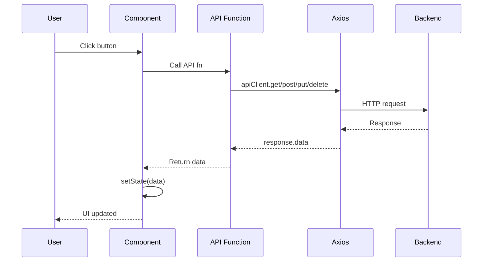
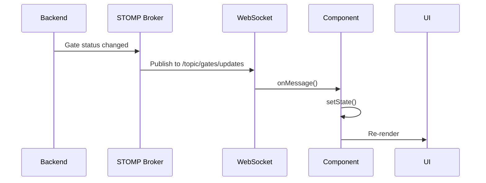
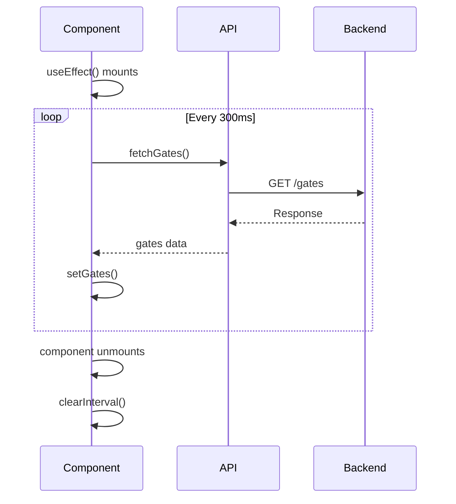
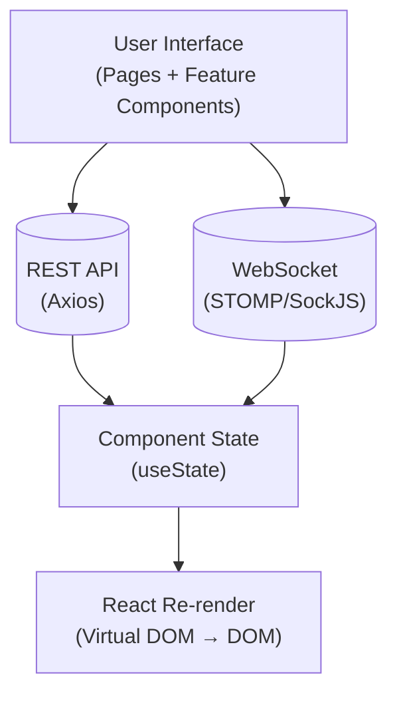

# Data Flow Patterns

The application uses three primary data flow patterns. Each serves a different purpose and use case.

## 1. REST API Flow (Synchronous CRUD)

Used for: Login, registration, gate CRUD, downlink commands, user profile updates, notification management.



### Example: Changing a Gate Status

```javascript
// 1. Dialog component captures user intent
const handleStatusChange = async (gateId, newStatus) => {
  try {
    // 2. Call feature API function
    const result = await requestGateStatusChange(gateId, workerId, newStatus);
    // 3. API function calls Axios
    //    → POST /{gateId}/{workerId}/request-status-change/
    //    with body: { requestedStatus: newStatus }
    // 4. On success, WebSocket will push the update
    //    (no manual state update needed for the changed gate)
  } catch (err) {
    console.error('Status change failed:', err);
  }
};
```

### All REST Endpoints Used

| Method | Endpoint | Purpose | Feature |
|---|---|---|---|
| POST | `/auth/login` | User login | auth |
| POST | `/auth/register` | User registration | auth |
| GET | `/auth/user-details` | Load user profile | auth |
| PUT | `/auth/user-change` | Update user details | auth |
| POST | `/auth/logout` | Logout | auth |
| GET | `/gates` | List all gates | gates |
| POST | `/add-gate-ui` | Create new gate | gates |
| PUT | `/update-gate` | Update gate | gates |
| DELETE | `/gates/{id}` | Delete gate | gates |
| POST | `/{gateId}/{workerId}/request-status-change/` | Request gate status change | gates |
| PUT | `/update-priority/{gateId}` | Update gate priority | gates |
| GET | `/downlinkcounter/counter` | Get downlink counter | gates |
| POST | `/downlinkcounter/try-increment` | Increment downlink counter (fails at 10) | gates |
| POST | `/downlinkcounter/reset` | Reset downlink counter | gates |
| POST | `api/downlink` | Send downlink command to IoT devices | gates |
| GET | `/gate-activities` | List gate activities | activities |
| POST | `/add-activities/` | Add activity log | activities |
| GET | `/notifications` | List all notifications | notifications |
| GET | `/notifications/{workerId}` | List by worker ID | notifications |
| POST | `/notifications/{id}/request-read-change` | Mark as read | notifications |

## 2. WebSocket Push Flow (Real-Time)

Used for: Live gate status updates, new activities, uplink events.



### Which Components Subscribe to What

| Component | Topics | Trigger |
|---|---|---|
| `StatusTables` | gates/add, gates/delete, gates/updates, gate-activities, gate-activities/delete, uplinks | Any gate or activity change |
| `InfoBoxes` | gates/add, gates/delete, gates/updates | Gate count changes |
| `RecentActivity` | gate-activities, gate-activities/delete | New activity logged or removed |

## 3. Polling Flow (Fallback)

Used for: Read-only dashboards (`DashboardViewPage`, `DashboardGuestPage`).



## Error Handling Pattern

API errors are caught at the call site and logged to the console. There is no centralized error handling:

```javascript
export const fetchGates = async () => {
  try {
    const response = await apiClient.get('/gates');
    return response.data;
  } catch (error) {
    console.error('Error fetching gates:', error);
    throw error;
  }
};
```

## Data Flow Summary


