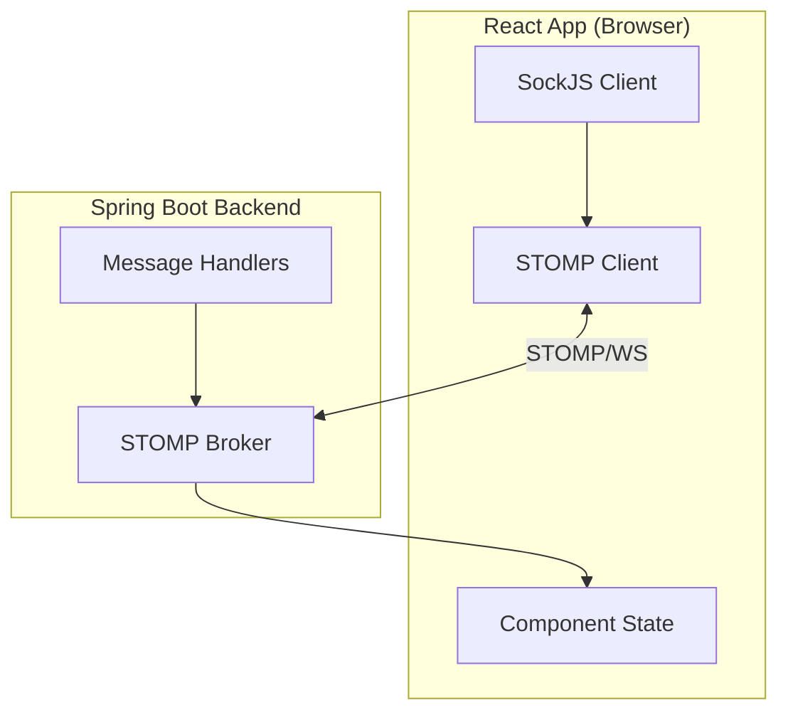

# Real-Time Communication

## Architecture

The application uses **STOMP over SockJS** for real-time, push-based communication with the backend. This enables live updates without polling, providing immediate UI feedback when gate statuses change or new events occur.



## WebSocket Topics

The frontend subscribes to the following STOMP topics:

| Topic | Purpose | Subscribed By |
|---|---|---|
| `/topic/gates/add` | New gate created | `StatusTables`, `InfoBoxes` |
| `/topic/gates/delete` | Gate removed | `StatusTables`, `InfoBoxes` |
| `/topic/gates/updates` | Gate status changed | `StatusTables`, `InfoBoxes` |
| `/topic/gate-activities` | New activity logged | `RecentActivity`, `StatusTables` |
| `/topic/gate-activities/delete` | Activity removed | `StatusTables` |
| `/topic/uplinks` | Uplink received from end-node | `StatusTables` |

## Connection Lifecycle

Each component manages its own WebSocket connection using `useEffect`:

```javascript
useEffect(() => {
  // 1. Establish connection
  const socket = new SockJS('http://localhost:8080/ws');
  const stompClient = Stomp.over(socket);
  
  // 2. Connect and subscribe
  stompClient.connect({}, () => {
    stompClient.subscribe('/topic/gates/updates', (message) => {
      const updatedGate = JSON.parse(message.body);
      // 3. Update local state
      setGates(prev => updateGateInList(prev, updatedGate));
    });
    
    stompClient.subscribe('/topic/gates/add', (message) => {
      const newGate = JSON.parse(message.body);
      setGates(prev => [...prev, newGate]);
    });
    
    stompClient.subscribe('/topic/gates/delete', (message) => {
      const deletedId = JSON.parse(message.body);
      setGates(prev => prev.filter(g => g.id !== deletedId));
    });
  });
  
  // 4. Cleanup on unmount
  return () => {
    stompClient.disconnect();
  };
}, []);
```

## Real-Time Update Handling

### Gate Status Changes

When a gate status changes (via `StatusChangedDialog` or external event):

1. User (or system) triggers a status change → REST API call
2. Backend processes the change and publishes to `/topic/gates/updates`
3. All connected clients receive the updated gate object
4. `StatusTables` updates the gate in its local array
5. `InfoBoxes` recalculates summary counts (total, open, closed, out-of-service)
6. React re-renders affected components

### New Activities

When a gate activity is logged:

1. Published to `/topic/gate-activities`
2. `RecentActivity` prepends to its list (showing last 4)
3. `StatusTables` expands its activity log for the relevant gate

### Uplink Events

When an end-node device sends an uplink:

1. Published to `/topic/uplinks`
2. `StatusTables` shows an `AlertDialogUplink` notification to the user
3. The dialog informs the user that an uplink was received

## Polling Fallback

The `StatusTablesView` component (used in read-only dashboards) uses a **300ms polling interval** as a fallback alongside WebSocket subscriptions:

```javascript
useEffect(() => {
  const interval = setInterval(() => {
    fetchGates().then(setGates);
  }, 300);
  return () => clearInterval(interval);
}, []);
```

This ensures the read-only view stays reasonably up-to-date even if the WebSocket connection drops.

## Connection Details

| Property | Value |
|---|---|
| WebSocket URL | `http://localhost:8080/ws` |
| Protocol | STOMP over SockJS |
| Transport | WebSocket primary, XHR/XDR polling fallback |
| Reconnection | Not implemented — component unmount/remount re-establishes |

## Limitations

1. **No reconnection logic** — if the WebSocket disconnects, components must be remounted (e.g., by navigating away and back) to re-establish the connection.

2. **No global connection manager** — each component creates its own SockJS/STOMP connection. This means multiple connections may exist simultaneously if multiple WebSocket-subscribing components are mounted at the same time.

3. **No heartbeat/stale detection** — there is no keepalive mechanism to detect silently dropped connections.
