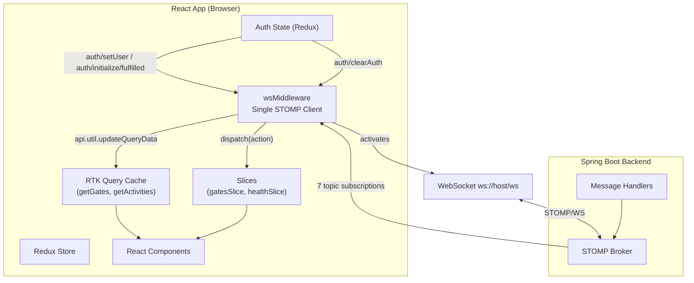

# Real-Time Communication

## Architecture

The application uses **STOMP over WebSocket** for real-time, push-based communication with the backend. A single centralized Redux middleware manages the entire WebSocket lifecycle: connection, subscriptions, reconnection, and message routing into the Redux store.

No component creates its own WebSocket connection. Components consume real-time data exclusively through Redux (RTK Query cache or slice state), never by subscribing to topics directly.


```mermaid
flowchart TB
    subgraph Browser["React App (Browser)"]
        Auth["Auth State (Redux)"]
        MW["wsMiddleware<br/>Single STOMP Client"]
        Store["Redux Store"]
        RTK["RTK Query Cache<br/>(getGates, getActivities)"]
        Slices["Slices<br/>(gatesSlice, healthSlice)"]
        UI["React Components"]
    end

    subgraph Server["Spring Boot Backend"]
        Broker["STOMP Broker"]
        Handlers["Message Handlers"]
    end

    Auth -->|"auth/setUser / auth/initialize/fulfilled"| MW
    Auth -->|"auth/clearAuth"| MW
    MW -->|"activates"| WS["WebSocket ws://host/ws"]
    WS <-->|"STOMP/WS"| Broker
    Handlers --> Broker
    Broker -->|"7 topic subscriptions"| MW
    MW -->|"api.util.updateQueryData"| RTK
    MW -->|"dispatch(action)"| Slices
    RTK --> UI
    Slices --> UI
```

## The wsMiddleware

**Location:** `src/app/store/middleware/wsMiddleware.js`

The middleware is a Redux middleware created by `createWsMiddleware()` and registered once in the store. It holds a single `@stomp/stompjs` `Client` instance in closure scope. It intercepts every dispatched action, but only acts on auth-related actions to drive the connection lifecycle.

### Auth-Tied Lifecycle

The WebSocket connection is tied to authentication state. It does not connect on app startup.

| Trigger Action | Effect |
|---|---|
| `auth/setUser` | Connect (if not already active) |
| `auth/initialize/fulfilled` | Connect (if not already active) |
| `auth/clearAuth` | Disconnect permanently (sets `intentionalDisconnect` flag) |

The `intentionalDisconnect` flag is the key mechanism that prevents reconnect loops after logout. When the user logs out, `auth/clearAuth` fires, the middleware calls `disconnect()` which sets the flag to `true` and deactivates the STOMP client. Any subsequent `onWebSocketClose` or `onStompError` callback will see the flag and skip reconnection scheduling.

### Connection URL

The WebSocket URL is derived from the current page protocol and host:

```
ws://host/ws        (HTTP)
wss://host/ws       (HTTPS)
```

This means the connection works in both development and production without configuration changes, as long as the backend serves `/ws` on the same host.

### Reconnection Strategy

The middleware implements **exponential backoff reconnection**. When the WebSocket closes or a STOMP error occurs (and the disconnect was not intentional), the middleware schedules a reconnect:

| Property | Value |
|---|---|
| Initial delay | 1000ms |
| Growth | Doubles each attempt (exponential) |
| Maximum delay | 30000ms (30s) |
| Triggered by | `onWebSocketClose`, `onStompError` |
| Suppressed by | `intentionalDisconnect` flag (set on logout) |

The delay sequence looks like: 1s, 2s, 4s, 8s, 16s, 30s, 30s, 30s...

When a reconnect succeeds, the `onConnect` callback resets the reconnect attempt counter back to zero. This means a brief network blip won't leave the client stuck at a 30-second delay for the next failure.

## STOMP Topics

The middleware subscribes to **all seven topics** inside the STOMP client's `onConnect` callback. There is no per-component subscription. Every topic subscription is registered once, at connection time.

| Topic | Payload Format | Redux Target | Routing Pattern |
|---|---|---|---|
| `/topic/gates/add` | JSON gate object | RTK Query `getGates` cache (push) | `api.util.updateQueryData` |
| `/topic/gates/delete` | Plain int (gate ID) | RTK Query `getGates` cache (filter) | `api.util.updateQueryData` |
| `/topic/gates/updates` | JSON gate object | RTK Query `getGates` cache (replace by id) | `api.util.updateQueryData` |
| `/topic/gate-activities` | JSON activity object | RTK Query `getActivities` cache (push) | `api.util.updateQueryData` |
| `/topic/gate-activities/delete` | Plain int (activity ID) | RTK Query `getActivities` cache (filter) | `api.util.updateQueryData` |
| `/topic/uplinks` | Plain string | `gatesSlice.uplinkString` | `dispatch(uplinkReceived(body))` |
| `/topic/health` | JSON health payload | `healthSlice.bySenseGateId` | `handleHealthMessage` → `dispatch(healthReceived({ statuses }))` |

### Two Message Routing Patterns

The middleware uses two distinct patterns depending on the payload type:

1. **JSON payloads → RTK Query cache patch.** For gate and activity topics, the middleware parses the JSON body and calls `api.util.updateQueryData()` to directly patch the RTK Query cache. This triggers a re-render of any component subscribed via `useGetGatesQuery` or `useGetActivitiesQuery`. No slice action is dispatched, and no component needs to know about the WebSocket at all.

2. **Plain string payloads → slice action dispatch.** For uplinks, the raw string body is passed to `dispatch(uplinkReceived(body))`, which updates `gatesSlice`. Components reading from that slice re-render.

3. **Health payloads → validated + dispatched to healthSlice.** Health messages go through `handleHealthMessage()` (in `healthMessageHandler.js`), which parses, validates, normalizes, and dispatches `healthReceived({ statuses })` to `healthSlice`.

## Real-Time Update Handling

### Gate Changes

When a gate is created, deleted, or updated, the backend publishes to the corresponding `/topic/gates/*` topic. The middleware patches the RTK Query `getGates` cache, which causes any component using `useGetGatesQuery()` to re-render with the updated data. This includes `StatusTables`, `StatCards`, and `StatusTablesView` (the guest read-only view).

No component manages its own WebSocket subscription. All of them simply read from the RTK Query cache via hooks.

### Gate Activities

New and deleted activities follow the same pattern through `/topic/gate-activities` and `/topic/gate-activities/delete`, patching the RTK Query `getActivities` cache.

### Uplink Events

When an end-node device sends an uplink, the backend publishes a plain string to `/topic/uplinks`. The middleware dispatches `uplinkReceived(body)`, which updates `gatesSlice`. The `UplinkToast` shared component reacts to this slice state and shows a toast notification.

## Health Topic (`/topic/health`)

The health topic delivers push-only status updates from SenseGate devices. On WebSocket connect, the middleware fetches the initial health state via `GET /api/health` (served by `HealthController`), which returns the last-known health data stored in the backend's in-memory `HealthStatusService`. After the initial fetch, live updates arrive via the `/topic/health` WebSocket subscription. Health data is not persisted to the database — the in-memory store resets on backend restart. The UI shows "Awaiting first health report" for devices that have not yet sent any data.

### Payload Schema

```json
{
  "messageType": 5,
  "statuses": [
    {
      "version": 1,
      "senseGateId": 42,
      "freeFallStatus": "NO_FALL",
      "batteryStatus": "CHARGING",
      "voltageMv": 3950
    }
  ]
}
```

The `messageType` field must equal `5`. The handler rejects any payload where this check fails.

### Enum Values

**BatteryStatus:**
| Value | Meaning |
|---|---|
| `CHARGING` | Device is charging |
| `DISCHARGING` | Device is on battery power |
| `LOW_BATTERY` | Battery is low |
| `UNKNOWN` | Sensor not reporting (sentinel value) |

**FreeFallStatus:**
| Value | Meaning |
|---|---|
| `NO_FALL` | No free fall detected |
| `FREE_FALL_DETECTED` | Free fall detected |
| `UNKNOWN` | Sensor not reporting (sentinel value) |

### Validation and Normalization

The `handleHealthMessage` function (in `src/app/store/middleware/healthMessageHandler.js`) validates every incoming payload before dispatching it to the store:

1. Parses the raw JSON string body
2. Checks `messageType === 5`
3. Validates `statuses` is an array
4. For each status entry: coerces `senseGateId` to a number, normalizes enum values to uppercase (falling back to `UNKNOWN` for invalid values), and coerces `version` and `voltageMv` to numbers or null
5. Dispatches the normalized statuses array to `healthSlice` via `healthReceived({ statuses })`

### Per-Field Merge Semantics

The backend sends **one event per message**, not a full health snapshot. A free fall message includes `batteryStatus: UNKNOWN` and `voltageMv: 0`. A battery message includes `freeFallStatus: UNKNOWN`. These are sentinel values, not real readings.

The `healthSlice` reducer preserves previously-known values when the incoming value is a sentinel:

| Field | Sentinel Value | Behavior |
|---|---|---|
| `battery` | `UNKNOWN` | Keep existing value, ignore incoming |
| `freeFall` | `UNKNOWN` | Keep existing value, ignore incoming |
| `voltageMv` | `0` | Keep existing value, ignore incoming |

If no previous value exists for a field (first message), the sentinel value is stored as-is.

### State Shape

```javascript
{
  bySenseGateId: {
    42: {
      battery:  { value: 'CHARGING', receivedAt: 1719900000000 },
      freeFall: { value: 'NO_FALL', receivedAt: 1719900000000 },
      voltageMv:{ value: 3950,       receivedAt: 1719900000000 }
    }
  }
}
```

Each field stores its own `receivedAt` timestamp, set when that specific field was last updated with a non-sentinel value.

### Staleness Detection

Each field has an independent `receivedAt` timestamp. The `isStale()` utility (in `src/features/health/healthUtils.js`) compares `receivedAt` against `STALE_THRESHOLD_MS`:

| Property | Value |
|---|---|
| `STALE_THRESHOLD_MS` | 5 minutes (300,000ms) |
| Location | `src/features/health/healthUtils.js` |
| Status | Placeholder value, marked as TODO for tuning with firmware broadcast cadence |

When a field's `receivedAt` is older than the threshold, the `HealthBadge` component renders an amber indicator by setting `data-stale="true"`.

### senseGateId vs gate.id (Known Limitation)

Health messages use `senseGateId` (an integer) to identify the reporting device. Gate data from the REST API uses `gate.id` (a Long). The UI assumes these two values are numerically equal and joins health data to gate records on this basis.

This equivalence is **not verified** by any backend contract or type system. It is a known limitation and should be documented as a TODO for the backend team to confirm.

## Connection Properties

| Property | Value |
|---|---|
| WebSocket URL | `ws://host/ws` (or `wss://` for HTTPS) |
| Protocol | STOMP over WebSocket |
| Client library | `@stomp/stompjs` (v7.1.1) |
| Connection manager | `wsMiddleware.js` (single Redux middleware) |
| Subscription count | 7 topics, all registered in `onConnect` |
| Reconnection | Exponential backoff (1s → 30s max), auto-reset on success |
| Auth lifecycle | Connects on login, disconnects on logout |
| Reconnect suppression | `intentionalDisconnect` flag prevents loops after logout |

## Limitations

1. **senseGateId / gate.id equivalence unverified.** Health messages key on `senseGateId`, gate data keys on `gate.id`. The UI assumes they match numerically. This should be confirmed with the backend team.

2. **STALE_THRESHOLD_MS is a placeholder.** The 5-minute staleness threshold in `healthUtils.js` is a TODO value that should be tuned to match the actual firmware broadcast cadence once that is known.

3. **No heartbeat/keepalive.** There is no application-level keepalive ping. A silently dropped connection is only detected when the browser fires the `onWebSocketClose` event, which then triggers the reconnection backoff.

4. **No persisted health state.** Health data is push-only with no REST fetch and no persistence. If the page is reloaded, all health state is lost until the next WebSocket message arrives. The UI returns to "Awaiting first health report."
