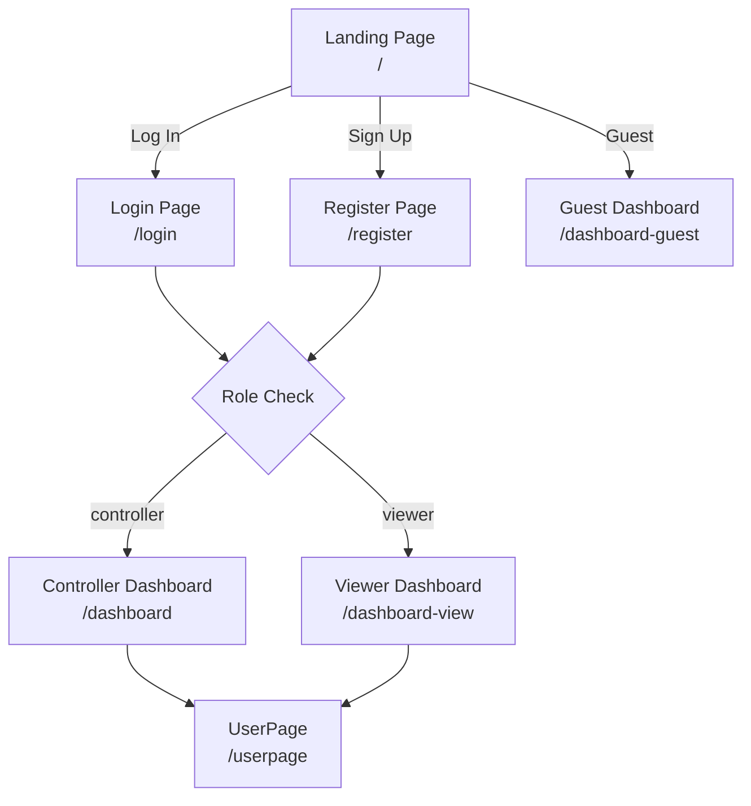

# Pages & Routing

## Route Table

All routes are defined in `src/app/App.jsx` using `react-router-dom` v7's `<Routes>` and `<Route>` components.

| Path | Component | Auth Required | Role | Purpose |
|---|---|---|---|---|
| `/` | `LandingPage` | No | — | Marketing hero page with navigation CTAs |
| `/login` | `LoginPage` | No | — | Email/password authentication |
| `/register` | `RegisterPage` | No | — | New user registration with role selection |
| `/dashboard` | `DashboardPage` | Yes | Controller | Full control panel — gate CRUD, downlinks |
| `/dashboard-view` | `DashboardViewPage` | Yes | Viewer/Controller | Read-only dashboard for monitoring |
| `/dashboard-guest` | `DashboardGuestPage` | No | Guest | Unauthenticated read-only view |
| `/userpage` | `UserPage` | Yes | Any | Profile management (name, password, logout) |

## Routing Setup

```javascript
// src/app/App.jsx (simplified)
<AuthProvider>
  <BrowserRouter>
    <Routes>
      <Route path="/" element={<LandingPage />} />
      <Route path="/login" element={<LoginPage />} />
      <Route path="/register" element={<RegisterPage />} />
      <Route path="/dashboard" element={<DashboardPage />} />
      <Route path="/dashboard-view" element={<DashboardViewPage />} />
      <Route path="/dashboard-guest" element={<DashboardGuestPage />} />
      <Route path="/userpage" element={<UserPage />} />
    </Routes>
  </BrowserRouter>
</AuthProvider>
```

## Authentication Guards

> The app does **not** use a protected route wrapper component. Instead, each protected page performs its own imperative check.

### Pattern for Protected Pages

```javascript
function ProtectedPage() {
  const { isAuthenticated, loading } = useAuth();
  const [dialogOpen, setDialogOpen] = useState(false);

  useEffect(() => {
    if (!loading && !isAuthenticated) {
      setDialogOpen(true);  // Show AlertDialogIllegal
    }
  }, [loading, isAuthenticated]);

  if (loading) return null;
  if (!isAuthenticated) {
    return <AlertDialogIllegal open={dialogOpen} />;
  }
  return <FullDashboard />;
}
```

The `AlertDialogIllegal` component displays a warning and navigates back to `/` on close.

### Guest Access

The `/dashboard-guest` route uses a different header (`HeaderBarGuest`), does not check authentication, and renders `StatusTablesView` (read-only mode). Guests cannot see notifications or access user settings.

## Page Details

### LandingPage (`/`)
- Decorative hero section with the SenseMate branding
- Three call-to-action buttons: **Log In**, **Sign Up**, **Continue as Guest**
- No authentication required — entry point for all users

### LoginPage (`/login`)
- Email and password form with client-side validation
- On success, the backend returns a JWT token
- The `AuthContext.login()` method stores the token and user data
- Redirect is based on user role:
  - `"controller"` → `/dashboard`
  - `"viewer"` → `/dashboard-view`
  - other → stays on login with error

### RegisterPage (`/register`)
- Form: name, email, password, confirm password
- Role toggle switch (controller/viewer)
- Client-side validations: required fields, password match
- On success: auto-login and redirect based on role

### DashboardPage (`/dashboard`)
- Full controller dashboard
- Components: `HeaderBar`, `InfoBoxes`, `StatusTables` (with edit/create/delete controls), `RecentActivity`
- WebSocket subscriptions for live gate and activity updates
- Downlink counter (max 10 sends, password-protected reset)

### DashboardViewPage (`/dashboard-view`)
- Read-only dashboard for authenticated viewers
- Same layout as controller dashboard but uses `StatusTablesView` (no action buttons, no bulk operations)
- Uses 300ms polling interval as a real-time fallback
- Notification popup and user button are available (via `HeaderBar`)

### DashboardGuestPage (`/dashboard-guest`)
- Read-only dashboard for unauthenticated guests
- Uses `HeaderBarGuest` (logo + exit button only)
- `StatusTablesView` with polling
- No notifications, no user settings access

### UserPage (`/userpage`)
- Displays current user info: email, name, role
- Forms to update name and password
- Logout button (clears JWT cookie and Axios header)
- Back button to return to dashboard

## Navigation Flow


