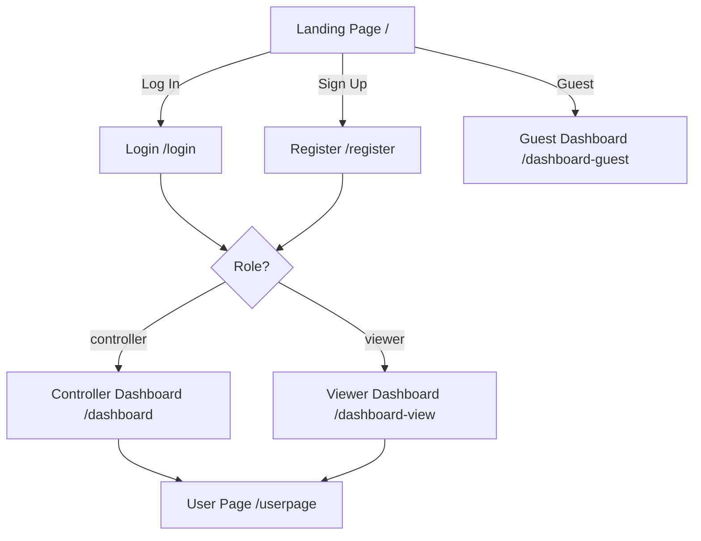

# Pages & Routing

## Route Table

Defined in `src/app/App.jsx` with `react-router-dom` v7.

| Path | Component | Auth | Role | Purpose |
|---|---|---|---|---|
| `/` | `LandingPage` | No | — | Hero page with Log In / Sign Up / Guest CTAs |
| `/login` | `LoginPage` | No | — | Email/password form |
| `/register` | `RegisterPage` | No | — | Registration with controller/viewer role toggle |
| `/dashboard` | `DashboardPage` | Yes | Controller | Full control — gate CRUD, downlinks |
| `/dashboard-view` | `DashboardViewPage` | Yes | Viewer | Read-only dashboard |
| `/dashboard-guest` | `DashboardGuestPage` | No | Guest | Unauthenticated read-only |
| `/userpage` | `UserPage` | Yes | Any | Profile management, logout |

## Auth Guards

Protected pages (`DashboardPage`, `DashboardViewPage`, `UserPage`) check `isAuthenticated` on mount. If not authenticated, an `AlertDialogIllegal` appears and navigating away redirects to `/`.

Guest pages (`DashboardGuestPage`) skip the guard entirely and use `HeaderBarGuest`.

## Page Composition

| Component | DashboardPage | DashboardViewPage | DashboardGuestPage |
|---|---|---|---|
| Header | `HeaderBar` | `HeaderBar` | `HeaderBarGuest` |
| Summary Cards | `InfoBoxes` | `InfoBoxes` | `InfoBoxes` |
| Gate Table | `StatusTables` | `StatusTablesView` | `StatusTablesView` |
| Activity Feed | `RecentActivity` | `RecentActivity` | `RecentActivity` |
| Auth Guard | `AlertDialogIllegal` | `AlertDialogIllegal` | None |
| Notifications | via `HeaderBar` | via `HeaderBar` | None |

```
+-------------------------------------------+
|  HeaderBar / HeaderBarGuest               |
+-------------------------------------------+
|  InfoBoxes: Total | Open | Closed | OOS   |
+-------------------------------------------+
|  StatusTables / StatusTablesView           |
|  RecentActivity                            |
+-------------------------------------------+
```

## Navigation Flow


```mermaid
flowchart TB
    Landing[Landing Page /]
    
    Landing -->|Log In| Login[Login /login]
    Landing -->|Sign Up| Register[Register /register]
    Landing -->|Guest| Guest[Guest Dashboard /dashboard-guest]
    
    Login --> RoleCheck{Role?}
    Register --> RoleCheck
    
    RoleCheck -->|controller| Controller[Controller Dashboard /dashboard]
    RoleCheck -->|viewer| Viewer[Viewer Dashboard /dashboard-view]
    
    Controller --> UserPage[User Page /userpage]
    Viewer --> UserPage
```
