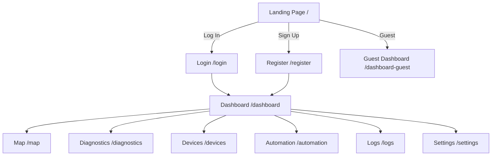

# Pages & Routing

## Route Table

Defined in `src/app/App.jsx` with `react-router-dom` v7.

| Path | Component | Auth | Role | Purpose |
|---|---|---|---|---|
| `/` | `LandingPage` | No | — | Hero page with Log In / Sign Up / Guest CTAs |
| `/login` | `LoginPage` | PublicOnlyRoute | — | Email/password form |
| `/register` | `RegisterPage` | PublicOnlyRoute | — | Registration with controller/viewer role toggle |
| `/dashboard` | `DashboardPage` | ProtectedRoute | Controller + Viewer | Gate dashboard — conditional rendering by role |
| `/dashboard-guest` | `DashboardGuestPage` | No | Guest | Unauthenticated read-only |
| `/map` | `MapPage` | ProtectedRoute | Controller + Viewer | Leaflet map visualization |
| `/diagnostics` | `DiagnosticsPage` | ProtectedRoute | Controller + Viewer | System diagnostics |
| `/devices` | `DevicesPage` | ProtectedRoute | Controller + Viewer | Device management |
| `/automation` | `AutomationPage` | ProtectedRoute | Controller + Viewer | Automation rules |
| `/logs` | `LogsPage` | ProtectedRoute | Controller + Viewer | Activity logs |
| `/settings` | `SettingsPage` | ProtectedRoute | Controller + Viewer | User settings |

## Auth Guards

### ProtectedRoute
Wraps routes that require authentication and optionally a specific role:
- While `auth.status === 'loading'` → shows `CircularProgress`
- If `unauthenticated` → redirects to `/login`
- If role doesn't match → redirects to `/`

### PublicOnlyRoute
Wraps routes that should only be visible to unauthenticated users (login, register):
- If `authenticated` → redirects to `/dashboard`
- If `unauthenticated` → renders the child route

Guest pages (`DashboardGuestPage`) skip guards entirely.

## Page Composition

DashboardPage uses `AppLayout` (Sidebar + Topbar) with conditional rendering based on user role:

| Component | Controller | Viewer | Guest |
|---|---|---|---|
| Layout | `AppLayout` | `AppLayout` | — |
| Summary Cards | `StatCards` | `StatCards` | — |
| Gate Table | `StatusTables` | `StatusTablesView` | `StatusTablesView` |
| Activity Feed | `ActivityPanel` | `ActivityPanel` | — |
| Auth Guard | `ProtectedRoute` | `ProtectedRoute` | None |

```
+-------------------------------------------+
|  AppLayout (Sidebar + Topbar)             |
+-------------------------------------------+
|  StatCards: Total | Open | Closed | OOS   |
+-------------------------------------------+
|  StatusTables / StatusTablesView          |
|  ActivityPanel                            |
+-------------------------------------------+
```

## Navigation Flow


```mermaid
flowchart TB
    Landing[Landing Page /]
    
    Landing -->|Log In| Login[Login /login]
    Landing -->|Sign Up| Register[Register /register]
    Landing -->|Guest| Guest[Guest Dashboard /dashboard-guest]
    
    Login --> Dashboard[Dashboard /dashboard]
    Register --> Dashboard
    
    Dashboard --> Map[Map /map]
    Dashboard --> Diagnostics[Diagnostics /diagnostics]
    Dashboard --> Devices[Devices /devices]
    Dashboard --> Automation[Automation /automation]
    Dashboard --> Logs[Logs /logs]
    Dashboard --> Settings[Settings /settings]
```
